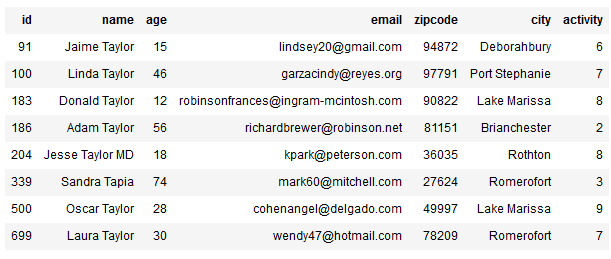
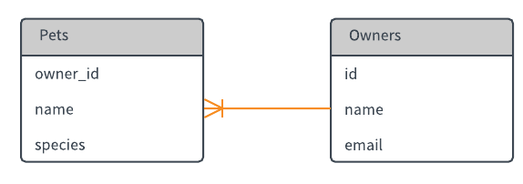
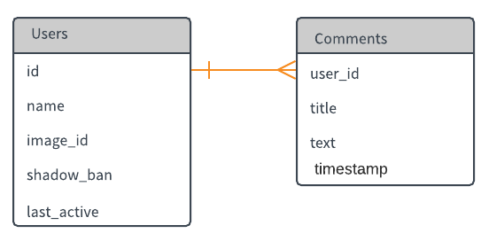
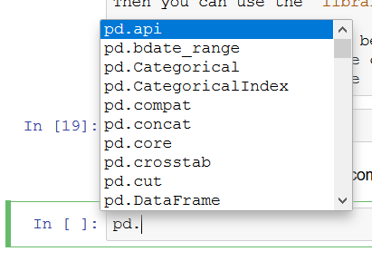

_[Link to Notebook Version of Lab](https://github.com/organisciak/Scripting-Course/blob/master/labs/03-joins-like-methods-lab.ipynb)_


## Lab Worksheet 3

Hopefully by this week you're getting comfortable with Python and SQL, and understand the differences between the two. If not, ask question and refer to our prior notes.

This will be the last week where we talk about fundamental skills for Python and SQL - starting next week, we're putting them to use!

SQL Skills

- `ORDER BY`
- `LIMIT`
- `AND` and `OR`
- `LIKE` clause for `WHERE`
- `JOIN`

## Lab preparation

Download [circulation.sqlite](https://github.com/organisciak/Scripting-Course/blob/master/data/circulation.sqlite?raw=true) and place in the same folder as this lab. Then connect to it in this way:


```python
%load_ext sql
%sql sqlite:///circulation.sqlite
```

This is a generated dataset of library circulation information, with three tables: `patrons`, `books`, and `circulation`.

## SQL

Last week, we reviewed `CREATE TABLE`, `INSERT`, and `SELECT`. Today, we'll cover a bit more about clauses that allow us to modify how we SELECT results.


## `LIMIT` and `ORDER BY`

`LIMIT` can limit the number of results that `SELECT` returns. This is especially useful if there are many, many matches, and you only want to see some of them.

`ORDER BY` allows you to specify a column to sort by, and whether it is sorted in ascending order (`ASC`) or descending order (`DESC`).

These clauses are usually at the end of the statement - if using both the `LIMIT` should go later than `ORDER BY`. The best way to understand them is by example:

*Example: Select 5 records from the patrons table.*


```python
%%sql
SELECT * FROM patrons
    LIMIT 5;
```

    Done.


<table>
    <tr>
        <th>id</th>
        <th>name</th>
        <th>age</th>
        <th>email</th>
        <th>zipcode</th>
        <th>city</th>
        <th>activity</th>
    </tr>
    <tr>
        <td>1</td>
        <td>Jeremy Mata</td>
        <td>30</td>
        <td>timothymoore@gmail.com</td>
        <td>52022</td>
        <td>Thomasmouth</td>
        <td>9</td>
    </tr>
    <tr>
        <td>2</td>
        <td>Daniel Garcia</td>
        <td>55</td>
        <td>mcdanielwilliam@sanchez-herrera.biz</td>
        <td>09529</td>
        <td>Deborahbury</td>
        <td>3</td>
    </tr>
    <tr>
        <td>3</td>
        <td>Warren Green</td>
        <td>17</td>
        <td>janice81@flores.com</td>
        <td>55036</td>
        <td>Michelefurt</td>
        <td>1</td>
    </tr>
    <tr>
        <td>4</td>
        <td>Erika Smith</td>
        <td>4</td>
        <td>tnichols@gregory.com</td>
        <td>11235</td>
        <td>Port Stephanie</td>
        <td>3</td>
    </tr>
    <tr>
        <td>5</td>
        <td>Matthew Johnson</td>
        <td>22</td>
        <td>christina30@manning.info</td>
        <td>52521</td>
        <td>Jamesfort</td>
        <td>4</td>
    </tr>
</table>


*Example: Select the five oldest patrons.*


```python
%%sql
SELECT * FROM patrons
    ORDER BY age DESC
    LIMIT 5;
```

    Done.


<table>
    <tr>
        <th>id</th>
        <th>name</th>
        <th>age</th>
        <th>email</th>
        <th>zipcode</th>
        <th>city</th>
        <th>activity</th>
    </tr>
    <tr>
        <td>516</td>
        <td>Latoya Clark</td>
        <td>82</td>
        <td>lanceosborne@hotmail.com</td>
        <td>79851</td>
        <td>Deborahbury</td>
        <td>9</td>
    </tr>
    <tr>
        <td>911</td>
        <td>Jackie Arias</td>
        <td>80</td>
        <td>sandra83@ramirez-wheeler.com</td>
        <td>53858</td>
        <td>Michelefurt</td>
        <td>9</td>
    </tr>
    <tr>
        <td>89</td>
        <td>Jennifer Bradley</td>
        <td>79</td>
        <td>jacquelinenoble@williams-ayala.com</td>
        <td>63196</td>
        <td>Port Stephanie</td>
        <td>4</td>
    </tr>
    <tr>
        <td>385</td>
        <td>Shannon Smith</td>
        <td>79</td>
        <td>christinamullen@yahoo.com</td>
        <td>24061</td>
        <td>Walkerview</td>
        <td>0</td>
    </tr>
    <tr>
        <td>238</td>
        <td>Christopher James</td>
        <td>78</td>
        <td>cookchristopher@yahoo.com</td>
        <td>71849</td>
        <td>Cooperton</td>
        <td>4</td>
    </tr>
</table>


## More on `WHERE`

### `OR`

Multiple conditions can be combined with `AND`; e.g. `WHERE age > 10 AND first_name == 'Jack'`. It is also possible to say 'one of these conditions' by using `OR`. For example,

```sql
SELECT * FROM people
    WHERE age > 10 OR first_name == 'Jack';
```

This will return all records where the person's age is >10 and all records where the first name is Jack.

You can avoid ambiguity by using parentheses. The following is functionally identical, but slightly easier to read and tougher to accidentally do something you didn't intend:

```sql
SELECT * FROM people
    WHERE (age > 10) OR (first_name == 'Jack');
```

### `LIKE`

In addition to logical operators - e.g. `WHERE age > 10` or `WHERE first_name == 'Jack'` - you can also do a partial match on a string with `LIKE`.

So, `WHERE first_name LIKE 'Ja%'` will match first names like James, Jack, Jan.

`LIKE` tells SQL to look for special characters in the string. There are two special characters that you should know:

- `%`, like in the example above, matched any number of random characters
- `_` matches a single random character.

*Example: match names that start with Jacob, followed by any other characters:*


```python
%%sql
SELECT * FROM patrons
    WHERE name LIKE 'Jacob%';
```

    Done.


<table>
    <tr>
        <th>id</th>
        <th>name</th>
        <th>age</th>
        <th>email</th>
        <th>zipcode</th>
        <th>city</th>
        <th>activity</th>
    </tr>
    <tr>
        <td>224</td>
        <td>Jacob Conrad</td>
        <td>34</td>
        <td>racheldurham@king-downs.com</td>
        <td>48807</td>
        <td>New Hannah</td>
        <td>5</td>
    </tr>
    <tr>
        <td>248</td>
        <td>Jacob Rivas</td>
        <td>32</td>
        <td>larry34@castillo-gibson.net</td>
        <td>48618</td>
        <td>East Pamelaburgh</td>
        <td>8</td>
    </tr>
    <tr>
        <td>287</td>
        <td>Jacob Ross</td>
        <td>53</td>
        <td>phillipsvalerie@hudson.biz</td>
        <td>98672</td>
        <td>Cooperton</td>
        <td>6</td>
    </tr>
    <tr>
        <td>417</td>
        <td>Jacob Palmer</td>
        <td>44</td>
        <td>willie34@hernandez-king.com</td>
        <td>88821</td>
        <td>Loganchester</td>
        <td>1</td>
    </tr>
    <tr>
        <td>428</td>
        <td>Jacob Reid</td>
        <td>34</td>
        <td>dustin32@lawson-miller.biz</td>
        <td>61655</td>
        <td>Colechester</td>
        <td>2</td>
    </tr>
    <tr>
        <td>943</td>
        <td>Jacob Garcia</td>
        <td>50</td>
        <td>vsalinas@gmail.com</td>
        <td>62186</td>
        <td>Romerofort</td>
        <td>5</td>
    </tr>
</table>


*Example: [**Doing it wrong**] - Search for @gmail emails. Problem - this searches for strings starting with @gmail, but you need to say that there can be other characters before `@`*


```python
%%sql
SELECT * FROM patrons
    WHERE email LIKE '@gmail.com';
```

    Done.


<table>
    <tr>
        <th>id</th>
        <th>name</th>
        <th>age</th>
        <th>email</th>
        <th>zipcode</th>
        <th>city</th>
        <th>activity</th>
    </tr>
</table>


*Example: [**Correct**] - Search for @gmail emails.*


```python
%%sql
SELECT * FROM patrons
    WHERE email LIKE '%@gmail.com';
```

    Done.


<table>
    <tr>
        <th>id</th>
        <th>name</th>
        <th>age</th>
        <th>email</th>
        <th>zipcode</th>
        <th>city</th>
        <th>activity</th>
    </tr>
    <tr>
        <td>1</td>
        <td>Jeremy Mata</td>
        <td>30</td>
        <td>timothymoore@gmail.com</td>
        <td>52022</td>
        <td>Thomasmouth</td>
        <td>9</td>
    </tr>
    <tr>
        <td>15</td>
        <td>Brian Nixon</td>
        <td>24</td>
        <td>combslee@gmail.com</td>
        <td>76117</td>
        <td>Rothton</td>
        <td>9</td>
    </tr>
    <tr>
        <td>19</td>
        <td>Shelly Roth</td>
        <td>46</td>
        <td>carloswalker@gmail.com</td>
        <td>03442</td>
        <td>Austinshire</td>
        <td>6</td>
    </tr>
    <tr>
        <td>21</td>
        <td>James Arnold</td>
        <td>22</td>
        <td>faithchavez@gmail.com</td>
        <td>15431</td>
        <td>South Danielport</td>
        <td>5</td>
    </tr>
    <tr>
        <td>22</td>
        <td>Jennifer Evans</td>
        <td>49</td>
        <td>ijackson@gmail.com</td>
        <td>69375</td>
        <td>East Pamelaburgh</td>
        <td>6</td>
    </tr>
    <tr>
        <td>23</td>
        <td>Brittany Coleman</td>
        <td>23</td>
        <td>watsonscott@gmail.com</td>
        <td>34912</td>
        <td>North Stephenfort</td>
        <td>7</td>
    </tr>
    <tr>
        <td>29</td>
        <td>Alyssa Williams DVM</td>
        <td>33</td>
        <td>tonya62@gmail.com</td>
        <td>55420</td>
        <td>Normanville</td>
        <td>4</td>
    </tr>
    <tr>
        <td>32</td>
        <td>Tiffany Brooks</td>
        <td>31</td>
        <td>jeffreyburgess@gmail.com</td>
        <td>10722</td>
        <td>South Matthew</td>
        <td>7</td>
    </tr>
    <tr>
        <td>34</td>
        <td>Victoria Carpenter</td>
        <td>28</td>
        <td>victoria72@gmail.com</td>
        <td>20246</td>
        <td>Thomasmouth</td>
        <td>5</td>
    </tr>
    <tr>
        <td>35</td>
        <td>Allison Payne</td>
        <td>31</td>
        <td>thomas19@gmail.com</td>
        <td>23188</td>
        <td>Lake Michaelfort</td>
        <td>4</td>
    </tr>
    <tr>
        <td>37</td>
        <td>Sharon Moore</td>
        <td>21</td>
        <td>elliottian@gmail.com</td>
        <td>33605</td>
        <td>Cooperton</td>
        <td>9</td>
    </tr>
    <tr>
        <td>45</td>
        <td>Tammy Meyer</td>
        <td>43</td>
        <td>laceywilliams@gmail.com</td>
        <td>73411</td>
        <td>Romerofort</td>
        <td>1</td>
    </tr>
    <tr>
        <td>47</td>
        <td>Cody Moore</td>
        <td>13</td>
        <td>annamaynard@gmail.com</td>
        <td>53722</td>
        <td>New Hannah</td>
        <td>0</td>
    </tr>
    <tr>
        <td>55</td>
        <td>Nathan Guzman DVM</td>
        <td>28</td>
        <td>ivan11@gmail.com</td>
        <td>23688</td>
        <td>Brianchester</td>
        <td>6</td>
    </tr>
    <tr>
        <td>76</td>
        <td>Elizabeth Contreras</td>
        <td>4</td>
        <td>nmolina@gmail.com</td>
        <td>51577</td>
        <td>Loganchester</td>
        <td>7</td>
    </tr>
    <tr>
        <td>81</td>
        <td>Tyler Lopez</td>
        <td>55</td>
        <td>lisa89@gmail.com</td>
        <td>12936</td>
        <td>Port Stephanie</td>
        <td>8</td>
    </tr>
    <tr>
        <td>90</td>
        <td>Kimberly Contreras</td>
        <td>29</td>
        <td>taraknight@gmail.com</td>
        <td>97554</td>
        <td>North Stephenfort</td>
        <td>5</td>
    </tr>
    <tr>
        <td>91</td>
        <td>Jaime Taylor</td>
        <td>15</td>
        <td>lindsey20@gmail.com</td>
        <td>94872</td>
        <td>Deborahbury</td>
        <td>6</td>
    </tr>
    <tr>
        <td>97</td>
        <td>Mr. Jesse Thomas</td>
        <td>36</td>
        <td>ewright@gmail.com</td>
        <td>64152</td>
        <td>New Terri</td>
        <td>5</td>
    </tr>
    <tr>
        <td>102</td>
        <td>Jared Zuniga</td>
        <td>46</td>
        <td>david56@gmail.com</td>
        <td>69391</td>
        <td>North Stephenfort</td>
        <td>3</td>
    </tr>
    <tr>
        <td>111</td>
        <td>Harold Singh</td>
        <td>29</td>
        <td>tamara80@gmail.com</td>
        <td>75243</td>
        <td>New Hannah</td>
        <td>2</td>
    </tr>
    <tr>
        <td>113</td>
        <td>Michelle Gentry</td>
        <td>33</td>
        <td>bchapman@gmail.com</td>
        <td>73576</td>
        <td>Lake Marissa</td>
        <td>6</td>
    </tr>
    <tr>
        <td>118</td>
        <td>Jessica Holmes</td>
        <td>17</td>
        <td>stephen17@gmail.com</td>
        <td>55081</td>
        <td>Cooperton</td>
        <td>4</td>
    </tr>
    <tr>
        <td>119</td>
        <td>Lee Smith</td>
        <td>51</td>
        <td>darren54@gmail.com</td>
        <td>28029</td>
        <td>South Amandabury</td>
        <td>9</td>
    </tr>
    <tr>
        <td>129</td>
        <td>Timothy Joseph</td>
        <td>17</td>
        <td>frankdecker@gmail.com</td>
        <td>97045</td>
        <td>South Amandabury</td>
        <td>2</td>
    </tr>
    <tr>
        <td>130</td>
        <td>Alexander Hernandez</td>
        <td>39</td>
        <td>btodd@gmail.com</td>
        <td>40984</td>
        <td>Kevinmouth</td>
        <td>4</td>
    </tr>
    <tr>
        <td>135</td>
        <td>Colton Simmons</td>
        <td>21</td>
        <td>kevin27@gmail.com</td>
        <td>65544</td>
        <td>North Melissabury</td>
        <td>5</td>
    </tr>
    <tr>
        <td>155</td>
        <td>Martha Foley</td>
        <td>12</td>
        <td>mdavis@gmail.com</td>
        <td>07669</td>
        <td>Marystad</td>
        <td>8</td>
    </tr>
    <tr>
        <td>156</td>
        <td>Connie Lawrence</td>
        <td>40</td>
        <td>xparker@gmail.com</td>
        <td>93753</td>
        <td>Brianchester</td>
        <td>7</td>
    </tr>
    <tr>
        <td>161</td>
        <td>Linda Brown</td>
        <td>39</td>
        <td>davidsimpson@gmail.com</td>
        <td>14634</td>
        <td>Romerofort</td>
        <td>8</td>
    </tr>
    <tr>
        <td>166</td>
        <td>Carla Roach</td>
        <td>28</td>
        <td>seth66@gmail.com</td>
        <td>44781</td>
        <td>New Terri</td>
        <td>2</td>
    </tr>
    <tr>
        <td>175</td>
        <td>Sean Lane</td>
        <td>40</td>
        <td>joseph20@gmail.com</td>
        <td>15764</td>
        <td>Marystad</td>
        <td>6</td>
    </tr>
    <tr>
        <td>190</td>
        <td>Diana Porter</td>
        <td>21</td>
        <td>bdonovan@gmail.com</td>
        <td>83124</td>
        <td>Marystad</td>
        <td>6</td>
    </tr>
    <tr>
        <td>196</td>
        <td>Lisa Huber</td>
        <td>16</td>
        <td>beverly21@gmail.com</td>
        <td>86245</td>
        <td>Thomasmouth</td>
        <td>8</td>
    </tr>
    <tr>
        <td>213</td>
        <td>Veronica Bryan</td>
        <td>22</td>
        <td>crystal09@gmail.com</td>
        <td>74326</td>
        <td>East Brookefort</td>
        <td>6</td>
    </tr>
    <tr>
        <td>215</td>
        <td>Joseph Santiago</td>
        <td>21</td>
        <td>jennifer23@gmail.com</td>
        <td>46510</td>
        <td>South Amandabury</td>
        <td>9</td>
    </tr>
    <tr>
        <td>218</td>
        <td>Lauren Robertson</td>
        <td>33</td>
        <td>rodriguezwesley@gmail.com</td>
        <td>61142</td>
        <td>Austinshire</td>
        <td>3</td>
    </tr>
    <tr>
        <td>225</td>
        <td>Richard Baker</td>
        <td>44</td>
        <td>robert29@gmail.com</td>
        <td>02682</td>
        <td>Lake Jennifer</td>
        <td>5</td>
    </tr>
    <tr>
        <td>230</td>
        <td>Richard Harris</td>
        <td>32</td>
        <td>shepardstephanie@gmail.com</td>
        <td>46827</td>
        <td>Brianchester</td>
        <td>5</td>
    </tr>
    <tr>
        <td>231</td>
        <td>Darrell Herrera</td>
        <td>62</td>
        <td>danajohnson@gmail.com</td>
        <td>64711</td>
        <td>Rothton</td>
        <td>6</td>
    </tr>
    <tr>
        <td>234</td>
        <td>Jason Johnson</td>
        <td>60</td>
        <td>iwells@gmail.com</td>
        <td>52186</td>
        <td>Normanville</td>
        <td>9</td>
    </tr>
    <tr>
        <td>235</td>
        <td>Lisa Knight</td>
        <td>42</td>
        <td>heatherguzman@gmail.com</td>
        <td>84405</td>
        <td>Kevinmouth</td>
        <td>6</td>
    </tr>
    <tr>
        <td>242</td>
        <td>Eric Williams</td>
        <td>46</td>
        <td>tanyarussell@gmail.com</td>
        <td>22853</td>
        <td>Colechester</td>
        <td>2</td>
    </tr>
    <tr>
        <td>245</td>
        <td>Ana Cook</td>
        <td>60</td>
        <td>andrew35@gmail.com</td>
        <td>37115</td>
        <td>Kevinmouth</td>
        <td>5</td>
    </tr>
    <tr>
        <td>247</td>
        <td>Brian Hubbard</td>
        <td>62</td>
        <td>daniellee@gmail.com</td>
        <td>82307</td>
        <td>Loganchester</td>
        <td>5</td>
    </tr>
    <tr>
        <td>257</td>
        <td>Jennifer Roberts</td>
        <td>43</td>
        <td>ngomez@gmail.com</td>
        <td>33791</td>
        <td>East Sherylshire</td>
        <td>3</td>
    </tr>
    <tr>
        <td>259</td>
        <td>Michael Ryan</td>
        <td>49</td>
        <td>roy11@gmail.com</td>
        <td>48383</td>
        <td>New Hannah</td>
        <td>3</td>
    </tr>
    <tr>
        <td>261</td>
        <td>Tammie Rodriguez</td>
        <td>0</td>
        <td>karenhughes@gmail.com</td>
        <td>54179</td>
        <td>Deborahbury</td>
        <td>7</td>
    </tr>
    <tr>
        <td>264</td>
        <td>Emily Leonard</td>
        <td>40</td>
        <td>jacobosborn@gmail.com</td>
        <td>39492</td>
        <td>Deborahbury</td>
        <td>3</td>
    </tr>
    <tr>
        <td>267</td>
        <td>Anthony Diaz</td>
        <td>49</td>
        <td>jesse93@gmail.com</td>
        <td>42516</td>
        <td>Jamesfort</td>
        <td>4</td>
    </tr>
    <tr>
        <td>269</td>
        <td>Vanessa Richardson</td>
        <td>47</td>
        <td>anthonymoreno@gmail.com</td>
        <td>90679</td>
        <td>East Brookefort</td>
        <td>6</td>
    </tr>
    <tr>
        <td>303</td>
        <td>Dylan Woodard</td>
        <td>15</td>
        <td>richardsallison@gmail.com</td>
        <td>54834</td>
        <td>North Melinda</td>
        <td>8</td>
    </tr>
    <tr>
        <td>306</td>
        <td>Jennifer Watson</td>
        <td>36</td>
        <td>jonathan60@gmail.com</td>
        <td>79619</td>
        <td>New Hannah</td>
        <td>3</td>
    </tr>
    <tr>
        <td>307</td>
        <td>Debra Benson</td>
        <td>24</td>
        <td>kenneth00@gmail.com</td>
        <td>52926</td>
        <td>Thomasmouth</td>
        <td>2</td>
    </tr>
    <tr>
        <td>315</td>
        <td>Andrew Suarez</td>
        <td>27</td>
        <td>welchwilliam@gmail.com</td>
        <td>78625</td>
        <td>Loganchester</td>
        <td>6</td>
    </tr>
    <tr>
        <td>321</td>
        <td>Logan Matthews</td>
        <td>55</td>
        <td>igibson@gmail.com</td>
        <td>43253</td>
        <td>Romerofort</td>
        <td>4</td>
    </tr>
    <tr>
        <td>323</td>
        <td>Chloe Lyons DVM</td>
        <td>35</td>
        <td>mary86@gmail.com</td>
        <td>49853</td>
        <td>Cooperton</td>
        <td>3</td>
    </tr>
    <tr>
        <td>338</td>
        <td>Kyle Torres</td>
        <td>23</td>
        <td>gutierrezsharon@gmail.com</td>
        <td>55577</td>
        <td>Irwinside</td>
        <td>3</td>
    </tr>
    <tr>
        <td>352</td>
        <td>Brandon Thompson</td>
        <td>43</td>
        <td>danielleturner@gmail.com</td>
        <td>07214</td>
        <td>Port Stephanie</td>
        <td>2</td>
    </tr>
    <tr>
        <td>368</td>
        <td>Benjamin Davis</td>
        <td>33</td>
        <td>johnsonmelissa@gmail.com</td>
        <td>81183</td>
        <td>Deborahbury</td>
        <td>2</td>
    </tr>
    <tr>
        <td>376</td>
        <td>Marvin Acosta</td>
        <td>40</td>
        <td>moorebrian@gmail.com</td>
        <td>43603</td>
        <td>North Melissabury</td>
        <td>6</td>
    </tr>
    <tr>
        <td>390</td>
        <td>Elizabeth Serrano</td>
        <td>17</td>
        <td>thompsoncarlos@gmail.com</td>
        <td>50059</td>
        <td>Rothton</td>
        <td>1</td>
    </tr>
    <tr>
        <td>398</td>
        <td>Gordon Gonzalez</td>
        <td>18</td>
        <td>ramoskevin@gmail.com</td>
        <td>48775</td>
        <td>North Cristinaview</td>
        <td>2</td>
    </tr>
    <tr>
        <td>401</td>
        <td>Tanner Chan</td>
        <td>20</td>
        <td>fjones@gmail.com</td>
        <td>78181</td>
        <td>Thomasmouth</td>
        <td>1</td>
    </tr>
    <tr>
        <td>402</td>
        <td>Jasmine Mendez</td>
        <td>47</td>
        <td>stacy64@gmail.com</td>
        <td>42869</td>
        <td>Kevinmouth</td>
        <td>8</td>
    </tr>
    <tr>
        <td>413</td>
        <td>Timothy Cooper</td>
        <td>32</td>
        <td>xmurillo@gmail.com</td>
        <td>66165</td>
        <td>Port Stephanie</td>
        <td>0</td>
    </tr>
    <tr>
        <td>419</td>
        <td>John Gomez</td>
        <td>23</td>
        <td>evansanthony@gmail.com</td>
        <td>27498</td>
        <td>East Pamelaburgh</td>
        <td>8</td>
    </tr>
    <tr>
        <td>423</td>
        <td>Katherine Newton</td>
        <td>32</td>
        <td>gonzaleztimothy@gmail.com</td>
        <td>36744</td>
        <td>Lake Jennifer</td>
        <td>0</td>
    </tr>
    <tr>
        <td>431</td>
        <td>Jennifer Henderson</td>
        <td>30</td>
        <td>nicholasstewart@gmail.com</td>
        <td>01262</td>
        <td>Walkerview</td>
        <td>5</td>
    </tr>
    <tr>
        <td>434</td>
        <td>Edward Cox</td>
        <td>21</td>
        <td>lewismatthew@gmail.com</td>
        <td>06201</td>
        <td>Lake Jennifer</td>
        <td>7</td>
    </tr>
    <tr>
        <td>438</td>
        <td>Austin Hatfield</td>
        <td>26</td>
        <td>qdunn@gmail.com</td>
        <td>49843</td>
        <td>Marystad</td>
        <td>0</td>
    </tr>
    <tr>
        <td>439</td>
        <td>Ronald Johnson</td>
        <td>28</td>
        <td>brangel@gmail.com</td>
        <td>81459</td>
        <td>East Williamport</td>
        <td>8</td>
    </tr>
    <tr>
        <td>441</td>
        <td>Andres Medina</td>
        <td>11</td>
        <td>martinezjames@gmail.com</td>
        <td>46724</td>
        <td>Loganchester</td>
        <td>4</td>
    </tr>
    <tr>
        <td>451</td>
        <td>Jonathan Estes</td>
        <td>42</td>
        <td>joanna83@gmail.com</td>
        <td>20362</td>
        <td>Lake Michaelfort</td>
        <td>5</td>
    </tr>
    <tr>
        <td>454</td>
        <td>Justin Vincent</td>
        <td>47</td>
        <td>parnold@gmail.com</td>
        <td>60194</td>
        <td>Colechester</td>
        <td>2</td>
    </tr>
    <tr>
        <td>460</td>
        <td>David James</td>
        <td>38</td>
        <td>crichardson@gmail.com</td>
        <td>50771</td>
        <td>North Melissabury</td>
        <td>4</td>
    </tr>
    <tr>
        <td>461</td>
        <td>Ashley Holmes</td>
        <td>28</td>
        <td>hwoods@gmail.com</td>
        <td>38507</td>
        <td>East Adam</td>
        <td>4</td>
    </tr>
    <tr>
        <td>473</td>
        <td>Michelle Bennett</td>
        <td>30</td>
        <td>donald17@gmail.com</td>
        <td>20547</td>
        <td>Port Stephanie</td>
        <td>5</td>
    </tr>
    <tr>
        <td>475</td>
        <td>Kimberly Schwartz</td>
        <td>38</td>
        <td>christophercarlson@gmail.com</td>
        <td>01336</td>
        <td>Thomasmouth</td>
        <td>9</td>
    </tr>
    <tr>
        <td>481</td>
        <td>Jamie Wilkins</td>
        <td>49</td>
        <td>torresjohn@gmail.com</td>
        <td>28358</td>
        <td>Coxmouth</td>
        <td>4</td>
    </tr>
    <tr>
        <td>482</td>
        <td>Beth Miller</td>
        <td>4</td>
        <td>zharris@gmail.com</td>
        <td>92255</td>
        <td>Loganchester</td>
        <td>1</td>
    </tr>
    <tr>
        <td>484</td>
        <td>Wesley Price</td>
        <td>61</td>
        <td>munozkevin@gmail.com</td>
        <td>48788</td>
        <td>Loganchester</td>
        <td>7</td>
    </tr>
    <tr>
        <td>495</td>
        <td>Carol Jones</td>
        <td>36</td>
        <td>rodriguezjennifer@gmail.com</td>
        <td>14333</td>
        <td>Port Stephanie</td>
        <td>0</td>
    </tr>
    <tr>
        <td>496</td>
        <td>Ann Sharp</td>
        <td>35</td>
        <td>valdezjames@gmail.com</td>
        <td>93801</td>
        <td>Kevinmouth</td>
        <td>2</td>
    </tr>
    <tr>
        <td>502</td>
        <td>Carly Robinson</td>
        <td>10</td>
        <td>john60@gmail.com</td>
        <td>53964</td>
        <td>Mckayborough</td>
        <td>5</td>
    </tr>
    <tr>
        <td>510</td>
        <td>Tracey Perez</td>
        <td>49</td>
        <td>hjordan@gmail.com</td>
        <td>63752</td>
        <td>Kevinmouth</td>
        <td>8</td>
    </tr>
    <tr>
        <td>511</td>
        <td>Donna Ellison</td>
        <td>6</td>
        <td>brett55@gmail.com</td>
        <td>95277</td>
        <td>Coxmouth</td>
        <td>9</td>
    </tr>
    <tr>
        <td>514</td>
        <td>Lisa James</td>
        <td>11</td>
        <td>taylorcollins@gmail.com</td>
        <td>77974</td>
        <td>Kleinville</td>
        <td>0</td>
    </tr>
    <tr>
        <td>524</td>
        <td>Jamie Pacheco</td>
        <td>35</td>
        <td>vangalicia@gmail.com</td>
        <td>14136</td>
        <td>Loganchester</td>
        <td>9</td>
    </tr>
    <tr>
        <td>537</td>
        <td>Stephanie Harmon</td>
        <td>10</td>
        <td>elizabethhayes@gmail.com</td>
        <td>69357</td>
        <td>East Sherylshire</td>
        <td>9</td>
    </tr>
    <tr>
        <td>539</td>
        <td>Kaitlyn Chambers</td>
        <td>41</td>
        <td>josephmichelle@gmail.com</td>
        <td>06763</td>
        <td>New Hannah</td>
        <td>6</td>
    </tr>
    <tr>
        <td>541</td>
        <td>Ray Brown</td>
        <td>14</td>
        <td>danielle47@gmail.com</td>
        <td>32898</td>
        <td>North Cristinaview</td>
        <td>0</td>
    </tr>
    <tr>
        <td>542</td>
        <td>Rebecca King</td>
        <td>33</td>
        <td>stephanie86@gmail.com</td>
        <td>13910</td>
        <td>North Cristinaview</td>
        <td>4</td>
    </tr>
    <tr>
        <td>551</td>
        <td>Faith Patterson</td>
        <td>39</td>
        <td>ikim@gmail.com</td>
        <td>89958</td>
        <td>Loganchester</td>
        <td>2</td>
    </tr>
    <tr>
        <td>559</td>
        <td>Martha Richards</td>
        <td>28</td>
        <td>lauracollins@gmail.com</td>
        <td>15479</td>
        <td>New Hannah</td>
        <td>6</td>
    </tr>
    <tr>
        <td>562</td>
        <td>Hannah Moore MD</td>
        <td>31</td>
        <td>powelldiana@gmail.com</td>
        <td>64392</td>
        <td>Port Stephanie</td>
        <td>1</td>
    </tr>
    <tr>
        <td>584</td>
        <td>Jasmine Vance</td>
        <td>52</td>
        <td>schmidtdavid@gmail.com</td>
        <td>64609</td>
        <td>Thomasmouth</td>
        <td>4</td>
    </tr>
    <tr>
        <td>594</td>
        <td>Ashley Harris</td>
        <td>21</td>
        <td>stephenrivera@gmail.com</td>
        <td>16219</td>
        <td>Colechester</td>
        <td>3</td>
    </tr>
    <tr>
        <td>599</td>
        <td>Travis Long</td>
        <td>29</td>
        <td>mannmorgan@gmail.com</td>
        <td>58858</td>
        <td>Romerofort</td>
        <td>8</td>
    </tr>
    <tr>
        <td>602</td>
        <td>Brandon Brown</td>
        <td>38</td>
        <td>dawn62@gmail.com</td>
        <td>32101</td>
        <td>East Brookefort</td>
        <td>5</td>
    </tr>
    <tr>
        <td>606</td>
        <td>Shirley Duncan</td>
        <td>21</td>
        <td>brandonwilliams@gmail.com</td>
        <td>11455</td>
        <td>East Brookefort</td>
        <td>2</td>
    </tr>
    <tr>
        <td>607</td>
        <td>Wyatt Day</td>
        <td>33</td>
        <td>wellsnicholas@gmail.com</td>
        <td>89653</td>
        <td>South Amandabury</td>
        <td>3</td>
    </tr>
    <tr>
        <td>613</td>
        <td>Kenneth Roman</td>
        <td>46</td>
        <td>ncalhoun@gmail.com</td>
        <td>57697</td>
        <td>Romerofort</td>
        <td>6</td>
    </tr>
    <tr>
        <td>628</td>
        <td>Jay Cohen</td>
        <td>59</td>
        <td>brian06@gmail.com</td>
        <td>67395</td>
        <td>Deborahbury</td>
        <td>7</td>
    </tr>
    <tr>
        <td>629</td>
        <td>Joseph Wall</td>
        <td>23</td>
        <td>jimmynichols@gmail.com</td>
        <td>27272</td>
        <td>East Brookefort</td>
        <td>1</td>
    </tr>
    <tr>
        <td>633</td>
        <td>Kimberly Smith</td>
        <td>21</td>
        <td>nelsonjasmine@gmail.com</td>
        <td>30088</td>
        <td>Rothton</td>
        <td>0</td>
    </tr>
    <tr>
        <td>637</td>
        <td>Kenneth Flores</td>
        <td>37</td>
        <td>fsoto@gmail.com</td>
        <td>15970</td>
        <td>North Cristinaview</td>
        <td>1</td>
    </tr>
    <tr>
        <td>642</td>
        <td>Jake Baird</td>
        <td>43</td>
        <td>gmontes@gmail.com</td>
        <td>26235</td>
        <td>Colechester</td>
        <td>4</td>
    </tr>
    <tr>
        <td>646</td>
        <td>Kenneth Hall</td>
        <td>29</td>
        <td>jonathan73@gmail.com</td>
        <td>74443</td>
        <td>Cooperton</td>
        <td>6</td>
    </tr>
    <tr>
        <td>664</td>
        <td>Rhonda Ochoa</td>
        <td>30</td>
        <td>robertsbrenda@gmail.com</td>
        <td>38488</td>
        <td>South Danielport</td>
        <td>0</td>
    </tr>
    <tr>
        <td>677</td>
        <td>Jonathan Price</td>
        <td>37</td>
        <td>riverajames@gmail.com</td>
        <td>55636</td>
        <td>New Hannah</td>
        <td>0</td>
    </tr>
    <tr>
        <td>683</td>
        <td>Kathleen Jennings</td>
        <td>44</td>
        <td>tjones@gmail.com</td>
        <td>11545</td>
        <td>Lake Michaelfort</td>
        <td>5</td>
    </tr>
    <tr>
        <td>684</td>
        <td>Dustin Santos</td>
        <td>6</td>
        <td>jmedina@gmail.com</td>
        <td>69427</td>
        <td>North Stephenfort</td>
        <td>6</td>
    </tr>
    <tr>
        <td>688</td>
        <td>Brian Jensen</td>
        <td>15</td>
        <td>heatherrodriguez@gmail.com</td>
        <td>76078</td>
        <td>Port Stephanie</td>
        <td>2</td>
    </tr>
    <tr>
        <td>689</td>
        <td>Darrell Pugh</td>
        <td>13</td>
        <td>pho@gmail.com</td>
        <td>74983</td>
        <td>Michelefurt</td>
        <td>8</td>
    </tr>
    <tr>
        <td>704</td>
        <td>Melissa Owens</td>
        <td>37</td>
        <td>pbrown@gmail.com</td>
        <td>14350</td>
        <td>Cooperton</td>
        <td>6</td>
    </tr>
    <tr>
        <td>705</td>
        <td>Ray Carr</td>
        <td>29</td>
        <td>ronald58@gmail.com</td>
        <td>63249</td>
        <td>Brianchester</td>
        <td>0</td>
    </tr>
    <tr>
        <td>706</td>
        <td>Brent Ward</td>
        <td>51</td>
        <td>baileyrobin@gmail.com</td>
        <td>60070</td>
        <td>Lake Jennifer</td>
        <td>0</td>
    </tr>
    <tr>
        <td>712</td>
        <td>Morgan Patton</td>
        <td>50</td>
        <td>jeffreybaker@gmail.com</td>
        <td>12732</td>
        <td>New Hannah</td>
        <td>9</td>
    </tr>
    <tr>
        <td>721</td>
        <td>Juan Shepherd</td>
        <td>32</td>
        <td>brookstamara@gmail.com</td>
        <td>84267</td>
        <td>Michelefurt</td>
        <td>1</td>
    </tr>
    <tr>
        <td>724</td>
        <td>Nathan Dalton</td>
        <td>22</td>
        <td>johnsonmaureen@gmail.com</td>
        <td>09235</td>
        <td>East Williamport</td>
        <td>2</td>
    </tr>
    <tr>
        <td>733</td>
        <td>Carrie Williams</td>
        <td>22</td>
        <td>gatesmichael@gmail.com</td>
        <td>04745</td>
        <td>Deborahbury</td>
        <td>0</td>
    </tr>
    <tr>
        <td>735</td>
        <td>Mariah Patrick</td>
        <td>26</td>
        <td>ashleynewman@gmail.com</td>
        <td>55596</td>
        <td>South Amandabury</td>
        <td>7</td>
    </tr>
    <tr>
        <td>772</td>
        <td>Samuel Montgomery</td>
        <td>26</td>
        <td>erikwilson@gmail.com</td>
        <td>39601</td>
        <td>New Hannah</td>
        <td>0</td>
    </tr>
    <tr>
        <td>774</td>
        <td>Erin Johnson</td>
        <td>46</td>
        <td>christopher48@gmail.com</td>
        <td>71247</td>
        <td>East Brookefort</td>
        <td>3</td>
    </tr>
    <tr>
        <td>776</td>
        <td>Alyssa Clayton</td>
        <td>22</td>
        <td>hilleric@gmail.com</td>
        <td>85157</td>
        <td>Rothton</td>
        <td>8</td>
    </tr>
    <tr>
        <td>782</td>
        <td>Calvin Dean</td>
        <td>43</td>
        <td>sandyingram@gmail.com</td>
        <td>70082</td>
        <td>East Sherylshire</td>
        <td>6</td>
    </tr>
    <tr>
        <td>799</td>
        <td>Jennifer Walker</td>
        <td>67</td>
        <td>sstephens@gmail.com</td>
        <td>73042</td>
        <td>Loganchester</td>
        <td>4</td>
    </tr>
    <tr>
        <td>802</td>
        <td>Tracie Roy</td>
        <td>28</td>
        <td>baldwinlee@gmail.com</td>
        <td>41498</td>
        <td>Michelefurt</td>
        <td>4</td>
    </tr>
    <tr>
        <td>803</td>
        <td>Jaime Lee</td>
        <td>8</td>
        <td>robertsimmons@gmail.com</td>
        <td>66412</td>
        <td>New Hannah</td>
        <td>6</td>
    </tr>
    <tr>
        <td>806</td>
        <td>Joseph Phillips</td>
        <td>29</td>
        <td>marissanguyen@gmail.com</td>
        <td>83812</td>
        <td>South Danielport</td>
        <td>6</td>
    </tr>
    <tr>
        <td>809</td>
        <td>Alexis Boyd</td>
        <td>23</td>
        <td>amanda14@gmail.com</td>
        <td>67210</td>
        <td>Kevinmouth</td>
        <td>5</td>
    </tr>
    <tr>
        <td>810</td>
        <td>Claudia King</td>
        <td>29</td>
        <td>ppatel@gmail.com</td>
        <td>16840</td>
        <td>East Leslieton</td>
        <td>1</td>
    </tr>
    <tr>
        <td>812</td>
        <td>David Parks</td>
        <td>19</td>
        <td>jacksonryan@gmail.com</td>
        <td>93160</td>
        <td>North Stephenfort</td>
        <td>3</td>
    </tr>
    <tr>
        <td>822</td>
        <td>Erika Garcia</td>
        <td>41</td>
        <td>melissaknox@gmail.com</td>
        <td>60640</td>
        <td>Marystad</td>
        <td>1</td>
    </tr>
    <tr>
        <td>849</td>
        <td>William Monroe</td>
        <td>52</td>
        <td>cody61@gmail.com</td>
        <td>81685</td>
        <td>Deborahbury</td>
        <td>3</td>
    </tr>
    <tr>
        <td>857</td>
        <td>Kristy Johnson</td>
        <td>57</td>
        <td>kathy87@gmail.com</td>
        <td>58399</td>
        <td>Port Stephanie</td>
        <td>6</td>
    </tr>
    <tr>
        <td>860</td>
        <td>Anna Trevino</td>
        <td>44</td>
        <td>gregory47@gmail.com</td>
        <td>10359</td>
        <td>South Danielport</td>
        <td>4</td>
    </tr>
    <tr>
        <td>870</td>
        <td>Jeffery Allen</td>
        <td>60</td>
        <td>cristina80@gmail.com</td>
        <td>97916</td>
        <td>New Hannah</td>
        <td>5</td>
    </tr>
    <tr>
        <td>871</td>
        <td>John Lee</td>
        <td>47</td>
        <td>natalie86@gmail.com</td>
        <td>42317</td>
        <td>Michelefurt</td>
        <td>8</td>
    </tr>
    <tr>
        <td>877</td>
        <td>Brianna Anderson</td>
        <td>17</td>
        <td>icoleman@gmail.com</td>
        <td>64782</td>
        <td>Kleinville</td>
        <td>2</td>
    </tr>
    <tr>
        <td>880</td>
        <td>Laura Combs</td>
        <td>19</td>
        <td>joshuacrane@gmail.com</td>
        <td>59511</td>
        <td>Cooperton</td>
        <td>4</td>
    </tr>
    <tr>
        <td>882</td>
        <td>Nicholas Harmon</td>
        <td>39</td>
        <td>savannah36@gmail.com</td>
        <td>59812</td>
        <td>Lake Michaelfort</td>
        <td>9</td>
    </tr>
    <tr>
        <td>883</td>
        <td>Kenneth Savage</td>
        <td>34</td>
        <td>millerchristian@gmail.com</td>
        <td>45896</td>
        <td>East Pamelaburgh</td>
        <td>8</td>
    </tr>
    <tr>
        <td>891</td>
        <td>Kevin Bartlett</td>
        <td>29</td>
        <td>gevans@gmail.com</td>
        <td>42105</td>
        <td>Port Stephanie</td>
        <td>7</td>
    </tr>
    <tr>
        <td>892</td>
        <td>Sean Macias</td>
        <td>77</td>
        <td>jonathan35@gmail.com</td>
        <td>94666</td>
        <td>North Stephenfort</td>
        <td>6</td>
    </tr>
    <tr>
        <td>895</td>
        <td>Rachel Carr</td>
        <td>53</td>
        <td>christopherfranco@gmail.com</td>
        <td>70277</td>
        <td>Colechester</td>
        <td>2</td>
    </tr>
    <tr>
        <td>903</td>
        <td>Roy Davis</td>
        <td>30</td>
        <td>williamgiles@gmail.com</td>
        <td>78202</td>
        <td>East Leslieton</td>
        <td>5</td>
    </tr>
    <tr>
        <td>908</td>
        <td>Ashley Medina</td>
        <td>24</td>
        <td>dawn86@gmail.com</td>
        <td>95418</td>
        <td>South Amandabury</td>
        <td>1</td>
    </tr>
    <tr>
        <td>910</td>
        <td>Christopher West</td>
        <td>28</td>
        <td>yvettehuber@gmail.com</td>
        <td>38809</td>
        <td>New Hannah</td>
        <td>6</td>
    </tr>
    <tr>
        <td>919</td>
        <td>Leslie Perez</td>
        <td>41</td>
        <td>brandtkatherine@gmail.com</td>
        <td>67621</td>
        <td>Cooperton</td>
        <td>8</td>
    </tr>
    <tr>
        <td>921</td>
        <td>Grant Forbes</td>
        <td>27</td>
        <td>thomas57@gmail.com</td>
        <td>22352</td>
        <td>Kevinmouth</td>
        <td>6</td>
    </tr>
    <tr>
        <td>927</td>
        <td>Jessica Robinson</td>
        <td>29</td>
        <td>ashleygarcia@gmail.com</td>
        <td>20314</td>
        <td>Port Stephanie</td>
        <td>2</td>
    </tr>
    <tr>
        <td>936</td>
        <td>Micheal Jones</td>
        <td>34</td>
        <td>elizabethrobertson@gmail.com</td>
        <td>15889</td>
        <td>Kevinmouth</td>
        <td>1</td>
    </tr>
    <tr>
        <td>939</td>
        <td>Angela Walters</td>
        <td>39</td>
        <td>yatesbryan@gmail.com</td>
        <td>45005</td>
        <td>Jamesfort</td>
        <td>4</td>
    </tr>
    <tr>
        <td>941</td>
        <td>Tamara Mcintosh</td>
        <td>31</td>
        <td>ipowell@gmail.com</td>
        <td>74004</td>
        <td>Marystad</td>
        <td>7</td>
    </tr>
    <tr>
        <td>943</td>
        <td>Jacob Garcia</td>
        <td>50</td>
        <td>vsalinas@gmail.com</td>
        <td>62186</td>
        <td>Romerofort</td>
        <td>5</td>
    </tr>
    <tr>
        <td>946</td>
        <td>Daniel Johnson</td>
        <td>32</td>
        <td>norrisjoseph@gmail.com</td>
        <td>80135</td>
        <td>Lake Marissa</td>
        <td>9</td>
    </tr>
    <tr>
        <td>948</td>
        <td>Elizabeth Smith</td>
        <td>26</td>
        <td>zwilliams@gmail.com</td>
        <td>99403</td>
        <td>Cooperton</td>
        <td>8</td>
    </tr>
    <tr>
        <td>953</td>
        <td>Miss Jennifer Meyer</td>
        <td>37</td>
        <td>hamiltongary@gmail.com</td>
        <td>22308</td>
        <td>Cooperton</td>
        <td>3</td>
    </tr>
    <tr>
        <td>960</td>
        <td>Shari Ruiz</td>
        <td>34</td>
        <td>campbellpaul@gmail.com</td>
        <td>62387</td>
        <td>South Amandabury</td>
        <td>0</td>
    </tr>
    <tr>
        <td>966</td>
        <td>Mary Newman</td>
        <td>51</td>
        <td>dylanrodriguez@gmail.com</td>
        <td>23685</td>
        <td>Kevinmouth</td>
        <td>4</td>
    </tr>
    <tr>
        <td>971</td>
        <td>Amanda Myers</td>
        <td>43</td>
        <td>fscott@gmail.com</td>
        <td>24638</td>
        <td>New Terri</td>
        <td>9</td>
    </tr>
    <tr>
        <td>974</td>
        <td>Benjamin Rodgers</td>
        <td>24</td>
        <td>tom97@gmail.com</td>
        <td>28016</td>
        <td>Irwinside</td>
        <td>0</td>
    </tr>
    <tr>
        <td>977</td>
        <td>Steven Meyer</td>
        <td>28</td>
        <td>pedro84@gmail.com</td>
        <td>60992</td>
        <td>North Stephenfort</td>
        <td>8</td>
    </tr>
    <tr>
        <td>986</td>
        <td>Robert Simmons</td>
        <td>31</td>
        <td>hudsonpaul@gmail.com</td>
        <td>99849</td>
        <td>Michelefurt</td>
        <td>9</td>
    </tr>
    <tr>
        <td>990</td>
        <td>Duane Simmons</td>
        <td>0</td>
        <td>donna76@gmail.com</td>
        <td>78653</td>
        <td>Colechester</td>
        <td>5</td>
    </tr>
    <tr>
        <td>998</td>
        <td>Calvin Mejia</td>
        <td>48</td>
        <td>egilbert@gmail.com</td>
        <td>55266</td>
        <td>South Amandabury</td>
        <td>7</td>
    </tr>
</table>


*Example: Find names that start with a two-character prefix, followed by a period and space*


```python
%%sql
SELECT * FROM patrons
    WHERE name LIKE '__. %';
```

    Done.


<table>
    <tr>
        <th>id</th>
        <th>name</th>
        <th>age</th>
        <th>email</th>
        <th>zipcode</th>
        <th>city</th>
        <th>activity</th>
    </tr>
    <tr>
        <td>66</td>
        <td>Mr. Andrew Hahn</td>
        <td>23</td>
        <td>showard@lee.com</td>
        <td>50404</td>
        <td>Colechester</td>
        <td>0</td>
    </tr>
    <tr>
        <td>85</td>
        <td>Dr. Sarah Yates</td>
        <td>21</td>
        <td>angelasmith@hotmail.com</td>
        <td>68316</td>
        <td>Jamesfort</td>
        <td>5</td>
    </tr>
    <tr>
        <td>97</td>
        <td>Mr. Jesse Thomas</td>
        <td>36</td>
        <td>ewright@gmail.com</td>
        <td>64152</td>
        <td>New Terri</td>
        <td>5</td>
    </tr>
    <tr>
        <td>164</td>
        <td>Mr. Nathan Murphy</td>
        <td>46</td>
        <td>sharon88@miller.com</td>
        <td>87025</td>
        <td>New Terri</td>
        <td>8</td>
    </tr>
    <tr>
        <td>179</td>
        <td>Mr. Kevin Lewis</td>
        <td>32</td>
        <td>zamoratiffany@yahoo.com</td>
        <td>53680</td>
        <td>Lake Marissa</td>
        <td>7</td>
    </tr>
    <tr>
        <td>372</td>
        <td>Dr. Brian Chavez</td>
        <td>28</td>
        <td>emilyshah@erickson-ellison.com</td>
        <td>09276</td>
        <td>Lake Michaelfort</td>
        <td>4</td>
    </tr>
    <tr>
        <td>386</td>
        <td>Mr. Philip Allen</td>
        <td>49</td>
        <td>djohnson@hotmail.com</td>
        <td>06663</td>
        <td>Jaredville</td>
        <td>1</td>
    </tr>
    <tr>
        <td>462</td>
        <td>Mr. Gabriel Martin</td>
        <td>34</td>
        <td>jennifer02@murphy.biz</td>
        <td>48427</td>
        <td>Colechester</td>
        <td>6</td>
    </tr>
    <tr>
        <td>574</td>
        <td>Ms. Cheryl Ruiz</td>
        <td>31</td>
        <td>sgrimes@morales.com</td>
        <td>02481</td>
        <td>North Stephenfort</td>
        <td>9</td>
    </tr>
    <tr>
        <td>630</td>
        <td>Ms. Erin Walsh DDS</td>
        <td>8</td>
        <td>richardlowery@duncan.biz</td>
        <td>49044</td>
        <td>Marystad</td>
        <td>9</td>
    </tr>
    <tr>
        <td>657</td>
        <td>Mr. James Jennings DVM</td>
        <td>54</td>
        <td>gwebb@hotmail.com</td>
        <td>39491</td>
        <td>Michelefurt</td>
        <td>9</td>
    </tr>
    <tr>
        <td>824</td>
        <td>Dr. Robert Silva</td>
        <td>24</td>
        <td>brettschaefer@hotmail.com</td>
        <td>18459</td>
        <td>North Melissabury</td>
        <td>2</td>
    </tr>
    <tr>
        <td>978</td>
        <td>Mr. Dakota Salazar</td>
        <td>40</td>
        <td>aguilarchristine@williams-brady.com</td>
        <td>86674</td>
        <td>Colechester</td>
        <td>7</td>
    </tr>
</table>


### SQL Questions 1

*Q*: Write the SQL to select the first 10 records of the `books` table.

*Q*: Write the SQL to select the `patrons` that are equal to or over 65 years old.

*Q*: Write the SQL to select any patrons that are 8 years old and have the zip code 49044.

*Q*: What is the id of the most recently returned book listed in the `circulation` table? Tip: you'll want to first check the columns in the table to know what to sort on.

*Q*: How many records are listed in `books` with `George Orwell` as the author?

*Q*: Complete the `WHERE .. LIKE` search for the following searches against the `books` table:
 - Written by an author with the middle initial `C`, like in `Arthur C. Clarke`: `WHERE author LIKE ....`
 - Title starting with the word `The`: `WHERE title LIKE ...`
 - Written by authors named like `Tim` or `Tom` (starts with a `T`, three characters, ends with an `m`): `WHERE author LIKE ...`
    
*Q*: Write the SQL for the last question, matching *only* Tim or Tom (e.g. no 'Tam'). Tip: Don't get fancy, try an `or` statement.

*Q*: How would you retrieve emails from `.org` domains? Write the SQL.

*Q*: Write the SQL to retrieve any people whose last name starts with `Ta`. Hint: the results should look like:



## SQL Joins

Review the lecture materials from this week to learn about JOINs. e.g.


```python
%%sql

SELECT books.title, patrons.name, patrons.age, circulation.checkout_time FROM circulation
    JOIN books ON (circulation.book_id == books.id)
    JOIN patrons ON (circulation.patron_id == patrons.id)
LIMIT 10;
```

    Done.


<table>
    <tr>
        <th>title</th>
        <th>name</th>
        <th>age</th>
        <th>checkout_time</th>
    </tr>
    <tr>
        <td>The Curious Incident of the Dog in the Night-time</td>
        <td>Michelle Wood</td>
        <td>21</td>
        <td>2017-05-11 16:53:33.000000</td>
    </tr>
    <tr>
        <td>The Catcher in the Rye: Annotations and Study Aids</td>
        <td>Joseph Santiago</td>
        <td>21</td>
        <td>2018-01-05 13:07:20.000000</td>
    </tr>
    <tr>
        <td>Harry Potter ve Sırlar Odası (Harry Potter, #2)</td>
        <td>James Harris</td>
        <td>54</td>
        <td>2018-01-29 22:25:54.000000</td>
    </tr>
    <tr>
        <td>Harry Potter y el cáliz de fuego (Harry Potter, #4)</td>
        <td>Felicia Schneider</td>
        <td>21</td>
        <td>2017-06-21 07:27:02.000000</td>
    </tr>
    <tr>
        <td>Brave New World / Brave New World Revisited</td>
        <td>Jason Brown</td>
        <td>35</td>
        <td>2017-08-29 16:19:26.000000</td>
    </tr>
    <tr>
        <td>Harry Potter et le Prisonnier d&#x27;Azkaban (Harry Potter, #3)</td>
        <td>Anthony Mann</td>
        <td>30</td>
        <td>2017-08-13 15:10:10.000000</td>
    </tr>
    <tr>
        <td>Outlander (Outlander, #1)</td>
        <td>Kayla Peterson</td>
        <td>46</td>
        <td>2017-09-26 11:38:24.000000</td>
    </tr>
    <tr>
        <td>魔戒前傳：哈比人歷險記</td>
        <td>Jeffrey Jimenez</td>
        <td>22</td>
        <td>2017-09-09 16:34:28.000000</td>
    </tr>
    <tr>
        <td>The Time Machine: An Invention</td>
        <td>Nathan Dalton</td>
        <td>22</td>
        <td>2017-10-16 18:47:49.000000</td>
    </tr>
    <tr>
        <td>Lord Of The Flies</td>
        <td>Gary Daugherty</td>
        <td>26</td>
        <td>2017-08-18 18:56:03.000000</td>
    </tr>
</table>


## Questions:

Consider the following two tables: `Pets` and `Owners`.



*Q*: Write the SQL to retrieve the email addresses for all pets where the species is 'cat'.

*Q*: Write the SQL to retrieve all the owners with a missing (i.e. null) email.

Consider the following tables for online comments: `Comments` and `Users`.



*Q*: Some users are banned in a way that they can see their own comments, but nobody else can see their comments. This is signified with a `TRUE` in the shadow_ban field. Write the SQL to retrieve all comments with information on whether the comment is shadow banned.

*Q*: Multiple Choice. Sometimes, a user deletes their account, but the comment is in the system. Assume `comments` is the left table.

- 1: What type of JOIN is necessary to retrieve all the comments, with user names and images if available?
- 2: What type of JOIN is necessary to retrieve all the comments by active users, with user names included?
- 3: What type of JOIN is necessary to retrieve all the active and deleted comments by a user?

Answer choices:

- INNER JOIN
- LEFT OUTER JOIN
- FULL OUTER JOIN
- Not possible.

## Python

### *methods* and *functions*

In Python and most programming languages, it is possible to create a 'recipe' of multiple instructions that you may want to repeat.

You can recognize a function by its parentheses. We've seen one function already:


```python
print()
```

    


Of course, running the `print` function alone isn't interesting - we want to tell it *what* to print! This brings us to an important feature of functions: *arguments*. Functions aren't simply a recipe, bundling the same lines of code - they can be given arguments to modify the code in some way.

For `print`, the first argument is a value: _what is it that you want to print?_ Very basically:


```python
print('test')
```

    test


Recall from last week that we can look up code documentation by running code with a question mark at the start. So if you run:

`?print()`

You'll see:

```
Docstring:
print(value, ..., sep=' ', end='\n', file=sys.stdout, flush=False)

Prints the values to a stream, or to sys.stdout by default.
Optional keyword arguments:
file:  a file-like object (stream); defaults to the current sys.stdout.
sep:   string inserted between values, default a space.
end:   string appended after the last value, default a newline.
flush: whether to forcibly flush the stream.
```

There are more arguments that you can supply! 

First, you can provide *multiple* values:


```python
print("Hello", "World")
```

    Hello World


Note that there are some weird looking arguments, like `sep=' '` and `end='\n'`.

Those are _named arguments_: you can change the argument by referring to it by name. They also have a default: so if you don't tell `print` what the separator between values (`sep`) is, it will simply be a `' '` (string comprised of just one space character).

When we ran `print("Hello", "World")`, it put a space between the two worlds because that's the default. To change what's put between the values, consider this example and it's output:


```python
print("Hello", "World", sep="#")
```

    Hello#World


Some objects in Python have build-in functions, called `methods`. These look the same, but are run from the object, with a period denoting that 'this method belongs to this object'.

We saw this briefly in last week's lab, when we used code autocomplete to see what a string can do. For example, we can use the `upper` method of strings to make them uppercase:


```python
teststring = "Hello world"
teststring.upper()
```


    'HELLO WORLD'


Or the `replace` method to replace parts of the string with something else, just like Find & Replace in many programs:


```python
teststring.replace('Hello', 'Goodbye')
```


    'Goodbye world'


### Tip:

Think about what type of object is returned by a method like `teststring.replace()`. It returns a new string, with your replacements. That new string has the same methods, so you could 'chain' multiple methods:


```python
teststring.replace('Hello', 'Goodbye').upper()
```


    'GOODBYE WORLD'


This only works because the result of `replace` was a string. The important distinction: `upper()` is not run on the output of `teststring.replace`, not on `teststring` itself!

When in doubt, set objects to multiple variables on multiple lines, though chaining will be useful for multi-step analyses later in the course. This is the more clear version of the above:


```python
replaced = teststring.replace('Hello', 'Goodbye')
uppercased = replaced.upper()
uppercased
```


    'GOODBYE WORLD'


### Import Statements

In week 1, we discussed 'libraries': importable collections of code. These are tools that make your life easier. To import a library, you write:

`import libraryname`

Then you can use the `libraryname` code. 

For a real example: we'll be using Pandas a lot in this class, which you can import as `import pandas`. Since we'll be refering to it a *lot*, we can rename it to something shorter by saying 'import ... as ...'. The pandas convention is to import it with the name `pd`, like this:


```python
import pandas as pd
```

Did it work for you? Try tab auto-complete to see the methods it offers:



## Questions

We'll practice importing, using methods, and looking up documentation.

*Q*: Write the Python code to do two things: import the Pandas library, then use the `read_csv` method from the library to load the following data: https://raw.githubusercontent.com/organisciak/Scripting-Course/master/data/cat_data.tsv. Note that it's separated by tabs (represent in code by a special character written as '\t') rather than commas. Set the resulting output to a variable, `data`.

Tip: Tinker, read the documentation, and don't worry about breaking stuff: you can try again!

*Q*: What's the code for getting the means of all the columns for `data`? It's a method - see if autocomplete can help find it.

`data` is a table-like structure for cat measurements, listing sex, body weight (`Bwt`), and heart weight (`Hwt`). Inspect the data to see what it looks like, and compare that to the following code:

*Q*: What does this code do:

```
data[:5]
```

*Q*: What does this code do:

```
data[['Sex', 'Bwt']]
```

*Q*: What does this code do:

```
data.query('Hwt > 13')
```

*Q*: Write the Python code to do two things: import the Pandas library, then use the `read_csv` method from the library to load the following data: https://raw.githubusercontent.com/organisciak/Scripting-Course/master/data/cat_data.tsv. Note that it's separated by tabs (represent in code by a special character written as '\t') rather than commas. Set the resulting output to a variable, `data`.


```python

```
