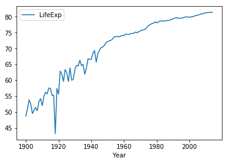
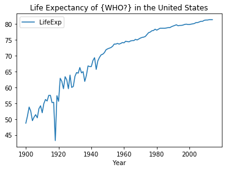
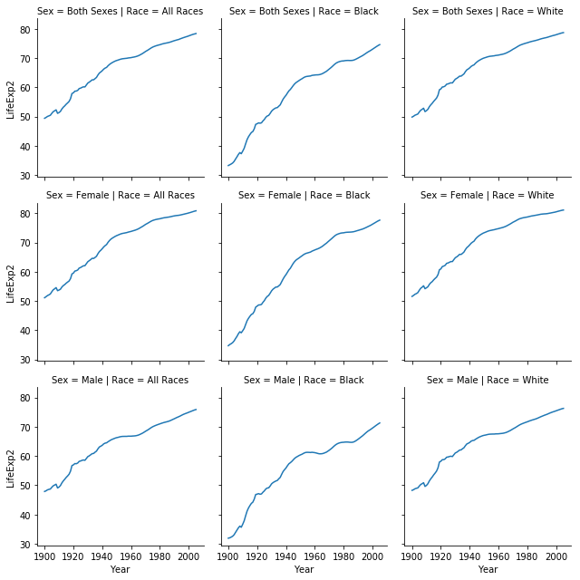

_[Link to Notebook Version of Lab](https://github.com/organisciak/Scripting-Course/blob/master/labs/06-visualization-lab.ipynb)_


# Lab 6 - Part 1

This week's lab will be submitted in two weeks, combined with next week's lab.

As we move toward your final projects, we're also practicing our 'figure out new stuff' skills. Remember the high level tips: look at documentation in Jupyter, try auto-fill to see what methods exist, search Google, search Stack Overflow, and read the documentation for the library (i.e. at http://pandas.pydata.org/).


```python
import pandas as pd
%matplotlib inline
```

## Dataset #1: Life Expectancy By Year, Race, Gender

Load this CDC dataset, _Death rates and life expectancy at birth_. Details about the dataset are at [Data.gov](https://catalog.data.gov/dataset/age-adjusted-death-rates-and-life-expectancy-at-birth-all-races-both-sexes-united-sta-1900).


```python
data = pd.read_csv('https://data.cdc.gov/api/views/w9j2-ggv5/rows.csv?accessType=DOWNLOAD')
# Rename columns to something shorter
data = data.rename(columns={"Average Life Expectancy (Years)": "LifeExp", "Age-adjusted Death Rate": "DeathRate"})
data.sample(10)
```


<div>
<style scoped>
    .dataframe tbody tr th:only-of-type {
        vertical-align: middle;
    }

    .dataframe tbody tr th {
        vertical-align: top;
    }

    .dataframe thead th {
        text-align: right;
    }
</style>
<table border="1" class="dataframe">
  <thead>
    <tr style="text-align: right;">
      <th></th>
      <th>Year</th>
      <th>Race</th>
      <th>Sex</th>
      <th>LifeExp</th>
      <th>DeathRate</th>
    </tr>
  </thead>
  <tbody>
    <tr>
      <th>989</th>
      <td>1954</td>
      <td>White</td>
      <td>Male</td>
      <td>67.5</td>
      <td>1516.3</td>
    </tr>
    <tr>
      <th>411</th>
      <td>1952</td>
      <td>Black</td>
      <td>Both Sexes</td>
      <td>61.4</td>
      <td>1671.3</td>
    </tr>
    <tr>
      <th>212</th>
      <td>1919</td>
      <td>All Races</td>
      <td>Female</td>
      <td>56.0</td>
      <td>1973.1</td>
    </tr>
    <tr>
      <th>393</th>
      <td>1970</td>
      <td>Black</td>
      <td>Both Sexes</td>
      <td>64.1</td>
      <td>1518.1</td>
    </tr>
    <tr>
      <th>80</th>
      <td>1935</td>
      <td>All Races</td>
      <td>Both Sexes</td>
      <td>61.7</td>
      <td>1860.1</td>
    </tr>
    <tr>
      <th>173</th>
      <td>1958</td>
      <td>All Races</td>
      <td>Female</td>
      <td>72.9</td>
      <td>1120.9</td>
    </tr>
    <tr>
      <th>976</th>
      <td>1967</td>
      <td>White</td>
      <td>Male</td>
      <td>67.8</td>
      <td>1566.9</td>
    </tr>
    <tr>
      <th>389</th>
      <td>1974</td>
      <td>Black</td>
      <td>Both Sexes</td>
      <td>66.0</td>
      <td>1397.7</td>
    </tr>
    <tr>
      <th>227</th>
      <td>1904</td>
      <td>All Races</td>
      <td>Female</td>
      <td>49.1</td>
      <td>2358.8</td>
    </tr>
    <tr>
      <th>468</th>
      <td>2011</td>
      <td>Black</td>
      <td>Female</td>
      <td>78.2</td>
      <td>739.8</td>
    </tr>
  </tbody>
</table>
</div>


**Questions**



- Which Race / Gender is represented in the above plot:
  - Black / Male
  - White / Both Sexes
  - White / Female  (or the similar looking All Races / Female)
  - Black / Both Sexes
  
- Write code to recreate the above plot, but giving the plot a sensible title, like below. This will require a skill not mentioned in class.



- Modify the above code to add a y-axis label, *Life Expectancy (Years)*. You can't change the axis labels within `plot()`. However, you can set the output of a `plot()` method to a variable, and that variable will have a method to *set* the *y-axis*.


- Write the code to plot a histogram of the life expectancy values across all conditions and years.

- Which Race+Sex group had the lowest life expectancy, and in what year?
  - Black Male in 1907
  - Black Female in 1918
  - Black Male in 1904
  
- To one precision point (e.g. XX.X), fill in the blanks:

<table border="1" class="dataframe">
  <thead>
    <tr style="text-align: right;">
      <th></th>
      <th></th>
      <th>LifeExp</th>
    </tr>
    <tr>
      <th>Race</th>
      <th>Sex</th>
      <th></th>
    </tr>
  </thead>
  <tbody>
    <tr>
      <th rowspan="3" valign="top">All Races</th>
      <th>Both Sexes</th>
        <td><bold>BLANK</bold></td>
    </tr>
    <tr>
      <th>Female</th>
      <td>69.2</td>
    </tr>
    <tr>
      <th>Male</th>
      <td>64.0</td>
    </tr>
    <tr>
      <th rowspan="3" valign="top">Black</th>
      <th>Both Sexes</th>
      <td>58.4</td>
    </tr>
    <tr>
      <th>Female</th>
      <td>61.0</td>
    </tr>
    <tr>
      <th>Male</th>
      <td><bold>BLANK</bold></td>
    </tr>
    <tr>
      <th rowspan="3" valign="top">White</th>
      <th>Both Sexes</th>
      <td>67.3</td>
    </tr>
    <tr>
      <th>Female</th>
      <td><bold>BLANK</bold></td>
    </tr>
    <tr>
      <th>Male</th>
      <td>64.8</td>
    </tr>
  </tbody>
</table>

- In point-form steps, how might you get average life expectancy by decade for All Races / Both Sexes? I'm interested in how you think through the solution - code is optional.

- Read the Seaborn documentation for FacetGrid (docs at https://seaborn.pydata.org/), and write the code to mimic the following chart. (Note, the lines will look different: I modified the data here so that it doesn't give away an earlier answer).

