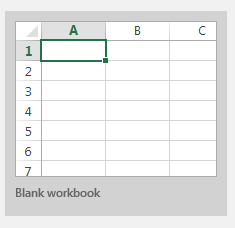
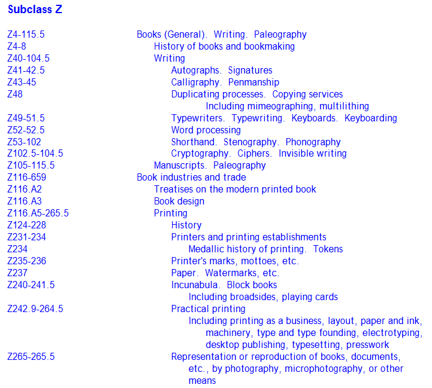
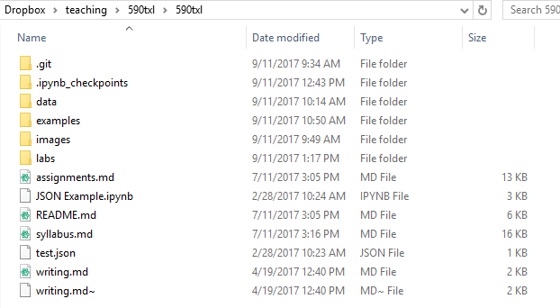
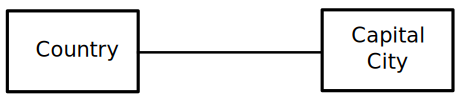
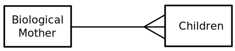

_[Link to Slides](http://www.porganized.com/Scripting-Course/slides/01-introduction.html)_


# Week 1: Scripting for Large Databases


## Today

- Introductions
- Course Overview
- Introduction to Relational Databases
- Introduction to the Scipy Stack
- Hello World

## Announcements?

## Who are you?

- What are you looking for from this course?
- What past technical experience do you have?
- Did you do anything fun over the break?

## Our tools

- [Canvas](https://canvas.du.edu/courses/65023/assignments/syllabus), [Slides](http://www.porganized.com/Scripting-Course/slides/01-introduction.html#/)

## Course Overview

### What this course is *not*

**This is not a programming course - but we'll use programming.**

Essentially, we'll be covering a 'data science subset' of Python.

You won't be a Python pro at the end, but you'll be comfortable with the basics, and knowledgeable in data science concepts.

Nothing that you'll be asked to do will be different from things that you'll see in class.

**This is not a Databases courses - but we'll review the basics.**

There is already a Database course offered in LIS.

We focus less on *design and setup*, and more on *use and analysis*.

Some components of a Database class:

- relational databases
- data modeling and database design
- data abstractions
- inserting data, retrieving data
- updates, deletions
- ER Diagrams
- First order logic
- noSQL database design
- noSQL database use
- infrastructure, setup

### What this course *is*

**We'll focus on use and analysis of *structured and semi-structured data*.**

Making large amounts of data malleable.

Going from data storage to data analysis.


**This is a practical course.**

- Lots of hands-on work.
- Readings are grounded in use.
- A big portion of the grade is labs.

(If you're in my Digital Humanities class this quarter, you may get whiplash between the two.)

## "Oh no, I'm not technical!"

Cornerstone of class is still inquiry, investigation, curiosity.

When I've taught skills-based LIS courses in the past, the non-programmers did *slightly* better.  

# Structured Data

Relational databases are heavily structured:

- Expectable data format
- Enforcement of data types, schema
- Relationships encoded

Structured data gives computers a warm and fuzzy feeling.

- Think _measurements_, _tables_, _spreadsheets_

### Where do  we see structured data?



## Unstructured Data

- Data that is not organized into a pre-defined format.
- Needs to be figured out.

- Think _raw text_, _images_

#### Unstructured

- "Hello, my name is Inigo Montoya. You killed my father. Prepare to die."
- "My name is Maximus Decimus Meridius, Commander of the armies of the North, General of the Felix Legions. Loyal servant to the true emperor, Marcus Aurelius. Father to a murdered son, Husband to a murdered wife, and I will have my vengeance, in this life or the next."
- "My name is Shoshana Dreyfus, and this is the face...of Jewish vengeance!"
- "I am Diana of Themyscira. Daughter of Hippolyta. In the name of all that is good, your wrath upon this world is over!" 


#### *vs.* Structured

| Name | Motivation |
|------|------------|
|Inigo Montoya|Vengeance|
|Maximus Decimus Meridius|Vengeance|
|Shoshana Dreyfus|Vengeance|
|Diana of Themyscira|Vengeance|


## Semi-Structured Data

- self-describing: data is internally labeled, but the structure needs to be learned
- more complex structure: you can't just look at the heading to figure it out
    - no "one size fits all" organization
    
- Think hierarchical data, graph data, folksonomies (tags), etc.

>    Traditional database systems rely on an old model: the relational data model.
    When it was proposed in the early 1970’s by Codd, a logician, the relational
    model generated a true revolution in data management. ...
>
>    The age of the Internet brought new data management applications and challenges.
    Data is now accessed over the Web, and is available in
    a variety of formats, including HTML, XML, as well as several application specific data formats.
    Often data is mixed with free text, and the boundary between data and text is sometimes blurred.
    The way the data can be retrieved also varies considerably: some instances can be downloaded entirely,
    others can only be accessed through limited capabilities.
    
From the [_Foundations of Semistructured Data_](https://www.dagstuhl.de/Reports/01/01361.pdf), a reading list by Mendelzon, Schwentick, Suciu.

** Where do you see semi-structured data?**





Can you say that a third level of nesting is different than a fourth?

## Topics

- Relational Databases, Structured Data, SQL
- Unstructured Data, NoSQL, JSON, MongoDB
- Large data patterns - What types of questions might you ask?

_back to course overview_

## Learning Outcomes

Upon satisfactory completion of the course, students will be able to:

1.  Demonstrate knowledge of relational database fundamentals.

2.  Use SQL and Pandas for structured data querying and analysis.

3.  Understand the contexts of use for NoSQL, and apply them
    with MongoDB.

4.  Apply fundamental data mining concepts in information
    science contexts.

5.  Collect and organize data from the web.

6.  Understand aggregations and transformations for structured and
    semi-structured data.

7.  Understand and apply large data patterns, such as Map-Reduce
    and Split-Apply-Combine.

## Assignments

### Labs – 625 pts
- 7 weekly labs – 4x100pts, 3x75pts

The labs are small exercises of specific skills and knowledge.

### Analysis Project – 260 pts

Perform a data analysis on a dataset of interest. This assignment has
three parts: a problem statement (week 5, 30pts) and a data collection
progress report (week 8, 30pts), both shared on Canvas with colleagues
for comment, and a final report (week 10, 200pts). In another college,
there'd be an exam for this course. However, in our LIS context, it’s
important to apply your skills with an engaging, creative problem.

### Participation - 115pts

Your participation grade is based on engagement (online and in class), as well as attendance. Remember that poor attendance may indirectly
affect your grade on the assignment and labs: missing class will make
this course very difficult.

*Total: 1000 pts*

### Late Policy

-   Assignments are due 2 hours before the lecture starts.
-   Late assignments will lose 10% day, up to 50%. Late is better
    than never.
-   1 lab can be late without penalty, because sometimes life gets in
    the way.
-   Last day for late assignments: June 8th.

** For reference **

## Schedule Overview

- Week 1    Mar 29  Relational Databases, Data types, Introduction to the SciPy Stack
- Week 2    Apr 5    Relational Databases continued, Data collection, Jupyter and Python
- Week 3    Apr 12   SQLite, Basic Querying, Introduction to Pandas
- Week 4    Apr 19   Split-Apply-Combine, Deletions and Updates, Indexing
- Week 5    Apr 26   Summation, aggregation, and transformation
- Week 6    May 3    Visualization
- Week 7    May 10   MongoDB - Ingesting Data, document aggregations
- Week 8    May 17   Document aggregations continued; Map-Reduce
- Week 9    May 24   Regular Expressions
- Week 10   May 31   Advanced techniques, review


```python
## Tips
```

# Syllabus

https://canvas.du.edu/courses/65023/assignments/syllabus

# Relational Databases

Relational databases were proposed in 1970 by E.F. Codd.

- Expressed as tables
- Rows are unique, expressed with a key
- Relationships are expressed between tables by using keys
- Agnostic of storage procedures
    - A user doesn't need to worry about physical storage or distribution across multiple systems 
- Data-integrity is built into the database, not into the application

## Codd's 12 Rules*

**Rule 0: The foundation rule**: For any system that is advertised as, or claimed to be, a relational data base management system, that system must be able to manage data bases entirely through its relational capabilities.

**Rule 1: The information rule**: All information in a relational data base is represented explicitly at the logical level and in exactly one way – by values in tables.

**Rule 2: The guaranteed access rule**: Each and every datum (atomic value) in a relational data base is guaranteed to be logically accessible by resorting to a combination of table name, primary key value and column name.

*Zero index!*

**Rule 3: Systematic treatment of null values**: Null values (distinct from the empty character string or a string of blank characters and distinct from zero or any other number) are supported in fully relational DBMS for representing missing information and inapplicable information in a systematic way, independent of data type.

**Rule 4: Dynamic online catalog based on the relational model**: The data base description is represented at the logical level in the same way as ordinary data, so that authorized users can apply the same relational language to its interrogation as they apply to the regular data.

**Rule 5: The comprehensive data sublanguage rule**: A relational system may support several languages and various modes of terminal use (for example, the fill-in-the-blanks mode). However, there must be at least one language whose statements are expressible, per some well-defined syntax, as character strings and that is comprehensive in supporting all of the following items: Data definition; View definition; Data manipulation (interactive and by program); Integrity constraints; Authorization; Transaction boundaries.

**Rule 6: The view updating rule**: All views that are theoretically updatable are also updatable by the system.

**Rule 7: High-level insert, update, and delete**: The capability of handling a base relation or a derived relation as a single operand applies not only to the retrieval of data but also to the insertion, update and deletion of data.

**Rule 8: Physical data independence**: Application programs and terminal activities remain logically unimpaired whenever any changes are made in either storage representations or access methods.

**Rule 9: Logical data independence**:  Application programs and terminal activities remain logically unimpaired when information-preserving changes of any kind that theoretically permit unimpairment are made to the base tables.

**Rule 10: Integrity independence**: Integrity constraints specific to a particular relational data base must be definable in the relational data sublanguage and storable in the catalog, not in the application programs.

**Rule 11: Distribution independence**: The end-user must not be able to see that the data is distributed over various locations. Users should always get the impression that the data is located at one site only.

**Rule 12: The nonsubversion rule**: If a relational system has a low-level (single-record-at-a-time) language, that low level cannot be used to subvert or bypass the integrity rules and constraints expressed in the higher level relational language (multiple-records-at-a-time). 

## SQL - Structured Query Language

- A language formalizing access to relational databases

 > _Rule 5: The comprehensive data sublanguage rule: A relational system may support several languages and various modes of terminal use (for example, the fill-in-the-blanks mode). However, there must be at least one language whose statements are expressible, per some well-defined syntax, as character strings and that is comprehensive in supporting all of the following items: Data definition; View definition; Data manipulation (interactive and by program); Integrity constraints; Authorization; Transaction boundaries._

Not everybody adheres to it exactly, but most relational databases use a close variant of SQL.

If you learn MySQL, you can pick up PostgresSQL, and Microsoft's SQLServer, and SQLite, etc.

## So what's NoSQL?

NoSQL isn't really refering to the access language; more fundamentally, it refers to databases that at _not relational_.

These systems come in various forms, often with their own access logic. There is no real 'NoSQL' syntax.

## Relationships between tables

Left Join


_[Via](https://pandas.pydata.org/pandas-docs/stable/merging.html)_

Left Inner Join


## Types of Relationships

- One to One Relationships



- One to Many Relationships



- Many to Many Relationships


# The SciPy Stack

This is our _toolbelt_. It's a collection of data science tools for Python.

- NumPy
- SciPy library
- pandas
- Matplotlib
- IPython

Plus
- Jupyter
- Sci-kit Learn
- Seaborn


# Example Demonstration


```python
%matplotlib inline
import pandas as pd
import seaborn as sns
sns.set(style="ticks")
```

Load the Iris dataset, a famous sample datasets introduced by Fisher in:

    Fisher,R.A. "The use of multiple measurements in taxonomic problems". Annual Eugenics, 7, Part II, 179-188 (1936).


```python
iris = sns.load_dataset("iris")
iris.sample(10)
```


<div>
<style scoped>
    .dataframe tbody tr th:only-of-type {
        vertical-align: middle;
    }

    .dataframe tbody tr th {
        vertical-align: top;
    }

    .dataframe thead th {
        text-align: right;
    }
</style>
<table border="1" class="dataframe">
  <thead>
    <tr style="text-align: right;">
      <th></th>
      <th>sepal_length</th>
      <th>sepal_width</th>
      <th>petal_length</th>
      <th>petal_width</th>
      <th>species</th>
    </tr>
  </thead>
  <tbody>
    <tr>
      <th>73</th>
      <td>6.1</td>
      <td>2.8</td>
      <td>4.7</td>
      <td>1.2</td>
      <td>versicolor</td>
    </tr>
    <tr>
      <th>43</th>
      <td>5.0</td>
      <td>3.5</td>
      <td>1.6</td>
      <td>0.6</td>
      <td>setosa</td>
    </tr>
    <tr>
      <th>100</th>
      <td>6.3</td>
      <td>3.3</td>
      <td>6.0</td>
      <td>2.5</td>
      <td>virginica</td>
    </tr>
    <tr>
      <th>26</th>
      <td>5.0</td>
      <td>3.4</td>
      <td>1.6</td>
      <td>0.4</td>
      <td>setosa</td>
    </tr>
    <tr>
      <th>94</th>
      <td>5.6</td>
      <td>2.7</td>
      <td>4.2</td>
      <td>1.3</td>
      <td>versicolor</td>
    </tr>
    <tr>
      <th>125</th>
      <td>7.2</td>
      <td>3.2</td>
      <td>6.0</td>
      <td>1.8</td>
      <td>virginica</td>
    </tr>
    <tr>
      <th>104</th>
      <td>6.5</td>
      <td>3.0</td>
      <td>5.8</td>
      <td>2.2</td>
      <td>virginica</td>
    </tr>
    <tr>
      <th>99</th>
      <td>5.7</td>
      <td>2.8</td>
      <td>4.1</td>
      <td>1.3</td>
      <td>versicolor</td>
    </tr>
    <tr>
      <th>145</th>
      <td>6.7</td>
      <td>3.0</td>
      <td>5.2</td>
      <td>2.3</td>
      <td>virginica</td>
    </tr>
    <tr>
      <th>148</th>
      <td>6.2</td>
      <td>3.4</td>
      <td>5.4</td>
      <td>2.3</td>
      <td>virginica</td>
    </tr>
  </tbody>
</table>
</div>


```python
iris.groupby(['species']).mean()
```


<div>
<style scoped>
    .dataframe tbody tr th:only-of-type {
        vertical-align: middle;
    }

    .dataframe tbody tr th {
        vertical-align: top;
    }

    .dataframe thead th {
        text-align: right;
    }
</style>
<table border="1" class="dataframe">
  <thead>
    <tr style="text-align: right;">
      <th></th>
      <th>sepal_length</th>
      <th>sepal_width</th>
      <th>petal_length</th>
      <th>petal_width</th>
    </tr>
    <tr>
      <th>species</th>
      <th></th>
      <th></th>
      <th></th>
      <th></th>
    </tr>
  </thead>
  <tbody>
    <tr>
      <th>setosa</th>
      <td>5.006</td>
      <td>3.428</td>
      <td>1.462</td>
      <td>0.246</td>
    </tr>
    <tr>
      <th>versicolor</th>
      <td>5.936</td>
      <td>2.770</td>
      <td>4.260</td>
      <td>1.326</td>
    </tr>
    <tr>
      <th>virginica</th>
      <td>6.588</td>
      <td>2.974</td>
      <td>5.552</td>
      <td>2.026</td>
    </tr>
  </tbody>
</table>
</div>


```python
iris.groupby(['species']).aggregate(['mean', 'std', 'sem'])
```


<div>
<style scoped>
    .dataframe tbody tr th:only-of-type {
        vertical-align: middle;
    }

    .dataframe tbody tr th {
        vertical-align: top;
    }

    .dataframe thead tr th {
        text-align: left;
    }

    .dataframe thead tr:last-of-type th {
        text-align: right;
    }
</style>
<table border="1" class="dataframe">
  <thead>
    <tr>
      <th></th>
      <th colspan="3" halign="left">sepal_length</th>
      <th colspan="3" halign="left">sepal_width</th>
      <th colspan="3" halign="left">petal_length</th>
      <th colspan="3" halign="left">petal_width</th>
    </tr>
    <tr>
      <th></th>
      <th>mean</th>
      <th>std</th>
      <th>sem</th>
      <th>mean</th>
      <th>std</th>
      <th>sem</th>
      <th>mean</th>
      <th>std</th>
      <th>sem</th>
      <th>mean</th>
      <th>std</th>
      <th>sem</th>
    </tr>
    <tr>
      <th>species</th>
      <th></th>
      <th></th>
      <th></th>
      <th></th>
      <th></th>
      <th></th>
      <th></th>
      <th></th>
      <th></th>
      <th></th>
      <th></th>
      <th></th>
    </tr>
  </thead>
  <tbody>
    <tr>
      <th>setosa</th>
      <td>5.006</td>
      <td>0.352490</td>
      <td>0.049850</td>
      <td>3.428</td>
      <td>0.379064</td>
      <td>0.053608</td>
      <td>1.462</td>
      <td>0.173664</td>
      <td>0.024560</td>
      <td>0.246</td>
      <td>0.105386</td>
      <td>0.014904</td>
    </tr>
    <tr>
      <th>versicolor</th>
      <td>5.936</td>
      <td>0.516171</td>
      <td>0.072998</td>
      <td>2.770</td>
      <td>0.313798</td>
      <td>0.044378</td>
      <td>4.260</td>
      <td>0.469911</td>
      <td>0.066455</td>
      <td>1.326</td>
      <td>0.197753</td>
      <td>0.027966</td>
    </tr>
    <tr>
      <th>virginica</th>
      <td>6.588</td>
      <td>0.635880</td>
      <td>0.089927</td>
      <td>2.974</td>
      <td>0.322497</td>
      <td>0.045608</td>
      <td>5.552</td>
      <td>0.551895</td>
      <td>0.078050</td>
      <td>2.026</td>
      <td>0.274650</td>
      <td>0.038841</td>
    </tr>
  </tbody>
</table>
</div>


```python
iris.plot(kind='scatter', x='petal_length', y='petal_width')
```


    <matplotlib.axes._subplots.AxesSubplot at 0x24bd16c3198>


```python
sns.lmplot(data=iris, x='petal_length', y='petal_width', hue='species', fit_reg=False)
```


    <seaborn.axisgrid.FacetGrid at 0x24bd1a0ab00>


```python
sns.pairplot(iris, hue='species')
```


    <seaborn.axisgrid.PairGrid at 0x24bcb059940>


# Adding data to a relational datadase

Create a connection to an SQLite database.

SQLite is a very lightweight (i.e. easy to set up) relational database - SQL skills used with it will largely transfer to Postgres, SQLServer, MySQL, etc.


```python
import sqlite3
conn = sqlite3.connect('../data/week1-example.db')
conn
```


    <sqlite3.Connection at 0x24bd20d4d50>


Tada!

### Create a table and insert data

_This example is from the [Python documentation](https://docs.python.org/2/library/sqlite3.html)._

Use the `CREATE TABLE` syntax to create a table, then `INSERT` to add some data.


```python
c = conn.cursor()
c.execute('''CREATE TABLE stocks
            (date text, trans text, symbol text, qty real, price real)''')
```


    <sqlite3.Cursor at 0x24bd1669c70>


A *cursor* is a temporary workspace, before you save or fetch data.


```python
c.execute("INSERT INTO stocks VALUES ('2006-01-05','BUY','RHAT',100,35.14)")
```


    <sqlite3.Cursor at 0x24bd1669c70>


```python
# Save it!
conn.commit()
```

Get the Data back out with a `SELECT` statement.


```python
c.execute("SELECT * FROM stocks")
c.fetchall()
```


    [('2006-01-05', 'BUY', 'RHAT', 100.0, 35.14)]


## Scaffolding to SQLite with Pandas.

Now lets try the `CREATE TABLE` and `INSERT` with Pandas.

I've downloaded and prepared a dataset of GoodReads book ratings ([Source](https://www.kaggle.com/gnanesh/goodreads-book-reviews/downloads/goodreads-book-reviews.zip/2)), let's open it on the computer:


```python
import pandas as pd
# Data downloaded from Kaggle: 
data = pd.read_csv("../data/br-trimmed.csv.bz2", compression='bz2')
data.head()
```


<div>
<style scoped>
    .dataframe tbody tr th:only-of-type {
        vertical-align: middle;
    }

    .dataframe tbody tr th {
        vertical-align: top;
    }

    .dataframe thead th {
        text-align: right;
    }
</style>
<table border="1" class="dataframe">
  <thead>
    <tr style="text-align: right;">
      <th></th>
      <th>bookID</th>
      <th>title</th>
      <th>author</th>
      <th>rating</th>
      <th>ratingsCount</th>
      <th>reviewsCount</th>
      <th>reviewerName</th>
      <th>reviewerRatings</th>
    </tr>
  </thead>
  <tbody>
    <tr>
      <th>0</th>
      <td>9</td>
      <td>Unauthorized Harry Potter Book Seven News: "Ha...</td>
      <td>W. Frederick Zimmerman</td>
      <td>3.73</td>
      <td>22</td>
      <td>1</td>
      <td>Charles G</td>
      <td>3.0</td>
    </tr>
    <tr>
      <th>1</th>
      <td>8</td>
      <td>Harry Potter Boxed Set, Books 1-5 (Harry Potte...</td>
      <td>J.K. Rowling</td>
      <td>4.77</td>
      <td>34107</td>
      <td>156</td>
      <td>✿Katherine Elizabeth✿</td>
      <td>5.0</td>
    </tr>
    <tr>
      <th>2</th>
      <td>3</td>
      <td>Harry Potter and the Sorcerer's Stone</td>
      <td>J.K. Rowling</td>
      <td>4.44</td>
      <td>4911929</td>
      <td>77741</td>
      <td>Lora</td>
      <td>5.0</td>
    </tr>
    <tr>
      <th>3</th>
      <td>1</td>
      <td>Harry Potter and the Half-Blood Prince (Harry ...</td>
      <td>J.K. Rowling</td>
      <td>4.54</td>
      <td>1810404</td>
      <td>28053</td>
      <td>Cait (Paper Fury)</td>
      <td>5.0</td>
    </tr>
    <tr>
      <th>4</th>
      <td>2</td>
      <td>Harry Potter and the Order of the Phoenix (Har...</td>
      <td>J.K. Rowling</td>
      <td>4.47</td>
      <td>1862749</td>
      <td>29308</td>
      <td>Diane ϟ [ Lestrange ]</td>
      <td>5.0</td>
    </tr>
  </tbody>
</table>
</div>


The dataset is a bit messy - 300k reviews - ultimately not too big - without much documentation.

_This block is hidden in the slideshow! This is background info._

Here's how the data was prepared on the unix command line with `cat`, `bzip2`, and `csvkit`, removing the text review to significantly trim the size:

```bash
cat br.csv | csvcut -c 1-8 | bzip2 -c >br-trimmed.csv.bz2
```

This data is *structured* - perfect for a database.

We already have a connection open to SQLite - lets drop the data there.


```python
data.to_sql(name='goodreads', con=conn)
```

That's it - all $312074$ rows are in!

Let's try selecting in the tradition, SQL-based way.


```python
c.execute("SELECT * FROM goodreads")
c.fetchone()
```


    (0,
     9,
     'Unauthorized Harry Potter Book Seven News: "Half-Blood Prince" Analysis and Speculation',
     'W. Frederick Zimmerman',
     3.73,
     22,
     1,
     'Charles G',
     3.0)


```python
c.execute("SELECT count(*) FROM goodreads")
c.fetchone()
```


    (312074,)


### `SELECT`ing data with Pandas


```python
data = pd.read_sql("SELECT * FROM goodreads", conn)
data.head()
```


<div>
<style scoped>
    .dataframe tbody tr th:only-of-type {
        vertical-align: middle;
    }

    .dataframe tbody tr th {
        vertical-align: top;
    }

    .dataframe thead th {
        text-align: right;
    }
</style>
<table border="1" class="dataframe">
  <thead>
    <tr style="text-align: right;">
      <th></th>
      <th>index</th>
      <th>bookID</th>
      <th>title</th>
      <th>author</th>
      <th>rating</th>
      <th>ratingsCount</th>
      <th>reviewsCount</th>
      <th>reviewerName</th>
      <th>reviewerRatings</th>
    </tr>
  </thead>
  <tbody>
    <tr>
      <th>0</th>
      <td>0</td>
      <td>9</td>
      <td>Unauthorized Harry Potter Book Seven News: "Ha...</td>
      <td>W. Frederick Zimmerman</td>
      <td>3.73</td>
      <td>22</td>
      <td>1</td>
      <td>Charles G</td>
      <td>3.0</td>
    </tr>
    <tr>
      <th>1</th>
      <td>1</td>
      <td>8</td>
      <td>Harry Potter Boxed Set, Books 1-5 (Harry Potte...</td>
      <td>J.K. Rowling</td>
      <td>4.77</td>
      <td>34107</td>
      <td>156</td>
      <td>✿Katherine Elizabeth✿</td>
      <td>5.0</td>
    </tr>
    <tr>
      <th>2</th>
      <td>2</td>
      <td>3</td>
      <td>Harry Potter and the Sorcerer's Stone</td>
      <td>J.K. Rowling</td>
      <td>4.44</td>
      <td>4911929</td>
      <td>77741</td>
      <td>Lora</td>
      <td>5.0</td>
    </tr>
    <tr>
      <th>3</th>
      <td>3</td>
      <td>1</td>
      <td>Harry Potter and the Half-Blood Prince (Harry ...</td>
      <td>J.K. Rowling</td>
      <td>4.54</td>
      <td>1810404</td>
      <td>28053</td>
      <td>Cait (Paper Fury)</td>
      <td>5.0</td>
    </tr>
    <tr>
      <th>4</th>
      <td>4</td>
      <td>2</td>
      <td>Harry Potter and the Order of the Phoenix (Har...</td>
      <td>J.K. Rowling</td>
      <td>4.47</td>
      <td>1862749</td>
      <td>29308</td>
      <td>Diane ϟ [ Lestrange ]</td>
      <td>5.0</td>
    </tr>
  </tbody>
</table>
</div>


### Analysis with Pandas

**Q**: Which authors have the most reviews?

_(any guesses?)_


```python
data.author.value_counts().head(10)
```


    William Shakespeare    851
    Anonymous              740
    Stephen King           522
    R.L. Stine             416
    C.S. Lewis             335
    J.R.R. Tolkien         334
    Fyodor Dostoyevsky     325
    Harold Bloom           319
    Agatha Christie        318
    Roald Dahl             296
    Name: author, dtype: int64


**Q**: Which popular authors have the best average rating?

Get the count of reviews and mean rating for authors.


```python
authors = data.groupby('author').rating.aggregate(['count', 'mean', 'var'])
authors.head(3)
```


<div>
<style scoped>
    .dataframe tbody tr th:only-of-type {
        vertical-align: middle;
    }

    .dataframe tbody tr th {
        vertical-align: top;
    }

    .dataframe thead th {
        text-align: right;
    }
</style>
<table border="1" class="dataframe">
  <thead>
    <tr style="text-align: right;">
      <th></th>
      <th>count</th>
      <th>mean</th>
      <th>var</th>
    </tr>
    <tr>
      <th>author</th>
      <th></th>
      <th></th>
      <th></th>
    </tr>
  </thead>
  <tbody>
    <tr>
      <th>&amp;#x2BB;Abd Alla&amp;#x304;h Shahba&amp;#x304;zi&amp;#x304;</th>
      <td>1</td>
      <td>0.00</td>
      <td>NaN</td>
    </tr>
    <tr>
      <th>&amp;. Jayne Ernest</th>
      <td>1</td>
      <td>4.08</td>
      <td>NaN</td>
    </tr>
    <tr>
      <th>'N Sync</th>
      <td>5</td>
      <td>3.31</td>
      <td>3.9482</td>
    </tr>
  </tbody>
</table>
</div>


Select popular authors.


```python
popular = authors.query('count > 100')
print("We now have", len(popular), "authors")
```

    We now have 136 authors


Sort.


```python
popular.sort_values('mean', ascending=False).head()
```


<div>
<style scoped>
    .dataframe tbody tr th:only-of-type {
        vertical-align: middle;
    }

    .dataframe tbody tr th {
        vertical-align: top;
    }

    .dataframe thead th {
        text-align: right;
    }
</style>
<table border="1" class="dataframe">
  <thead>
    <tr style="text-align: right;">
      <th></th>
      <th>count</th>
      <th>mean</th>
      <th>var</th>
    </tr>
    <tr>
      <th>author</th>
      <th></th>
      <th></th>
      <th></th>
    </tr>
  </thead>
  <tbody>
    <tr>
      <th>J.K. Rowling</th>
      <td>220</td>
      <td>4.490409</td>
      <td>0.007114</td>
    </tr>
    <tr>
      <th>Jorge Luis Borges</th>
      <td>103</td>
      <td>4.266505</td>
      <td>0.101380</td>
    </tr>
    <tr>
      <th>Hal Leonard Publishing Company</th>
      <td>110</td>
      <td>4.262727</td>
      <td>0.366813</td>
    </tr>
    <tr>
      <th>Patrick O'Brian</th>
      <td>103</td>
      <td>4.259612</td>
      <td>0.049629</td>
    </tr>
    <tr>
      <th>Max Lucado</th>
      <td>123</td>
      <td>4.259593</td>
      <td>0.198932</td>
    </tr>
  </tbody>
</table>
</div>


**Q**: Which popular authors have the worst average rating?


```python
popular.sort_values('mean').head()
```


<div>
<style scoped>
    .dataframe tbody tr th:only-of-type {
        vertical-align: middle;
    }

    .dataframe tbody tr th {
        vertical-align: top;
    }

    .dataframe thead th {
        text-align: right;
    }
</style>
<table border="1" class="dataframe">
  <thead>
    <tr style="text-align: right;">
      <th></th>
      <th>count</th>
      <th>mean</th>
      <th>var</th>
    </tr>
    <tr>
      <th>author</th>
      <th></th>
      <th></th>
      <th></th>
    </tr>
  </thead>
  <tbody>
    <tr>
      <th>Various</th>
      <td>145</td>
      <td>2.614138</td>
      <td>3.557917</td>
    </tr>
    <tr>
      <th>SparkNotes</th>
      <td>131</td>
      <td>3.343206</td>
      <td>1.535616</td>
    </tr>
    <tr>
      <th>NOT A BOOK</th>
      <td>101</td>
      <td>3.394554</td>
      <td>2.809939</td>
    </tr>
    <tr>
      <th>Wolfgang Hohlbein</th>
      <td>139</td>
      <td>3.437266</td>
      <td>0.311810</td>
    </tr>
    <tr>
      <th>Herman Melville</th>
      <td>118</td>
      <td>3.515932</td>
      <td>0.117853</td>
    </tr>
  </tbody>
</table>
</div>


**Q**: Which popular authors are most divisive?


```python
popular.sort_values('var', ascending=False).head(15)
```


<div>
<style scoped>
    .dataframe tbody tr th:only-of-type {
        vertical-align: middle;
    }

    .dataframe tbody tr th {
        vertical-align: top;
    }

    .dataframe thead th {
        text-align: right;
    }
</style>
<table border="1" class="dataframe">
  <thead>
    <tr style="text-align: right;">
      <th></th>
      <th>count</th>
      <th>mean</th>
      <th>var</th>
    </tr>
    <tr>
      <th>author</th>
      <th></th>
      <th></th>
      <th></th>
    </tr>
  </thead>
  <tbody>
    <tr>
      <th>Various</th>
      <td>145</td>
      <td>2.614138</td>
      <td>3.557917</td>
    </tr>
    <tr>
      <th>NOT A BOOK</th>
      <td>101</td>
      <td>3.394554</td>
      <td>2.809939</td>
    </tr>
    <tr>
      <th>SparkNotes</th>
      <td>131</td>
      <td>3.343206</td>
      <td>1.535616</td>
    </tr>
    <tr>
      <th>Anonymous</th>
      <td>740</td>
      <td>3.945270</td>
      <td>1.422790</td>
    </tr>
    <tr>
      <th>Terry Deary</th>
      <td>164</td>
      <td>3.663598</td>
      <td>1.067339</td>
    </tr>
    <tr>
      <th>Harold Bloom</th>
      <td>319</td>
      <td>3.621505</td>
      <td>0.944466</td>
    </tr>
    <tr>
      <th>Mort Walker</th>
      <td>112</td>
      <td>3.794821</td>
      <td>0.915950</td>
    </tr>
    <tr>
      <th>Jalaluddin Rumi</th>
      <td>131</td>
      <td>4.145496</td>
      <td>0.791400</td>
    </tr>
    <tr>
      <th>Zane Grey</th>
      <td>182</td>
      <td>3.561044</td>
      <td>0.662960</td>
    </tr>
    <tr>
      <th>René Goscinny</th>
      <td>105</td>
      <td>3.970000</td>
      <td>0.656037</td>
    </tr>
    <tr>
      <th>James Joyce</th>
      <td>107</td>
      <td>3.697290</td>
      <td>0.618982</td>
    </tr>
    <tr>
      <th>Anton Chekhov</th>
      <td>195</td>
      <td>3.896359</td>
      <td>0.553781</td>
    </tr>
    <tr>
      <th>Unknown</th>
      <td>110</td>
      <td>3.604000</td>
      <td>0.542138</td>
    </tr>
    <tr>
      <th>Thomas Hardy</th>
      <td>112</td>
      <td>3.743839</td>
      <td>0.421692</td>
    </tr>
    <tr>
      <th>Honoré de Balzac</th>
      <td>125</td>
      <td>3.662880</td>
      <td>0.416908</td>
    </tr>
  </tbody>
</table>
</div>


```python
popular.sort_values('var').head()
```


<div>
<style scoped>
    .dataframe tbody tr th:only-of-type {
        vertical-align: middle;
    }

    .dataframe tbody tr th {
        vertical-align: top;
    }

    .dataframe thead th {
        text-align: right;
    }
</style>
<table border="1" class="dataframe">
  <thead>
    <tr style="text-align: right;">
      <th></th>
      <th>count</th>
      <th>mean</th>
      <th>var</th>
    </tr>
    <tr>
      <th>author</th>
      <th></th>
      <th></th>
      <th></th>
    </tr>
  </thead>
  <tbody>
    <tr>
      <th>J.K. Rowling</th>
      <td>220</td>
      <td>4.490409</td>
      <td>0.007114</td>
    </tr>
    <tr>
      <th>Dante Alighieri</th>
      <td>115</td>
      <td>4.000609</td>
      <td>0.007922</td>
    </tr>
    <tr>
      <th>Lemony Snicket</th>
      <td>113</td>
      <td>3.954956</td>
      <td>0.011188</td>
    </tr>
    <tr>
      <th>Robert B. Parker</th>
      <td>112</td>
      <td>3.907589</td>
      <td>0.013280</td>
    </tr>
    <tr>
      <th>Edgar Rice Burroughs</th>
      <td>124</td>
      <td>3.815081</td>
      <td>0.015248</td>
    </tr>
  </tbody>
</table>
</div>


## Example with unstructured data, using *MongoDB*

Here's a [recipe dataset](https://www.kaggle.com/c/whats-cooking) from _Yummly_.


```python
import json
with open('../data/cooking.json') as f:
    data = json.load(f)

print("There are ", len(data), "items that look like this:")
data[:1]
```

    There are  39774 items that look like this:


    [{'cuisine': 'greek',
      'id': 10259,
      'ingredients': ['romaine lettuce',
       'black olives',
       'grape tomatoes',
       'garlic',
       'pepper',
       'purple onion',
       'seasoning',
       'garbanzo beans',
       'feta cheese crumbles']}]


```python
from pymongo import MongoClient
client = MongoClient('localhost', 27017)
db = client.week1
```


```python
# 'collection' in MongoDB is like a 'table' in SQL
collection = db.cooking
result = collection.insert_many(data)
```

How many records are there in the collection 'cooking' of the database 'week1'?


```python
collection.count()
```


    39774


With the data in MongoDB, we can query the semi-structured data with similar flexibility to structured data.

For example, we can unfold the ingredients, so that there's a record for every ingredient of even data point.


```python
pipeline = [
     {"$unwind": "$ingredients"}
]
agg = collection.aggregate(pipeline)

# Print first five results
list(agg)[:5]
```


    [{'_id': ObjectId('5abaa03a4b6d02da4a6906e9'),
      'cuisine': 'greek',
      'id': 10259,
      'ingredients': 'romaine lettuce'},
     {'_id': ObjectId('5abaa03a4b6d02da4a6906e9'),
      'cuisine': 'greek',
      'id': 10259,
      'ingredients': 'black olives'},
     {'_id': ObjectId('5abaa03a4b6d02da4a6906e9'),
      'cuisine': 'greek',
      'id': 10259,
      'ingredients': 'grape tomatoes'},
     {'_id': ObjectId('5abaa03a4b6d02da4a6906e9'),
      'cuisine': 'greek',
      'id': 10259,
      'ingredients': 'garlic'},
     {'_id': ObjectId('5abaa03a4b6d02da4a6906e9'),
      'cuisine': 'greek',
      'id': 10259,
      'ingredients': 'pepper'}]


Why unwind? Now it's easier to group the data, to count which ingredients are most common.


```python
pipeline = [
     {"$unwind": "$ingredients"},
     {"$group": {"_id": "$ingredients", "count": {"$sum": 1}}}
]
agg = collection.aggregate(pipeline)
list(agg)[:5]
```


    [{'_id': 'lop chong', 'count': 1},
     {'_id': 'Lipton® Iced Tea Brew Family Size Tea Bags', 'count': 1},
     {'_id': 'ciabatta loaf', 'count': 1},
     {'_id': 'cholesterol free egg substitute', 'count': 1},
     {'_id': 'Oscar Mayer Cotto Salami', 'count': 1}]


Unwind > Group > Sort


```python
pipeline = [
     {"$unwind": "$ingredients"},
     {"$group": {"_id": "$ingredients", "count": {"$sum": 1}}},
     {"$sort": {"count": -1}}
]
agg = collection.aggregate(pipeline)
list(agg)[:5]
```


    [{'_id': 'salt', 'count': 18049},
     {'_id': 'olive oil', 'count': 7972},
     {'_id': 'onions', 'count': 7972},
     {'_id': 'water', 'count': 7457},
     {'_id': 'garlic', 'count': 7380}]


Which cuisine+ingredient are most common in this dataset?


```python
pipeline = [
     {"$unwind": "$ingredients"},
     {"$group": {"_id": {
         "ingredients": "$ingredients", "cuisine": "$cuisine"
     }, "count": {"$sum": 1}}},
     {"$sort": {"count": -1}}
]
agg = collection.aggregate(pipeline)
list(agg)[:5]
```


    [{'_id': {'cuisine': 'italian', 'ingredients': 'salt'}, 'count': 3454},
     {'_id': {'cuisine': 'italian', 'ingredients': 'olive oil'}, 'count': 3111},
     {'_id': {'cuisine': 'mexican', 'ingredients': 'salt'}, 'count': 2720},
     {'_id': {'cuisine': 'southern_us', 'ingredients': 'salt'}, 'count': 2290},
     {'_id': {'cuisine': 'indian', 'ingredients': 'salt'}, 'count': 1934}]


# LAB

Today's lab is intended to get your system ready for the following 9 weeks, and to start getting comfortable with the tools.

It is at https://github.com/organisciak/Scripting-Course/blob/master/labs/01%20-%20Getting%20Started.ipynb.
