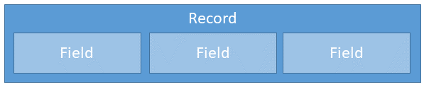
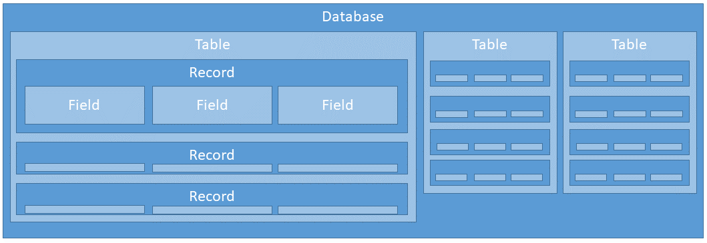
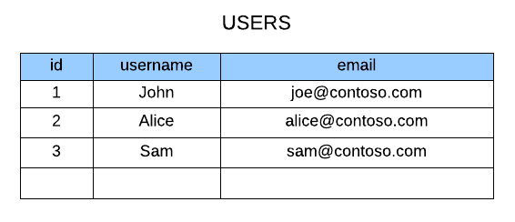
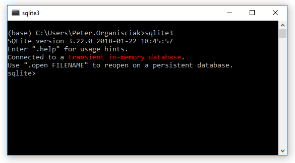

_[Link to Slides](http://www.porganized.com/Scripting-Course/slides/02-databases.html)_


# Week 2: Relational Databases and Python

## Today

- More on relational databases
- Fundamentals of SQL
    - Hands-on
- More Python concepts

### Announcements?

- 

## Review

- relational database
- SQL
- no-SQL
- structured data
- semi-structured data

## Review Lab Skills

- What's a 'notebook'? 
- Why did we install _Anaconda_?
- Python
   - What are lists?
   - How do strings, integers, and floats differ?
       - What happens when you add them?
   - How do you set a variable?

## Librarianship

## Relational Databases

Let's consider the parts of relational databases by zooming out from the finest value.

### Field

A single piece of data.

e.g. One datum.
e.g. A single column of a single record.


### Record

A collection of related fields, represented as one row in the table.



_What does a record represent?_

### Table

A collection of records, following the same schema, or description of fields.


### Relational Database

A collection of tables all in the same domain.



### DBMS

A _Database Management System_ (DBMS, or more exactly RDBMS) is the set of software programs that run your databases.

- e.g. MySQL, SQLite, PostgresSQL, etc.

_What's the difference?_

- 'Database' is the organizational model for your content, the DBMS is how that model and content is actually managed by a system.
- DBMS is like _Word_, the database is your document.

### Structure of a relational database

- DBMS
  - ↳ Database
    - ↳ Table
      - ↳ Records or Rows

### Spreasheet as Database

As per [Launch School](https://launchschool.com/books/sql/read/introduction#spreadsheetdb):

Because relational databases are tabular, we can imagine a single table as akin to a spreadsheet.



When a database, when a table?

- Connect to RDBMS
- select DB
- 

### Concurrency

- ability for multiple users to access the same record

### Client-Server architecture


Via [Launch School](https://launchschool.com/books/sql/read/interacting_with_postgresql)

## Intro to SQL

**SQL is intended to read naturally: even if you can't write SQL, you should be able to read it**

```sql
CREATE TABLE cats (breed);
```

**SQL is expressed in _statements_, constructed from _keywords_**

Statement:

```sql
CREATE TABLE cats (breed);
```

keywords: `CREATE TABLE`

**Keywords are capitalized - by convention, not by requirement**

This is preferred:
    
```sql
CREATE TABLE cats (breed);
```

...but this works just fine:
    
```sql
create table cats (breed);
```

**End statements with a semi-colon**

Won't work in most systems:

```sql
CREATE TABLE cats (breed)
```


```python
# Ignore this for now: putting data in for an example
!pip install ipython-sql
```


```python
# Ignore this for now: connecting to a transient, in-memory database
%load_ext sql
%sql sqlite://
```

### Create Table


```python
%%sql
CREATE TABLE cats (breed, affection);
```

What's going on here?

>"create a table named _cats_ with a text field, _breed_ and an integer field, _affection_"

What if I run `CREATE TABLE` again?


```python
%%sql
CREATE TABLE cats (breed, affection);
```

    (sqlite3.OperationalError) table cats already exists [SQL: 'CREATE TABLE cats (breed, affection);'] (Background on this error at: http://sqlalche.me/e/e3q8)


**Solution**: IF NOT EXISTS keyword


```python
%%sql
CREATE TABLE IF NOT EXISTS cats (breed, affection);
```

    Done.


    []


_This doesn't do anything if the table exists, but avoids an error._

(Better solution: don't try to create tables that exist!)

# TODO: Exercise for different CREATE STATEMENTS

### `INSERT` keyword

Pairs with `INTO` and `VALUES()`


```python
%%sql
INSERT INTO cats VALUES 
          ('Norwegian Forest',2),
          ('Bengal',5),
          ('Maine Coon',3);
```

    3 rows affected.


    []


_What's happening here?_

"Insert three records into the table `cats`, representing cat `breed` names and an `affection` score."

- As in Python, text is quoted, integers are not.


```python
%%sql
DROP TABLE cats;
```

    Done.


    []


```python
%%sql
CREATE TABLE cats (breed TEXT, affection INTEGER);
```

    Done.


    []


```python
%%sql
INSERT INTO cats VALUES 
          ('Norwegian Forest',2),
          ('Bengal',5),
          ('Maine Coon',3);
```

    3 rows affected.


    []


## `SELECT` keyword

Get the data!


```python
%%sql
SELECT breed from cats;
```

    Done.


<table>
    <tr>
        <th>breed</th>
    </tr>
    <tr>
        <td>Norwegian Forest</td>
    </tr>
    <tr>
        <td>Bengal</td>
    </tr>
    <tr>
        <td>Maine Coon</td>
    </tr>
</table>


In plain text:

> "SELECT the `breed` field of the `cats` table"

How might we ask for "both the breed and affection field?" 
How might we ask for "all fields"?

- Separate field names by commas
- Say 'all fields' with `*`


```python
%%sql
SELECT breed, affection from cats;
```

    Done.


<table>
    <tr>
        <th>breed</th>
        <th>affection</th>
    </tr>
    <tr>
        <td>Norwegian Forest</td>
        <td>2</td>
    </tr>
    <tr>
        <td>Bengal</td>
        <td>5</td>
    </tr>
    <tr>
        <td>Maine Coon</td>
        <td>3</td>
    </tr>
</table>


```python
%%sql
SELECT * from cats;
```

    Done.


<table>
    <tr>
        <th>breed</th>
        <th>affection</th>
    </tr>
    <tr>
        <td>Norwegian Forest</td>
        <td>2</td>
    </tr>
    <tr>
        <td>Bengal</td>
        <td>5</td>
    </tr>
    <tr>
        <td>Maine Coon</td>
        <td>3</td>
    </tr>
</table>


### Some data types

- text
- int - integer (like `int` in Python)
- float - floating point number (like `float` in Python)
- boolean - True/False values

### The `WHERE` clause

How would you select just the breeds with an affection of `2`?


```python
%%sql
SELECT * from cats WHERE affection == 2;
```

    Done.


<table>
    <tr>
        <th>breed</th>
        <th>affection</th>
    </tr>
    <tr>
        <td>Norwegian Forest</td>
        <td>2</td>
    </tr>
    <tr>
        <td>Norwegian Forest</td>
        <td>2</td>
    </tr>
</table>


**psst**

In SQL, you can say `affection == 2` or `affection = 2`, but in most programming languages, only `==` is for comparisons. Use `==` to avoid confusion when you swith between Python and SQL

_What if you add quotes to the affection score?_


```python
%%sql
INSERT INTO cats
    VALUES ('Norwegian Forest','2');
```

    1 rows affected.


    []


SQLite figured it out.

_What if you add a quoted non-number to the affection score?_


```python
%%sql
INSERT INTO cats
    VALUES ('Norwegian Forest','test');
```

    1 rows affected.


    []


_What if you don't put quotes around text?_


```python
%%sql
INSERT INTO cats
    VALUES (Bengal,'5');
```

    (sqlite3.OperationalError) no such column: Bengal [SQL: "INSERT INTO cats\n    VALUES (Bengal,'5');"] (Background on this error at: http://sqlalche.me/e/e3q8)


```python
%%sql
INSERT INTO cats
    VALUES ('Norwegian Forest','text');
```

    1 rows affected.


    []


### Select

#### From

#### Where

#### Limit?

### Find

### Update

### Delete



## Lab
