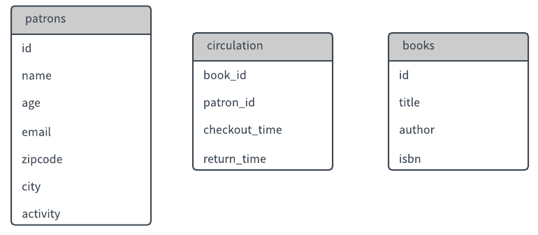
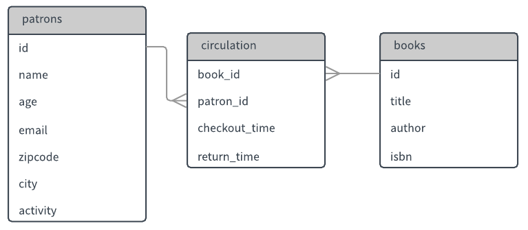

_[Link to Slides](http://www.porganized.com/Scripting-Course/slides/03-sql-pandas.html)_


## Fundamentals 3


```python
import pandas as pd
%sql sqlite:///week2.db
```


    'Connected: None@week2.db'


## Today

- Last week of `SQL` and `Python` fundamentals
- `JOIN`
- Setting the stage for data analysis in Python

This course is challenging, but the type of challenge changes after this week.

Up to now, the challenge is in context-shifting, and understanding the differences between many different concepts. Starting next week, the challenge will be more about application and problem-solving. Fewer disparate concepts, but trickier to grasp.

#### Structure note

## Review

### Mapping this course's concepts

**Databases**
 - Relational databases
 - NoSQL databases
 - The systems are known as DBMSs - Database Management Systems
 
**DBMSs**
 - The one we use is 'SQLite': which is super lightweight, stored as a single file on your filesystem, with dynamic typing

### Mapping this course's concepts

**SQL**: a language for accessing databases: how do you ask for stuff from the system?
- not quite a programming language: it's heavily structured to its task of 'asking for stuff'
- SQL can exists in many forms: on the command line, in an application. It is _not_ inherently related to or dependent on Python, though Python is one possible way to use it.

**Python**: a programming language. Allows you to do many things, but we'll be focusing on database and data science uses.

Why are we learning Python? After this week, we'll be relying on tools in Python to work with structured data.

## SQL Review

`CREATE TABLE table_name (column1, column2);`

`INSERT INTO table_name VALUES (field1, field2);`

`SELECT column1, column2 FROM table_name;`


```python
%load_ext sql
%sql sqlite:///../data/circulation.sqlite
```

    The sql extension is already loaded. To reload it, use:
      %reload_ext sql


    'Connected: None@../data/circulation.sqlite'


### `WHERE` clause


```python
%%sql
SELECT * FROM patrons
    WHERE age == 61;
```

    Done.


<table>
    <tr>
        <th>id</th>
        <th>name</th>
        <th>age</th>
        <th>email</th>
        <th>zipcode</th>
        <th>city</th>
        <th>activity</th>
    </tr>
    <tr>
        <td>236</td>
        <td>Jonathan Daniels</td>
        <td>61</td>
        <td>qgutierrez@jimenez.com</td>
        <td>34547</td>
        <td>Port Stephanie</td>
        <td>2</td>
    </tr>
    <tr>
        <td>449</td>
        <td>Molly Acosta</td>
        <td>61</td>
        <td>tinagrant@hotmail.com</td>
        <td>62921</td>
        <td>East Pamelaburgh</td>
        <td>3</td>
    </tr>
    <tr>
        <td>484</td>
        <td>Wesley Price</td>
        <td>61</td>
        <td>munozkevin@gmail.com</td>
        <td>48788</td>
        <td>Loganchester</td>
        <td>7</td>
    </tr>
    <tr>
        <td>492</td>
        <td>Karla Alexander</td>
        <td>61</td>
        <td>desiree22@brown-williams.com</td>
        <td>45479</td>
        <td>Lake Marissa</td>
        <td>4</td>
    </tr>
    <tr>
        <td>727</td>
        <td>Luis Ho</td>
        <td>61</td>
        <td>jstanley@schaefer.com</td>
        <td>75009</td>
        <td>Michelefurt</td>
        <td>0</td>
    </tr>
</table>


### `AND`


```python
%%sql
SELECT * FROM patrons
    WHERE age > 60 AND activity > 6;
```

    Done.


<table>
    <tr>
        <th>id</th>
        <th>name</th>
        <th>age</th>
        <th>email</th>
        <th>zipcode</th>
        <th>city</th>
        <th>activity</th>
    </tr>
    <tr>
        <td>266</td>
        <td>Richard Jackson</td>
        <td>64</td>
        <td>elliottstephanie@yahoo.com</td>
        <td>94105</td>
        <td>Loganchester</td>
        <td>8</td>
    </tr>
    <tr>
        <td>484</td>
        <td>Wesley Price</td>
        <td>61</td>
        <td>munozkevin@gmail.com</td>
        <td>48788</td>
        <td>Loganchester</td>
        <td>7</td>
    </tr>
    <tr>
        <td>516</td>
        <td>Latoya Clark</td>
        <td>82</td>
        <td>lanceosborne@hotmail.com</td>
        <td>79851</td>
        <td>Deborahbury</td>
        <td>9</td>
    </tr>
    <tr>
        <td>519</td>
        <td>Brian Rubio</td>
        <td>65</td>
        <td>mchambers@rice.com</td>
        <td>80314</td>
        <td>Thomasmouth</td>
        <td>7</td>
    </tr>
    <tr>
        <td>526</td>
        <td>Dawn Jones</td>
        <td>66</td>
        <td>thaynes@yahoo.com</td>
        <td>66603</td>
        <td>Rothton</td>
        <td>8</td>
    </tr>
    <tr>
        <td>572</td>
        <td>Matthew Walsh</td>
        <td>73</td>
        <td>stanley25@rivera-wood.com</td>
        <td>27152</td>
        <td>Loganchester</td>
        <td>7</td>
    </tr>
    <tr>
        <td>828</td>
        <td>Kathryn Nguyen</td>
        <td>62</td>
        <td>wongandrea@clark.net</td>
        <td>18945</td>
        <td>Lake Marissa</td>
        <td>9</td>
    </tr>
    <tr>
        <td>856</td>
        <td>Carrie Ramirez</td>
        <td>68</td>
        <td>llam@simpson.com</td>
        <td>36689</td>
        <td>Loganchester</td>
        <td>8</td>
    </tr>
    <tr>
        <td>911</td>
        <td>Jackie Arias</td>
        <td>80</td>
        <td>sandra83@ramirez-wheeler.com</td>
        <td>53858</td>
        <td>Michelefurt</td>
        <td>9</td>
    </tr>
</table>


### Lab 2 Review


```python
%%sql sqlite:///
CREATE TABLE worker_wages (role, num_workers, wage);
INSERT INTO worker_wages VALUES
    ('Big piecer', 5902, 233.59),
    ('Engineman', 909, 388.47),
    ('Foreman', 2883, 466.54),
    ('Grinders', 1983, 399.9),
    ('Labourer', 208, 269.73),
    ('Mechanic', 669, 440.82),
    ('Others', 2966, 311.64),
    ('Sizer', 597, 469.62),
    ('Spinner', 6951, 408.97),
    ('Twister', 865, 357.2);
```

    Done.
    10 rows affected.


    []


**Q**: Write the SQL to add these two rows to the `worker_wages` table:
        
| worker | num_workers |	wage |
|------------------------------|
|Drawer |	375|	328.98|
|Warehouseman|	1586|	308.73|


```python
%%sql
INSERT INTO worker_wages VALUES ("Drawer", 375, 328.98 )
```

    Done.


<table>
    <tr>
        <th>role</th>
        <th>num_workers</th>
        <th>wage</th>
    </tr>
    <tr>
        <td>Big piecer</td>
        <td>5902</td>
        <td>233.59</td>
    </tr>
    <tr>
        <td>Engineman</td>
        <td>909</td>
        <td>388.47</td>
    </tr>
    <tr>
        <td>Foreman</td>
        <td>2883</td>
        <td>466.54</td>
    </tr>
    <tr>
        <td>Grinders</td>
        <td>1983</td>
        <td>399.9</td>
    </tr>
    <tr>
        <td>Labourer</td>
        <td>208</td>
        <td>269.73</td>
    </tr>
    <tr>
        <td>Mechanic</td>
        <td>669</td>
        <td>440.82</td>
    </tr>
    <tr>
        <td>Others</td>
        <td>2966</td>
        <td>311.64</td>
    </tr>
    <tr>
        <td>Sizer</td>
        <td>597</td>
        <td>469.62</td>
    </tr>
    <tr>
        <td>Spinner</td>
        <td>6951</td>
        <td>408.97</td>
    </tr>
    <tr>
        <td>Twister</td>
        <td>865</td>
        <td>357.2</td>
    </tr>
</table>


**Q**: What's wrong with this SQL?
    
```sql
    INSERT INTO worker_wages VALUES (Weaver, 8577, 273.97);
```


```python
%%sql sqlite:///../data/week2.db
SELECT * from heights
    WHERE height > 185;
```

    Done.


<table>
    <tr>
        <th>Unnamed: 0</th>
        <th>sex</th>
        <th>weight</th>
        <th>height</th>
        <th>repwt</th>
        <th>repht</th>
    </tr>
    <tr>
        <td>8</td>
        <td>M</td>
        <td>69</td>
        <td>186</td>
        <td>73.0</td>
        <td>180.0</td>
    </tr>
    <tr>
        <td>17</td>
        <td>M</td>
        <td>92</td>
        <td>187</td>
        <td>101.0</td>
        <td>185.0</td>
    </tr>
    <tr>
        <td>19</td>
        <td>M</td>
        <td>76</td>
        <td>197</td>
        <td>75.0</td>
        <td>200.0</td>
    </tr>
    <tr>
        <td>40</td>
        <td>M</td>
        <td>65</td>
        <td>187</td>
        <td>67.0</td>
        <td>188.0</td>
    </tr>
    <tr>
        <td>65</td>
        <td>M</td>
        <td>97</td>
        <td>189</td>
        <td>98.0</td>
        <td>185.0</td>
    </tr>
    <tr>
        <td>95</td>
        <td>M</td>
        <td>88</td>
        <td>189</td>
        <td>87.0</td>
        <td>185.0</td>
    </tr>
    <tr>
        <td>139</td>
        <td>M</td>
        <td>90</td>
        <td>188</td>
        <td>91.0</td>
        <td>185.0</td>
    </tr>
    <tr>
        <td>140</td>
        <td>M</td>
        <td>85</td>
        <td>191</td>
        <td>83.0</td>
        <td>188.0</td>
    </tr>
    <tr>
        <td>169</td>
        <td>M</td>
        <td>96</td>
        <td>191</td>
        <td>95.0</td>
        <td>188.0</td>
    </tr>
</table>


What's wrong with this?


```python
%%sql
SELECT * from heights
    WHERE sex == 'm';
```

    Done.


<table>
    <tr>
        <th>Unnamed: 0</th>
        <th>sex</th>
        <th>weight</th>
        <th>height</th>
        <th>repwt</th>
        <th>repht</th>
    </tr>
</table>


*Q*: How would you select the women that overestimate their weight and underestimate their height?


```python
%%sql
SELECT * FROM heights
    WHERE sex == 'F'
    AND repwt > weight
    AND repht < height
;
```

    Done.


<table>
    <tr>
        <th>Unnamed: 0</th>
        <th>sex</th>
        <th>weight</th>
        <th>height</th>
        <th>repwt</th>
        <th>repht</th>
    </tr>
    <tr>
        <td>3</td>
        <td>F</td>
        <td>53</td>
        <td>161</td>
        <td>54.0</td>
        <td>158.0</td>
    </tr>
    <tr>
        <td>13</td>
        <td>F</td>
        <td>51</td>
        <td>161</td>
        <td>52.0</td>
        <td>158.0</td>
    </tr>
    <tr>
        <td>15</td>
        <td>F</td>
        <td>52</td>
        <td>163</td>
        <td>57.0</td>
        <td>160.0</td>
    </tr>
    <tr>
        <td>16</td>
        <td>F</td>
        <td>65</td>
        <td>166</td>
        <td>66.0</td>
        <td>165.0</td>
    </tr>
    <tr>
        <td>25</td>
        <td>F</td>
        <td>54</td>
        <td>171</td>
        <td>59.0</td>
        <td>168.0</td>
    </tr>
    <tr>
        <td>28</td>
        <td>F</td>
        <td>58</td>
        <td>166</td>
        <td>60.0</td>
        <td>160.0</td>
    </tr>
    <tr>
        <td>29</td>
        <td>F</td>
        <td>39</td>
        <td>157</td>
        <td>41.0</td>
        <td>153.0</td>
    </tr>
    <tr>
        <td>46</td>
        <td>F</td>
        <td>54</td>
        <td>160</td>
        <td>55.0</td>
        <td>158.0</td>
    </tr>
    <tr>
        <td>49</td>
        <td>F</td>
        <td>54</td>
        <td>174</td>
        <td>56.0</td>
        <td>173.0</td>
    </tr>
    <tr>
        <td>52</td>
        <td>F</td>
        <td>56</td>
        <td>165</td>
        <td>57.0</td>
        <td>163.0</td>
    </tr>
    <tr>
        <td>74</td>
        <td>F</td>
        <td>56</td>
        <td>163</td>
        <td>57.0</td>
        <td>159.0</td>
    </tr>
    <tr>
        <td>77</td>
        <td>F</td>
        <td>50</td>
        <td>160</td>
        <td>55.0</td>
        <td>150.0</td>
    </tr>
    <tr>
        <td>78</td>
        <td>F</td>
        <td>63</td>
        <td>160</td>
        <td>64.0</td>
        <td>158.0</td>
    </tr>
    <tr>
        <td>89</td>
        <td>F</td>
        <td>57</td>
        <td>163</td>
        <td>59.0</td>
        <td>160.0</td>
    </tr>
    <tr>
        <td>96</td>
        <td>F</td>
        <td>56</td>
        <td>165</td>
        <td>57.0</td>
        <td>160.0</td>
    </tr>
    <tr>
        <td>105</td>
        <td>F</td>
        <td>62</td>
        <td>175</td>
        <td>63.0</td>
        <td>173.0</td>
    </tr>
    <tr>
        <td>113</td>
        <td>F</td>
        <td>55</td>
        <td>174</td>
        <td>57.0</td>
        <td>171.0</td>
    </tr>
    <tr>
        <td>115</td>
        <td>F</td>
        <td>76</td>
        <td>167</td>
        <td>77.0</td>
        <td>165.0</td>
    </tr>
    <tr>
        <td>142</td>
        <td>F</td>
        <td>52</td>
        <td>163</td>
        <td>53.0</td>
        <td>160.0</td>
    </tr>
    <tr>
        <td>143</td>
        <td>F</td>
        <td>53</td>
        <td>165</td>
        <td>55.0</td>
        <td>163.0</td>
    </tr>
    <tr>
        <td>151</td>
        <td>F</td>
        <td>57</td>
        <td>168</td>
        <td>58.0</td>
        <td>165.0</td>
    </tr>
</table>


## Python Review


```python
from IPython.display import YouTubeVideo
```

### Loops

A `for` loop repeats a set of instructions.


```python
YouTubeVideo('I0jgcyfC2r8')
```


        <iframe
            width="400"
            height="300"
            src="https://www.youtube.com/embed/I0jgcyfC2r8"
            frameborder="0"
            allowfullscreen
        ></iframe>
        


```python
for something in a_bunch_of_somethings:
    do_something()
    do_something_else()
```

*"For every student in the class, perform handshake"*

```python
for student in classroom:
    handshake()
```

`for` loops *iterate* through a collection of objects, setting each object to a variable and running through the loop in turn.

'collection of objects' - vague and general, because there's a lot you can iterate through.

*"For every student in the class, perform **a student-specific** handshake"*

```python
for student in classroom:
    handshake(student)
```

Where `handshake(name)` is an imaginary function that can bring up a student's handshake instructions.


```python
balance = 1000

for expense in [6, 5, 4, 3, -1000]:
    print("SPENDING:")
    print(expense)
    balance = balance + expense
    print("REMAINING:")
    print(balance)
    print('----')
    
print("Final balance:", balance)
```

    SPENDING:
    6
    REMAINING:
    1006
    ----
    SPENDING:
    5
    REMAINING:
    1011
    ----
    SPENDING:
    4
    REMAINING:
    1015
    ----
    SPENDING:
    3
    REMAINING:
    1018
    ----
    SPENDING:
    -1000
    REMAINING:
    18
    ----
    Final balance: 18


```python
balance = 1000

for expense in [6, 5, 4, 3, -1000]:
    if expense > 0: 
        print("Spending $", expense)
    else:
        print("Payday!")

    balance = balance + expense
    print("Remaining balanced on credit card: $", balance)
```

    Spending $ 6
    Remaining balanced on credit card: $ 1006
    Spending $ 5
    Remaining balanced on credit card: $ 1011
    Spending $ 4
    Remaining balanced on credit card: $ 1015
    Spending $ 3
    Remaining balanced on credit card: $ 1018
    Payday!
    Remaining balanced on credit card: $ 18


```python
%sql sqlite:///../data/week2.db
results = %sql SELECT * FROM heights;
```

    Done.


```python
results
```


<table>
    <tr>
        <th>Unnamed: 0</th>
        <th>sex</th>
        <th>weight</th>
        <th>height</th>
        <th>repwt</th>
        <th>repht</th>
    </tr>
    <tr>
        <td>1</td>
        <td>M</td>
        <td>77</td>
        <td>182</td>
        <td>77.0</td>
        <td>180.0</td>
    </tr>
    <tr>
        <td>2</td>
        <td>F</td>
        <td>58</td>
        <td>161</td>
        <td>51.0</td>
        <td>159.0</td>
    </tr>
    <tr>
        <td>3</td>
        <td>F</td>
        <td>53</td>
        <td>161</td>
        <td>54.0</td>
        <td>158.0</td>
    </tr>
    <tr>
        <td>4</td>
        <td>M</td>
        <td>68</td>
        <td>177</td>
        <td>70.0</td>
        <td>175.0</td>
    </tr>
    <tr>
        <td>5</td>
        <td>F</td>
        <td>59</td>
        <td>157</td>
        <td>59.0</td>
        <td>155.0</td>
    </tr>
    <tr>
        <td>6</td>
        <td>M</td>
        <td>76</td>
        <td>170</td>
        <td>76.0</td>
        <td>165.0</td>
    </tr>
    <tr>
        <td>7</td>
        <td>M</td>
        <td>76</td>
        <td>167</td>
        <td>77.0</td>
        <td>165.0</td>
    </tr>
    <tr>
        <td>8</td>
        <td>M</td>
        <td>69</td>
        <td>186</td>
        <td>73.0</td>
        <td>180.0</td>
    </tr>
    <tr>
        <td>9</td>
        <td>M</td>
        <td>71</td>
        <td>178</td>
        <td>71.0</td>
        <td>175.0</td>
    </tr>
    <tr>
        <td>10</td>
        <td>M</td>
        <td>65</td>
        <td>171</td>
        <td>64.0</td>
        <td>170.0</td>
    </tr>
    <tr>
        <td>11</td>
        <td>M</td>
        <td>70</td>
        <td>175</td>
        <td>75.0</td>
        <td>174.0</td>
    </tr>
    <tr>
        <td>12</td>
        <td>F</td>
        <td>166</td>
        <td>57</td>
        <td>56.0</td>
        <td>163.0</td>
    </tr>
    <tr>
        <td>13</td>
        <td>F</td>
        <td>51</td>
        <td>161</td>
        <td>52.0</td>
        <td>158.0</td>
    </tr>
    <tr>
        <td>14</td>
        <td>F</td>
        <td>64</td>
        <td>168</td>
        <td>64.0</td>
        <td>165.0</td>
    </tr>
    <tr>
        <td>15</td>
        <td>F</td>
        <td>52</td>
        <td>163</td>
        <td>57.0</td>
        <td>160.0</td>
    </tr>
    <tr>
        <td>16</td>
        <td>F</td>
        <td>65</td>
        <td>166</td>
        <td>66.0</td>
        <td>165.0</td>
    </tr>
    <tr>
        <td>17</td>
        <td>M</td>
        <td>92</td>
        <td>187</td>
        <td>101.0</td>
        <td>185.0</td>
    </tr>
    <tr>
        <td>18</td>
        <td>F</td>
        <td>62</td>
        <td>168</td>
        <td>62.0</td>
        <td>165.0</td>
    </tr>
    <tr>
        <td>19</td>
        <td>M</td>
        <td>76</td>
        <td>197</td>
        <td>75.0</td>
        <td>200.0</td>
    </tr>
    <tr>
        <td>20</td>
        <td>F</td>
        <td>61</td>
        <td>175</td>
        <td>61.0</td>
        <td>171.0</td>
    </tr>
    <tr>
        <td>21</td>
        <td>M</td>
        <td>119</td>
        <td>180</td>
        <td>124.0</td>
        <td>178.0</td>
    </tr>
    <tr>
        <td>22</td>
        <td>F</td>
        <td>61</td>
        <td>170</td>
        <td>61.0</td>
        <td>170.0</td>
    </tr>
    <tr>
        <td>23</td>
        <td>M</td>
        <td>65</td>
        <td>175</td>
        <td>66.0</td>
        <td>173.0</td>
    </tr>
    <tr>
        <td>24</td>
        <td>M</td>
        <td>66</td>
        <td>173</td>
        <td>70.0</td>
        <td>170.0</td>
    </tr>
    <tr>
        <td>25</td>
        <td>F</td>
        <td>54</td>
        <td>171</td>
        <td>59.0</td>
        <td>168.0</td>
    </tr>
    <tr>
        <td>26</td>
        <td>F</td>
        <td>50</td>
        <td>166</td>
        <td>50.0</td>
        <td>165.0</td>
    </tr>
    <tr>
        <td>27</td>
        <td>F</td>
        <td>63</td>
        <td>169</td>
        <td>61.0</td>
        <td>168.0</td>
    </tr>
    <tr>
        <td>28</td>
        <td>F</td>
        <td>58</td>
        <td>166</td>
        <td>60.0</td>
        <td>160.0</td>
    </tr>
    <tr>
        <td>29</td>
        <td>F</td>
        <td>39</td>
        <td>157</td>
        <td>41.0</td>
        <td>153.0</td>
    </tr>
    <tr>
        <td>30</td>
        <td>M</td>
        <td>101</td>
        <td>183</td>
        <td>100.0</td>
        <td>180.0</td>
    </tr>
    <tr>
        <td>31</td>
        <td>F</td>
        <td>71</td>
        <td>166</td>
        <td>71.0</td>
        <td>165.0</td>
    </tr>
    <tr>
        <td>32</td>
        <td>M</td>
        <td>75</td>
        <td>178</td>
        <td>73.0</td>
        <td>175.0</td>
    </tr>
    <tr>
        <td>33</td>
        <td>M</td>
        <td>79</td>
        <td>173</td>
        <td>76.0</td>
        <td>173.0</td>
    </tr>
    <tr>
        <td>34</td>
        <td>F</td>
        <td>52</td>
        <td>164</td>
        <td>52.0</td>
        <td>161.0</td>
    </tr>
    <tr>
        <td>35</td>
        <td>F</td>
        <td>68</td>
        <td>169</td>
        <td>63.0</td>
        <td>170.0</td>
    </tr>
    <tr>
        <td>36</td>
        <td>M</td>
        <td>64</td>
        <td>176</td>
        <td>65.0</td>
        <td>175.0</td>
    </tr>
    <tr>
        <td>37</td>
        <td>F</td>
        <td>56</td>
        <td>166</td>
        <td>54.0</td>
        <td>165.0</td>
    </tr>
    <tr>
        <td>38</td>
        <td>M</td>
        <td>69</td>
        <td>174</td>
        <td>69.0</td>
        <td>171.0</td>
    </tr>
    <tr>
        <td>39</td>
        <td>M</td>
        <td>88</td>
        <td>178</td>
        <td>86.0</td>
        <td>175.0</td>
    </tr>
    <tr>
        <td>40</td>
        <td>M</td>
        <td>65</td>
        <td>187</td>
        <td>67.0</td>
        <td>188.0</td>
    </tr>
    <tr>
        <td>41</td>
        <td>F</td>
        <td>54</td>
        <td>164</td>
        <td>53.0</td>
        <td>160.0</td>
    </tr>
    <tr>
        <td>42</td>
        <td>M</td>
        <td>80</td>
        <td>178</td>
        <td>80.0</td>
        <td>178.0</td>
    </tr>
    <tr>
        <td>43</td>
        <td>F</td>
        <td>63</td>
        <td>163</td>
        <td>59.0</td>
        <td>159.0</td>
    </tr>
    <tr>
        <td>44</td>
        <td>M</td>
        <td>78</td>
        <td>183</td>
        <td>80.0</td>
        <td>180.0</td>
    </tr>
    <tr>
        <td>45</td>
        <td>M</td>
        <td>85</td>
        <td>179</td>
        <td>82.0</td>
        <td>175.0</td>
    </tr>
    <tr>
        <td>46</td>
        <td>F</td>
        <td>54</td>
        <td>160</td>
        <td>55.0</td>
        <td>158.0</td>
    </tr>
    <tr>
        <td>47</td>
        <td>M</td>
        <td>73</td>
        <td>180</td>
        <td>None</td>
        <td>None</td>
    </tr>
    <tr>
        <td>48</td>
        <td>F</td>
        <td>49</td>
        <td>161</td>
        <td>None</td>
        <td>None</td>
    </tr>
    <tr>
        <td>49</td>
        <td>F</td>
        <td>54</td>
        <td>174</td>
        <td>56.0</td>
        <td>173.0</td>
    </tr>
    <tr>
        <td>50</td>
        <td>F</td>
        <td>75</td>
        <td>162</td>
        <td>75.0</td>
        <td>158.0</td>
    </tr>
    <tr>
        <td>51</td>
        <td>M</td>
        <td>82</td>
        <td>182</td>
        <td>85.0</td>
        <td>183.0</td>
    </tr>
    <tr>
        <td>52</td>
        <td>F</td>
        <td>56</td>
        <td>165</td>
        <td>57.0</td>
        <td>163.0</td>
    </tr>
    <tr>
        <td>53</td>
        <td>M</td>
        <td>74</td>
        <td>169</td>
        <td>73.0</td>
        <td>170.0</td>
    </tr>
    <tr>
        <td>54</td>
        <td>M</td>
        <td>102</td>
        <td>185</td>
        <td>107.0</td>
        <td>185.0</td>
    </tr>
    <tr>
        <td>55</td>
        <td>M</td>
        <td>64</td>
        <td>177</td>
        <td>None</td>
        <td>None</td>
    </tr>
    <tr>
        <td>56</td>
        <td>M</td>
        <td>65</td>
        <td>176</td>
        <td>64.0</td>
        <td>172.0</td>
    </tr>
    <tr>
        <td>57</td>
        <td>F</td>
        <td>66</td>
        <td>170</td>
        <td>65.0</td>
        <td>None</td>
    </tr>
    <tr>
        <td>58</td>
        <td>M</td>
        <td>73</td>
        <td>183</td>
        <td>74.0</td>
        <td>180.0</td>
    </tr>
    <tr>
        <td>59</td>
        <td>M</td>
        <td>75</td>
        <td>172</td>
        <td>70.0</td>
        <td>169.0</td>
    </tr>
    <tr>
        <td>60</td>
        <td>M</td>
        <td>57</td>
        <td>173</td>
        <td>58.0</td>
        <td>170.0</td>
    </tr>
    <tr>
        <td>61</td>
        <td>M</td>
        <td>68</td>
        <td>165</td>
        <td>69.0</td>
        <td>165.0</td>
    </tr>
    <tr>
        <td>62</td>
        <td>M</td>
        <td>71</td>
        <td>177</td>
        <td>71.0</td>
        <td>170.0</td>
    </tr>
    <tr>
        <td>63</td>
        <td>M</td>
        <td>71</td>
        <td>180</td>
        <td>76.0</td>
        <td>175.0</td>
    </tr>
    <tr>
        <td>64</td>
        <td>F</td>
        <td>78</td>
        <td>173</td>
        <td>75.0</td>
        <td>169.0</td>
    </tr>
    <tr>
        <td>65</td>
        <td>M</td>
        <td>97</td>
        <td>189</td>
        <td>98.0</td>
        <td>185.0</td>
    </tr>
    <tr>
        <td>66</td>
        <td>F</td>
        <td>60</td>
        <td>162</td>
        <td>59.0</td>
        <td>160.0</td>
    </tr>
    <tr>
        <td>67</td>
        <td>F</td>
        <td>64</td>
        <td>165</td>
        <td>63.0</td>
        <td>163.0</td>
    </tr>
    <tr>
        <td>68</td>
        <td>F</td>
        <td>64</td>
        <td>164</td>
        <td>62.0</td>
        <td>161.0</td>
    </tr>
    <tr>
        <td>69</td>
        <td>F</td>
        <td>52</td>
        <td>158</td>
        <td>51.0</td>
        <td>155.0</td>
    </tr>
    <tr>
        <td>70</td>
        <td>M</td>
        <td>80</td>
        <td>178</td>
        <td>76.0</td>
        <td>175.0</td>
    </tr>
    <tr>
        <td>71</td>
        <td>F</td>
        <td>62</td>
        <td>175</td>
        <td>61.0</td>
        <td>171.0</td>
    </tr>
    <tr>
        <td>72</td>
        <td>M</td>
        <td>66</td>
        <td>173</td>
        <td>66.0</td>
        <td>175.0</td>
    </tr>
    <tr>
        <td>73</td>
        <td>F</td>
        <td>55</td>
        <td>165</td>
        <td>54.0</td>
        <td>163.0</td>
    </tr>
    <tr>
        <td>74</td>
        <td>F</td>
        <td>56</td>
        <td>163</td>
        <td>57.0</td>
        <td>159.0</td>
    </tr>
    <tr>
        <td>75</td>
        <td>F</td>
        <td>50</td>
        <td>166</td>
        <td>50.0</td>
        <td>161.0</td>
    </tr>
    <tr>
        <td>76</td>
        <td>F</td>
        <td>50</td>
        <td>171</td>
        <td>None</td>
        <td>None</td>
    </tr>
    <tr>
        <td>77</td>
        <td>F</td>
        <td>50</td>
        <td>160</td>
        <td>55.0</td>
        <td>150.0</td>
    </tr>
    <tr>
        <td>78</td>
        <td>F</td>
        <td>63</td>
        <td>160</td>
        <td>64.0</td>
        <td>158.0</td>
    </tr>
    <tr>
        <td>79</td>
        <td>M</td>
        <td>69</td>
        <td>182</td>
        <td>70.0</td>
        <td>180.0</td>
    </tr>
    <tr>
        <td>80</td>
        <td>M</td>
        <td>69</td>
        <td>183</td>
        <td>70.0</td>
        <td>183.0</td>
    </tr>
    <tr>
        <td>81</td>
        <td>F</td>
        <td>61</td>
        <td>165</td>
        <td>60.0</td>
        <td>163.0</td>
    </tr>
    <tr>
        <td>82</td>
        <td>M</td>
        <td>55</td>
        <td>168</td>
        <td>56.0</td>
        <td>170.0</td>
    </tr>
    <tr>
        <td>83</td>
        <td>F</td>
        <td>53</td>
        <td>169</td>
        <td>52.0</td>
        <td>175.0</td>
    </tr>
    <tr>
        <td>84</td>
        <td>F</td>
        <td>60</td>
        <td>167</td>
        <td>55.0</td>
        <td>163.0</td>
    </tr>
    <tr>
        <td>85</td>
        <td>F</td>
        <td>56</td>
        <td>170</td>
        <td>56.0</td>
        <td>170.0</td>
    </tr>
    <tr>
        <td>86</td>
        <td>M</td>
        <td>59</td>
        <td>182</td>
        <td>61.0</td>
        <td>183.0</td>
    </tr>
    <tr>
        <td>87</td>
        <td>M</td>
        <td>62</td>
        <td>178</td>
        <td>66.0</td>
        <td>175.0</td>
    </tr>
    <tr>
        <td>88</td>
        <td>F</td>
        <td>53</td>
        <td>165</td>
        <td>53.0</td>
        <td>165.0</td>
    </tr>
    <tr>
        <td>89</td>
        <td>F</td>
        <td>57</td>
        <td>163</td>
        <td>59.0</td>
        <td>160.0</td>
    </tr>
    <tr>
        <td>90</td>
        <td>F</td>
        <td>57</td>
        <td>162</td>
        <td>56.0</td>
        <td>160.0</td>
    </tr>
    <tr>
        <td>91</td>
        <td>M</td>
        <td>70</td>
        <td>173</td>
        <td>68.0</td>
        <td>170.0</td>
    </tr>
    <tr>
        <td>92</td>
        <td>F</td>
        <td>56</td>
        <td>161</td>
        <td>56.0</td>
        <td>161.0</td>
    </tr>
    <tr>
        <td>93</td>
        <td>M</td>
        <td>84</td>
        <td>184</td>
        <td>86.0</td>
        <td>183.0</td>
    </tr>
    <tr>
        <td>94</td>
        <td>M</td>
        <td>69</td>
        <td>180</td>
        <td>71.0</td>
        <td>180.0</td>
    </tr>
    <tr>
        <td>95</td>
        <td>M</td>
        <td>88</td>
        <td>189</td>
        <td>87.0</td>
        <td>185.0</td>
    </tr>
    <tr>
        <td>96</td>
        <td>F</td>
        <td>56</td>
        <td>165</td>
        <td>57.0</td>
        <td>160.0</td>
    </tr>
    <tr>
        <td>97</td>
        <td>M</td>
        <td>103</td>
        <td>185</td>
        <td>101.0</td>
        <td>182.0</td>
    </tr>
    <tr>
        <td>98</td>
        <td>F</td>
        <td>50</td>
        <td>169</td>
        <td>50.0</td>
        <td>165.0</td>
    </tr>
    <tr>
        <td>99</td>
        <td>F</td>
        <td>52</td>
        <td>159</td>
        <td>52.0</td>
        <td>153.0</td>
    </tr>
    <tr>
        <td>100</td>
        <td>F</td>
        <td>55</td>
        <td>155</td>
        <td>None</td>
        <td>154.0</td>
    </tr>
    <tr>
        <td>101</td>
        <td>F</td>
        <td>55</td>
        <td>164</td>
        <td>55.0</td>
        <td>163.0</td>
    </tr>
    <tr>
        <td>102</td>
        <td>M</td>
        <td>63</td>
        <td>178</td>
        <td>63.0</td>
        <td>175.0</td>
    </tr>
    <tr>
        <td>103</td>
        <td>F</td>
        <td>47</td>
        <td>163</td>
        <td>47.0</td>
        <td>160.0</td>
    </tr>
    <tr>
        <td>104</td>
        <td>F</td>
        <td>45</td>
        <td>163</td>
        <td>45.0</td>
        <td>160.0</td>
    </tr>
    <tr>
        <td>105</td>
        <td>F</td>
        <td>62</td>
        <td>175</td>
        <td>63.0</td>
        <td>173.0</td>
    </tr>
    <tr>
        <td>106</td>
        <td>F</td>
        <td>53</td>
        <td>164</td>
        <td>51.0</td>
        <td>160.0</td>
    </tr>
    <tr>
        <td>107</td>
        <td>F</td>
        <td>52</td>
        <td>152</td>
        <td>51.0</td>
        <td>150.0</td>
    </tr>
    <tr>
        <td>108</td>
        <td>F</td>
        <td>57</td>
        <td>167</td>
        <td>55.0</td>
        <td>164.0</td>
    </tr>
    <tr>
        <td>109</td>
        <td>F</td>
        <td>64</td>
        <td>166</td>
        <td>64.0</td>
        <td>165.0</td>
    </tr>
    <tr>
        <td>110</td>
        <td>F</td>
        <td>59</td>
        <td>166</td>
        <td>55.0</td>
        <td>163.0</td>
    </tr>
    <tr>
        <td>111</td>
        <td>M</td>
        <td>84</td>
        <td>183</td>
        <td>90.0</td>
        <td>183.0</td>
    </tr>
    <tr>
        <td>112</td>
        <td>M</td>
        <td>79</td>
        <td>179</td>
        <td>79.0</td>
        <td>171.0</td>
    </tr>
    <tr>
        <td>113</td>
        <td>F</td>
        <td>55</td>
        <td>174</td>
        <td>57.0</td>
        <td>171.0</td>
    </tr>
    <tr>
        <td>114</td>
        <td>M</td>
        <td>67</td>
        <td>179</td>
        <td>67.0</td>
        <td>179.0</td>
    </tr>
    <tr>
        <td>115</td>
        <td>F</td>
        <td>76</td>
        <td>167</td>
        <td>77.0</td>
        <td>165.0</td>
    </tr>
    <tr>
        <td>116</td>
        <td>F</td>
        <td>62</td>
        <td>168</td>
        <td>62.0</td>
        <td>163.0</td>
    </tr>
    <tr>
        <td>117</td>
        <td>M</td>
        <td>83</td>
        <td>184</td>
        <td>83.0</td>
        <td>181.0</td>
    </tr>
    <tr>
        <td>118</td>
        <td>M</td>
        <td>96</td>
        <td>184</td>
        <td>94.0</td>
        <td>183.0</td>
    </tr>
    <tr>
        <td>119</td>
        <td>M</td>
        <td>75</td>
        <td>169</td>
        <td>76.0</td>
        <td>165.0</td>
    </tr>
    <tr>
        <td>120</td>
        <td>M</td>
        <td>65</td>
        <td>178</td>
        <td>66.0</td>
        <td>178.0</td>
    </tr>
    <tr>
        <td>121</td>
        <td>M</td>
        <td>78</td>
        <td>178</td>
        <td>77.0</td>
        <td>175.0</td>
    </tr>
    <tr>
        <td>122</td>
        <td>M</td>
        <td>69</td>
        <td>167</td>
        <td>73.0</td>
        <td>165.0</td>
    </tr>
    <tr>
        <td>123</td>
        <td>F</td>
        <td>68</td>
        <td>178</td>
        <td>68.0</td>
        <td>175.0</td>
    </tr>
    <tr>
        <td>124</td>
        <td>F</td>
        <td>55</td>
        <td>165</td>
        <td>55.0</td>
        <td>163.0</td>
    </tr>
    <tr>
        <td>125</td>
        <td>M</td>
        <td>67</td>
        <td>179</td>
        <td>None</td>
        <td>None</td>
    </tr>
    <tr>
        <td>126</td>
        <td>F</td>
        <td>52</td>
        <td>169</td>
        <td>56.0</td>
        <td>None</td>
    </tr>
    <tr>
        <td>127</td>
        <td>F</td>
        <td>47</td>
        <td>153</td>
        <td>None</td>
        <td>154.0</td>
    </tr>
    <tr>
        <td>128</td>
        <td>F</td>
        <td>45</td>
        <td>157</td>
        <td>45.0</td>
        <td>153.0</td>
    </tr>
    <tr>
        <td>129</td>
        <td>F</td>
        <td>68</td>
        <td>171</td>
        <td>68.0</td>
        <td>169.0</td>
    </tr>
    <tr>
        <td>130</td>
        <td>F</td>
        <td>44</td>
        <td>157</td>
        <td>44.0</td>
        <td>155.0</td>
    </tr>
    <tr>
        <td>131</td>
        <td>F</td>
        <td>62</td>
        <td>166</td>
        <td>61.0</td>
        <td>163.0</td>
    </tr>
    <tr>
        <td>132</td>
        <td>M</td>
        <td>87</td>
        <td>185</td>
        <td>89.0</td>
        <td>185.0</td>
    </tr>
    <tr>
        <td>133</td>
        <td>F</td>
        <td>56</td>
        <td>160</td>
        <td>53.0</td>
        <td>158.0</td>
    </tr>
    <tr>
        <td>134</td>
        <td>F</td>
        <td>50</td>
        <td>148</td>
        <td>47.0</td>
        <td>148.0</td>
    </tr>
    <tr>
        <td>135</td>
        <td>M</td>
        <td>83</td>
        <td>177</td>
        <td>84.0</td>
        <td>175.0</td>
    </tr>
    <tr>
        <td>136</td>
        <td>F</td>
        <td>53</td>
        <td>162</td>
        <td>53.0</td>
        <td>160.0</td>
    </tr>
    <tr>
        <td>137</td>
        <td>F</td>
        <td>64</td>
        <td>172</td>
        <td>62.0</td>
        <td>168.0</td>
    </tr>
    <tr>
        <td>138</td>
        <td>F</td>
        <td>62</td>
        <td>167</td>
        <td>None</td>
        <td>None</td>
    </tr>
    <tr>
        <td>139</td>
        <td>M</td>
        <td>90</td>
        <td>188</td>
        <td>91.0</td>
        <td>185.0</td>
    </tr>
    <tr>
        <td>140</td>
        <td>M</td>
        <td>85</td>
        <td>191</td>
        <td>83.0</td>
        <td>188.0</td>
    </tr>
    <tr>
        <td>141</td>
        <td>M</td>
        <td>66</td>
        <td>175</td>
        <td>68.0</td>
        <td>175.0</td>
    </tr>
    <tr>
        <td>142</td>
        <td>F</td>
        <td>52</td>
        <td>163</td>
        <td>53.0</td>
        <td>160.0</td>
    </tr>
    <tr>
        <td>143</td>
        <td>F</td>
        <td>53</td>
        <td>165</td>
        <td>55.0</td>
        <td>163.0</td>
    </tr>
    <tr>
        <td>144</td>
        <td>F</td>
        <td>54</td>
        <td>176</td>
        <td>55.0</td>
        <td>176.0</td>
    </tr>
    <tr>
        <td>145</td>
        <td>F</td>
        <td>64</td>
        <td>171</td>
        <td>66.0</td>
        <td>171.0</td>
    </tr>
    <tr>
        <td>146</td>
        <td>F</td>
        <td>55</td>
        <td>160</td>
        <td>55.0</td>
        <td>155.0</td>
    </tr>
    <tr>
        <td>147</td>
        <td>F</td>
        <td>55</td>
        <td>165</td>
        <td>55.0</td>
        <td>165.0</td>
    </tr>
    <tr>
        <td>148</td>
        <td>F</td>
        <td>59</td>
        <td>157</td>
        <td>55.0</td>
        <td>158.0</td>
    </tr>
    <tr>
        <td>149</td>
        <td>F</td>
        <td>70</td>
        <td>173</td>
        <td>67.0</td>
        <td>170.0</td>
    </tr>
    <tr>
        <td>150</td>
        <td>M</td>
        <td>88</td>
        <td>184</td>
        <td>86.0</td>
        <td>183.0</td>
    </tr>
    <tr>
        <td>151</td>
        <td>F</td>
        <td>57</td>
        <td>168</td>
        <td>58.0</td>
        <td>165.0</td>
    </tr>
    <tr>
        <td>152</td>
        <td>F</td>
        <td>47</td>
        <td>162</td>
        <td>47.0</td>
        <td>160.0</td>
    </tr>
    <tr>
        <td>153</td>
        <td>F</td>
        <td>47</td>
        <td>150</td>
        <td>45.0</td>
        <td>152.0</td>
    </tr>
    <tr>
        <td>154</td>
        <td>F</td>
        <td>55</td>
        <td>162</td>
        <td>None</td>
        <td>None</td>
    </tr>
    <tr>
        <td>155</td>
        <td>F</td>
        <td>48</td>
        <td>163</td>
        <td>44.0</td>
        <td>160.0</td>
    </tr>
    <tr>
        <td>156</td>
        <td>M</td>
        <td>54</td>
        <td>169</td>
        <td>58.0</td>
        <td>165.0</td>
    </tr>
    <tr>
        <td>157</td>
        <td>M</td>
        <td>69</td>
        <td>172</td>
        <td>68.0</td>
        <td>174.0</td>
    </tr>
    <tr>
        <td>158</td>
        <td>F</td>
        <td>59</td>
        <td>170</td>
        <td>None</td>
        <td>None</td>
    </tr>
    <tr>
        <td>159</td>
        <td>F</td>
        <td>58</td>
        <td>169</td>
        <td>None</td>
        <td>None</td>
    </tr>
    <tr>
        <td>160</td>
        <td>F</td>
        <td>57</td>
        <td>167</td>
        <td>56.0</td>
        <td>165.0</td>
    </tr>
    <tr>
        <td>161</td>
        <td>F</td>
        <td>51</td>
        <td>163</td>
        <td>50.0</td>
        <td>160.0</td>
    </tr>
    <tr>
        <td>162</td>
        <td>F</td>
        <td>54</td>
        <td>161</td>
        <td>54.0</td>
        <td>160.0</td>
    </tr>
    <tr>
        <td>163</td>
        <td>F</td>
        <td>53</td>
        <td>162</td>
        <td>52.0</td>
        <td>158.0</td>
    </tr>
    <tr>
        <td>164</td>
        <td>F</td>
        <td>59</td>
        <td>172</td>
        <td>58.0</td>
        <td>171.0</td>
    </tr>
    <tr>
        <td>165</td>
        <td>M</td>
        <td>56</td>
        <td>163</td>
        <td>58.0</td>
        <td>161.0</td>
    </tr>
    <tr>
        <td>166</td>
        <td>F</td>
        <td>59</td>
        <td>159</td>
        <td>59.0</td>
        <td>155.0</td>
    </tr>
    <tr>
        <td>167</td>
        <td>F</td>
        <td>63</td>
        <td>170</td>
        <td>62.0</td>
        <td>168.0</td>
    </tr>
    <tr>
        <td>168</td>
        <td>F</td>
        <td>66</td>
        <td>166</td>
        <td>66.0</td>
        <td>165.0</td>
    </tr>
    <tr>
        <td>169</td>
        <td>M</td>
        <td>96</td>
        <td>191</td>
        <td>95.0</td>
        <td>188.0</td>
    </tr>
    <tr>
        <td>170</td>
        <td>F</td>
        <td>53</td>
        <td>158</td>
        <td>50.0</td>
        <td>155.0</td>
    </tr>
    <tr>
        <td>171</td>
        <td>M</td>
        <td>76</td>
        <td>169</td>
        <td>75.0</td>
        <td>165.0</td>
    </tr>
    <tr>
        <td>172</td>
        <td>F</td>
        <td>54</td>
        <td>163</td>
        <td>None</td>
        <td>None</td>
    </tr>
    <tr>
        <td>173</td>
        <td>M</td>
        <td>61</td>
        <td>170</td>
        <td>61.0</td>
        <td>170.0</td>
    </tr>
    <tr>
        <td>174</td>
        <td>M</td>
        <td>82</td>
        <td>176</td>
        <td>None</td>
        <td>None</td>
    </tr>
    <tr>
        <td>175</td>
        <td>M</td>
        <td>62</td>
        <td>168</td>
        <td>64.0</td>
        <td>168.0</td>
    </tr>
    <tr>
        <td>176</td>
        <td>M</td>
        <td>71</td>
        <td>178</td>
        <td>68.0</td>
        <td>178.0</td>
    </tr>
    <tr>
        <td>177</td>
        <td>F</td>
        <td>60</td>
        <td>174</td>
        <td>None</td>
        <td>None</td>
    </tr>
    <tr>
        <td>178</td>
        <td>M</td>
        <td>66</td>
        <td>170</td>
        <td>67.0</td>
        <td>165.0</td>
    </tr>
    <tr>
        <td>179</td>
        <td>M</td>
        <td>81</td>
        <td>178</td>
        <td>82.0</td>
        <td>175.0</td>
    </tr>
    <tr>
        <td>180</td>
        <td>M</td>
        <td>68</td>
        <td>174</td>
        <td>68.0</td>
        <td>173.0</td>
    </tr>
    <tr>
        <td>181</td>
        <td>M</td>
        <td>80</td>
        <td>176</td>
        <td>78.0</td>
        <td>175.0</td>
    </tr>
    <tr>
        <td>182</td>
        <td>F</td>
        <td>43</td>
        <td>154</td>
        <td>None</td>
        <td>None</td>
    </tr>
    <tr>
        <td>183</td>
        <td>M</td>
        <td>82</td>
        <td>181</td>
        <td>None</td>
        <td>None</td>
    </tr>
    <tr>
        <td>184</td>
        <td>F</td>
        <td>63</td>
        <td>165</td>
        <td>59.0</td>
        <td>160.0</td>
    </tr>
    <tr>
        <td>185</td>
        <td>M</td>
        <td>70</td>
        <td>173</td>
        <td>70.0</td>
        <td>173.0</td>
    </tr>
    <tr>
        <td>186</td>
        <td>F</td>
        <td>56</td>
        <td>162</td>
        <td>56.0</td>
        <td>160.0</td>
    </tr>
    <tr>
        <td>187</td>
        <td>F</td>
        <td>60</td>
        <td>172</td>
        <td>55.0</td>
        <td>168.0</td>
    </tr>
    <tr>
        <td>188</td>
        <td>F</td>
        <td>58</td>
        <td>169</td>
        <td>54.0</td>
        <td>166.0</td>
    </tr>
    <tr>
        <td>189</td>
        <td>M</td>
        <td>76</td>
        <td>183</td>
        <td>75.0</td>
        <td>180.0</td>
    </tr>
    <tr>
        <td>190</td>
        <td>F</td>
        <td>50</td>
        <td>158</td>
        <td>49.0</td>
        <td>155.0</td>
    </tr>
    <tr>
        <td>191</td>
        <td>M</td>
        <td>88</td>
        <td>185</td>
        <td>93.0</td>
        <td>188.0</td>
    </tr>
    <tr>
        <td>192</td>
        <td>M</td>
        <td>89</td>
        <td>173</td>
        <td>86.0</td>
        <td>173.0</td>
    </tr>
    <tr>
        <td>193</td>
        <td>F</td>
        <td>59</td>
        <td>164</td>
        <td>59.0</td>
        <td>165.0</td>
    </tr>
    <tr>
        <td>194</td>
        <td>F</td>
        <td>51</td>
        <td>156</td>
        <td>51.0</td>
        <td>158.0</td>
    </tr>
    <tr>
        <td>195</td>
        <td>F</td>
        <td>62</td>
        <td>164</td>
        <td>61.0</td>
        <td>161.0</td>
    </tr>
    <tr>
        <td>196</td>
        <td>M</td>
        <td>74</td>
        <td>175</td>
        <td>71.0</td>
        <td>175.0</td>
    </tr>
    <tr>
        <td>197</td>
        <td>M</td>
        <td>83</td>
        <td>180</td>
        <td>80.0</td>
        <td>180.0</td>
    </tr>
    <tr>
        <td>198</td>
        <td>M</td>
        <td>81</td>
        <td>175</td>
        <td>None</td>
        <td>None</td>
    </tr>
    <tr>
        <td>199</td>
        <td>M</td>
        <td>90</td>
        <td>181</td>
        <td>91.0</td>
        <td>178.0</td>
    </tr>
    <tr>
        <td>200</td>
        <td>M</td>
        <td>79</td>
        <td>177</td>
        <td>81.0</td>
        <td>178.0</td>
    </tr>
</table>


```python
for record in results:
    print(record)
```

    (1, 'M', 77, 182, 77.0, 180.0)
    (2, 'F', 58, 161, 51.0, 159.0)
    (3, 'F', 53, 161, 54.0, 158.0)
    (4, 'M', 68, 177, 70.0, 175.0)
    (5, 'F', 59, 157, 59.0, 155.0)
    (6, 'M', 76, 170, 76.0, 165.0)
    (7, 'M', 76, 167, 77.0, 165.0)
    (8, 'M', 69, 186, 73.0, 180.0)
    (9, 'M', 71, 178, 71.0, 175.0)
    (10, 'M', 65, 171, 64.0, 170.0)
    (11, 'M', 70, 175, 75.0, 174.0)
    (12, 'F', 166, 57, 56.0, 163.0)
    (13, 'F', 51, 161, 52.0, 158.0)
    (14, 'F', 64, 168, 64.0, 165.0)
    (15, 'F', 52, 163, 57.0, 160.0)
    (16, 'F', 65, 166, 66.0, 165.0)
    (17, 'M', 92, 187, 101.0, 185.0)
    (18, 'F', 62, 168, 62.0, 165.0)
    (19, 'M', 76, 197, 75.0, 200.0)
    (20, 'F', 61, 175, 61.0, 171.0)
    (21, 'M', 119, 180, 124.0, 178.0)
    (22, 'F', 61, 170, 61.0, 170.0)
    (23, 'M', 65, 175, 66.0, 173.0)
    (24, 'M', 66, 173, 70.0, 170.0)
    (25, 'F', 54, 171, 59.0, 168.0)
    (26, 'F', 50, 166, 50.0, 165.0)
    (27, 'F', 63, 169, 61.0, 168.0)
    (28, 'F', 58, 166, 60.0, 160.0)
    (29, 'F', 39, 157, 41.0, 153.0)
    (30, 'M', 101, 183, 100.0, 180.0)
    (31, 'F', 71, 166, 71.0, 165.0)
    (32, 'M', 75, 178, 73.0, 175.0)
    (33, 'M', 79, 173, 76.0, 173.0)
    (34, 'F', 52, 164, 52.0, 161.0)
    (35, 'F', 68, 169, 63.0, 170.0)
    (36, 'M', 64, 176, 65.0, 175.0)
    (37, 'F', 56, 166, 54.0, 165.0)
    (38, 'M', 69, 174, 69.0, 171.0)
    (39, 'M', 88, 178, 86.0, 175.0)
    (40, 'M', 65, 187, 67.0, 188.0)
    (41, 'F', 54, 164, 53.0, 160.0)
    (42, 'M', 80, 178, 80.0, 178.0)
    (43, 'F', 63, 163, 59.0, 159.0)
    (44, 'M', 78, 183, 80.0, 180.0)
    (45, 'M', 85, 179, 82.0, 175.0)
    (46, 'F', 54, 160, 55.0, 158.0)
    (47, 'M', 73, 180, None, None)
    (48, 'F', 49, 161, None, None)
    (49, 'F', 54, 174, 56.0, 173.0)
    (50, 'F', 75, 162, 75.0, 158.0)
    (51, 'M', 82, 182, 85.0, 183.0)
    (52, 'F', 56, 165, 57.0, 163.0)
    (53, 'M', 74, 169, 73.0, 170.0)
    (54, 'M', 102, 185, 107.0, 185.0)
    (55, 'M', 64, 177, None, None)
    (56, 'M', 65, 176, 64.0, 172.0)
    (57, 'F', 66, 170, 65.0, None)
    (58, 'M', 73, 183, 74.0, 180.0)
    (59, 'M', 75, 172, 70.0, 169.0)
    (60, 'M', 57, 173, 58.0, 170.0)
    (61, 'M', 68, 165, 69.0, 165.0)
    (62, 'M', 71, 177, 71.0, 170.0)
    (63, 'M', 71, 180, 76.0, 175.0)
    (64, 'F', 78, 173, 75.0, 169.0)
    (65, 'M', 97, 189, 98.0, 185.0)
    (66, 'F', 60, 162, 59.0, 160.0)
    (67, 'F', 64, 165, 63.0, 163.0)
    (68, 'F', 64, 164, 62.0, 161.0)
    (69, 'F', 52, 158, 51.0, 155.0)
    (70, 'M', 80, 178, 76.0, 175.0)
    (71, 'F', 62, 175, 61.0, 171.0)
    (72, 'M', 66, 173, 66.0, 175.0)
    (73, 'F', 55, 165, 54.0, 163.0)
    (74, 'F', 56, 163, 57.0, 159.0)
    (75, 'F', 50, 166, 50.0, 161.0)
    (76, 'F', 50, 171, None, None)
    (77, 'F', 50, 160, 55.0, 150.0)
    (78, 'F', 63, 160, 64.0, 158.0)
    (79, 'M', 69, 182, 70.0, 180.0)
    (80, 'M', 69, 183, 70.0, 183.0)
    (81, 'F', 61, 165, 60.0, 163.0)
    (82, 'M', 55, 168, 56.0, 170.0)
    (83, 'F', 53, 169, 52.0, 175.0)
    (84, 'F', 60, 167, 55.0, 163.0)
    (85, 'F', 56, 170, 56.0, 170.0)
    (86, 'M', 59, 182, 61.0, 183.0)
    (87, 'M', 62, 178, 66.0, 175.0)
    (88, 'F', 53, 165, 53.0, 165.0)
    (89, 'F', 57, 163, 59.0, 160.0)
    (90, 'F', 57, 162, 56.0, 160.0)
    (91, 'M', 70, 173, 68.0, 170.0)
    (92, 'F', 56, 161, 56.0, 161.0)
    (93, 'M', 84, 184, 86.0, 183.0)
    (94, 'M', 69, 180, 71.0, 180.0)
    (95, 'M', 88, 189, 87.0, 185.0)
    (96, 'F', 56, 165, 57.0, 160.0)
    (97, 'M', 103, 185, 101.0, 182.0)
    (98, 'F', 50, 169, 50.0, 165.0)
    (99, 'F', 52, 159, 52.0, 153.0)
    (100, 'F', 55, 155, None, 154.0)
    (101, 'F', 55, 164, 55.0, 163.0)
    (102, 'M', 63, 178, 63.0, 175.0)
    (103, 'F', 47, 163, 47.0, 160.0)
    (104, 'F', 45, 163, 45.0, 160.0)
    (105, 'F', 62, 175, 63.0, 173.0)
    (106, 'F', 53, 164, 51.0, 160.0)
    (107, 'F', 52, 152, 51.0, 150.0)
    (108, 'F', 57, 167, 55.0, 164.0)
    (109, 'F', 64, 166, 64.0, 165.0)
    (110, 'F', 59, 166, 55.0, 163.0)
    (111, 'M', 84, 183, 90.0, 183.0)
    (112, 'M', 79, 179, 79.0, 171.0)
    (113, 'F', 55, 174, 57.0, 171.0)
    (114, 'M', 67, 179, 67.0, 179.0)
    (115, 'F', 76, 167, 77.0, 165.0)
    (116, 'F', 62, 168, 62.0, 163.0)
    (117, 'M', 83, 184, 83.0, 181.0)
    (118, 'M', 96, 184, 94.0, 183.0)
    (119, 'M', 75, 169, 76.0, 165.0)
    (120, 'M', 65, 178, 66.0, 178.0)
    (121, 'M', 78, 178, 77.0, 175.0)
    (122, 'M', 69, 167, 73.0, 165.0)
    (123, 'F', 68, 178, 68.0, 175.0)
    (124, 'F', 55, 165, 55.0, 163.0)
    (125, 'M', 67, 179, None, None)
    (126, 'F', 52, 169, 56.0, None)
    (127, 'F', 47, 153, None, 154.0)
    (128, 'F', 45, 157, 45.0, 153.0)
    (129, 'F', 68, 171, 68.0, 169.0)
    (130, 'F', 44, 157, 44.0, 155.0)
    (131, 'F', 62, 166, 61.0, 163.0)
    (132, 'M', 87, 185, 89.0, 185.0)
    (133, 'F', 56, 160, 53.0, 158.0)
    (134, 'F', 50, 148, 47.0, 148.0)
    (135, 'M', 83, 177, 84.0, 175.0)
    (136, 'F', 53, 162, 53.0, 160.0)
    (137, 'F', 64, 172, 62.0, 168.0)
    (138, 'F', 62, 167, None, None)
    (139, 'M', 90, 188, 91.0, 185.0)
    (140, 'M', 85, 191, 83.0, 188.0)
    (141, 'M', 66, 175, 68.0, 175.0)
    (142, 'F', 52, 163, 53.0, 160.0)
    (143, 'F', 53, 165, 55.0, 163.0)
    (144, 'F', 54, 176, 55.0, 176.0)
    (145, 'F', 64, 171, 66.0, 171.0)
    (146, 'F', 55, 160, 55.0, 155.0)
    (147, 'F', 55, 165, 55.0, 165.0)
    (148, 'F', 59, 157, 55.0, 158.0)
    (149, 'F', 70, 173, 67.0, 170.0)
    (150, 'M', 88, 184, 86.0, 183.0)
    (151, 'F', 57, 168, 58.0, 165.0)
    (152, 'F', 47, 162, 47.0, 160.0)
    (153, 'F', 47, 150, 45.0, 152.0)
    (154, 'F', 55, 162, None, None)
    (155, 'F', 48, 163, 44.0, 160.0)
    (156, 'M', 54, 169, 58.0, 165.0)
    (157, 'M', 69, 172, 68.0, 174.0)
    (158, 'F', 59, 170, None, None)
    (159, 'F', 58, 169, None, None)
    (160, 'F', 57, 167, 56.0, 165.0)
    (161, 'F', 51, 163, 50.0, 160.0)
    (162, 'F', 54, 161, 54.0, 160.0)
    (163, 'F', 53, 162, 52.0, 158.0)
    (164, 'F', 59, 172, 58.0, 171.0)
    (165, 'M', 56, 163, 58.0, 161.0)
    (166, 'F', 59, 159, 59.0, 155.0)
    (167, 'F', 63, 170, 62.0, 168.0)
    (168, 'F', 66, 166, 66.0, 165.0)
    (169, 'M', 96, 191, 95.0, 188.0)
    (170, 'F', 53, 158, 50.0, 155.0)
    (171, 'M', 76, 169, 75.0, 165.0)
    (172, 'F', 54, 163, None, None)
    (173, 'M', 61, 170, 61.0, 170.0)
    (174, 'M', 82, 176, None, None)
    (175, 'M', 62, 168, 64.0, 168.0)
    (176, 'M', 71, 178, 68.0, 178.0)
    (177, 'F', 60, 174, None, None)
    (178, 'M', 66, 170, 67.0, 165.0)
    (179, 'M', 81, 178, 82.0, 175.0)
    (180, 'M', 68, 174, 68.0, 173.0)
    (181, 'M', 80, 176, 78.0, 175.0)
    (182, 'F', 43, 154, None, None)
    (183, 'M', 82, 181, None, None)
    (184, 'F', 63, 165, 59.0, 160.0)
    (185, 'M', 70, 173, 70.0, 173.0)
    (186, 'F', 56, 162, 56.0, 160.0)
    (187, 'F', 60, 172, 55.0, 168.0)
    (188, 'F', 58, 169, 54.0, 166.0)
    (189, 'M', 76, 183, 75.0, 180.0)
    (190, 'F', 50, 158, 49.0, 155.0)
    (191, 'M', 88, 185, 93.0, 188.0)
    (192, 'M', 89, 173, 86.0, 173.0)
    (193, 'F', 59, 164, 59.0, 165.0)
    (194, 'F', 51, 156, 51.0, 158.0)
    (195, 'F', 62, 164, 61.0, 161.0)
    (196, 'M', 74, 175, 71.0, 175.0)
    (197, 'M', 83, 180, 80.0, 180.0)
    (198, 'M', 81, 175, None, None)
    (199, 'M', 90, 181, 91.0, 178.0)
    (200, 'M', 79, 177, 81.0, 178.0)


Knowing we can iterate through the results from the SQL table, how might we look at the average difference between estimate and reality?


```python
# Edit this
for record in results:
    print(record)
```


    -3.05


```python
total_height = 0

for id, sex, weight, height, reported_weight, reported_height in results[:5]:
    diffh = height - reported_height
    diffw = weight - reported_weight
    print("Person", id)
    print("   The difference between their real and reported height is", diffh)
    print("   The difference between their real and reported weight is", diffw)
```

    Person 1
       The difference between their real and reported height is 2.0
       The difference between their real and reported weight is 0.0
    Person 2
       The difference between their real and reported height is 2.0
       The difference between their real and reported weight is 7.0
    Person 3
       The difference between their real and reported height is 3.0
       The difference between their real and reported weight is -1.0
    Person 4
       The difference between their real and reported height is 2.0
       The difference between their real and reported weight is -2.0
    Person 5
       The difference between their real and reported height is 2.0
       The difference between their real and reported weight is 0.0


```python
total_height = 0
number_of_people = 0

for id, sex, weight, height, reported_weight, reported_height in results:
    total_height = total_height + height
    number_of_people = number_of_people + 1
    
total_height / number_of_people
```


    170.02


# More SQL Concepts

`LIMIT`, `ORDER BY`, `LIKE`, `OR`, `JOIN`


*To follow along*

Download [circulation.sqlite](https://github.com/organisciak/Scripting-Course/blob/master/data/circulation.sqlite?raw=true) and place in the same folder as this lab. Then connect to it in this way:

```
%load_ext sql
%sql sqlite:///circulation.sqlite
```


```python
# On Dr. O's computer, the file is not in the same folder, 
# but one directory up, in a 'data' folder. That's why ../data/ is added here.
%sql sqlite:///../data/circulation.sqlite
```


    'Connected: None@../data/circulation.sqlite'


## `LIMIT`

LIMIT can limit the number of results that SELECT returns. Add it to the end of a `SELECT` statement.

```sql
SELECT colName
    FROM tableName
    LIMIT count;
```


```python
%%sql sqlite:///../data/circulation.sqlite
SELECT * FROM patrons
    LIMIT 5;
```

    Done.


<table>
    <tr>
        <th>id</th>
        <th>name</th>
        <th>age</th>
        <th>email</th>
        <th>zipcode</th>
        <th>city</th>
        <th>activity</th>
    </tr>
    <tr>
        <td>1</td>
        <td>Jeremy Mata</td>
        <td>30</td>
        <td>timothymoore@gmail.com</td>
        <td>52022</td>
        <td>Thomasmouth</td>
        <td>9</td>
    </tr>
    <tr>
        <td>2</td>
        <td>Daniel Garcia</td>
        <td>55</td>
        <td>mcdanielwilliam@sanchez-herrera.biz</td>
        <td>09529</td>
        <td>Deborahbury</td>
        <td>3</td>
    </tr>
    <tr>
        <td>3</td>
        <td>Warren Green</td>
        <td>17</td>
        <td>janice81@flores.com</td>
        <td>55036</td>
        <td>Michelefurt</td>
        <td>1</td>
    </tr>
    <tr>
        <td>4</td>
        <td>Erika Smith</td>
        <td>4</td>
        <td>tnichols@gregory.com</td>
        <td>11235</td>
        <td>Port Stephanie</td>
        <td>3</td>
    </tr>
    <tr>
        <td>5</td>
        <td>Matthew Johnson</td>
        <td>22</td>
        <td>christina30@manning.info</td>
        <td>52521</td>
        <td>Jamesfort</td>
        <td>4</td>
    </tr>
</table>


### Quick look at our current database


```python
%%sql
SELECT * FROM patrons
    LIMIT 2;
```

    Done.


<table>
    <tr>
        <th>id</th>
        <th>name</th>
        <th>age</th>
        <th>email</th>
        <th>zipcode</th>
        <th>city</th>
        <th>activity</th>
    </tr>
    <tr>
        <td>1</td>
        <td>Jeremy Mata</td>
        <td>30</td>
        <td>timothymoore@gmail.com</td>
        <td>52022</td>
        <td>Thomasmouth</td>
        <td>9</td>
    </tr>
    <tr>
        <td>2</td>
        <td>Daniel Garcia</td>
        <td>55</td>
        <td>mcdanielwilliam@sanchez-herrera.biz</td>
        <td>09529</td>
        <td>Deborahbury</td>
        <td>3</td>
    </tr>
</table>


```python
%%sql
SELECT * FROM books
    LIMIT 2;
```

    Done.


<table>
    <tr>
        <th>id</th>
        <th>title</th>
        <th>author</th>
        <th>isbn</th>
    </tr>
    <tr>
        <td>1</td>
        <td>Sun Tzu: Art Of War</td>
        <td>Sun Tzu</td>
        <td>0-433-19939-3</td>
    </tr>
    <tr>
        <td>2</td>
        <td>The Way and Its Power: A Study of the Tao T? Ching and Its Place in Chinese Thought</td>
        <td>Arth Estate the</td>
        <td>0-213-70445-5</td>
    </tr>
</table>


```python
%%sql
SELECT * FROM circulation
    LIMIT 2;
```

    Done.


<table>
    <tr>
        <th>book_id</th>
        <th>patron_id</th>
        <th>checkout_time</th>
        <th>return_time</th>
    </tr>
    <tr>
        <td>1898</td>
        <td>862</td>
        <td>2017-05-11 16:53:33.000000</td>
        <td>2017-06-09 16:40:11.804214</td>
    </tr>
    <tr>
        <td>450</td>
        <td>215</td>
        <td>2018-01-05 13:07:20.000000</td>
        <td>2018-01-23 10:00:01.071255</td>
    </tr>
</table>


## Paging

`LIMIT offset, count`


```python
%%sql
SELECT * FROM patrons
    LIMIT 3, 5;
```

    Done.


<table>
    <tr>
        <th>id</th>
        <th>name</th>
        <th>age</th>
        <th>email</th>
        <th>zipcode</th>
        <th>city</th>
        <th>activity</th>
    </tr>
    <tr>
        <td>4</td>
        <td>Erika Smith</td>
        <td>4</td>
        <td>tnichols@gregory.com</td>
        <td>11235</td>
        <td>Port Stephanie</td>
        <td>3</td>
    </tr>
    <tr>
        <td>5</td>
        <td>Matthew Johnson</td>
        <td>22</td>
        <td>christina30@manning.info</td>
        <td>52521</td>
        <td>Jamesfort</td>
        <td>4</td>
    </tr>
    <tr>
        <td>6</td>
        <td>Jackson Jackson</td>
        <td>6</td>
        <td>vincent18@compton-figueroa.com</td>
        <td>83620</td>
        <td>Irwinside</td>
        <td>5</td>
    </tr>
    <tr>
        <td>7</td>
        <td>Sarah Brown</td>
        <td>19</td>
        <td>tyler16@mendoza.biz</td>
        <td>98407</td>
        <td>Kevinmouth</td>
        <td>4</td>
    </tr>
    <tr>
        <td>8</td>
        <td>Michael Barnett</td>
        <td>46</td>
        <td>keith30@andersen.com</td>
        <td>56064</td>
        <td>Marystad</td>
        <td>7</td>
    </tr>
</table>


## `ORDER BY`

 > `ORDER BY columnName DESC|ASC`

`ORDER BY` allows you to specify a column to sort by, and whether it is sorted in ascending order (`ASC`) or descending order (`DESC`).


```python
%%sql sqlite:///../data/circulation.sqlite
SELECT * FROM patrons
    ORDER BY age DESC
    LIMIT 5;
```

    Done.


<table>
    <tr>
        <th>id</th>
        <th>name</th>
        <th>age</th>
        <th>email</th>
        <th>zipcode</th>
        <th>city</th>
        <th>activity</th>
    </tr>
    <tr>
        <td>516</td>
        <td>Latoya Clark</td>
        <td>82</td>
        <td>lanceosborne@hotmail.com</td>
        <td>79851</td>
        <td>Deborahbury</td>
        <td>9</td>
    </tr>
    <tr>
        <td>911</td>
        <td>Jackie Arias</td>
        <td>80</td>
        <td>sandra83@ramirez-wheeler.com</td>
        <td>53858</td>
        <td>Michelefurt</td>
        <td>9</td>
    </tr>
    <tr>
        <td>89</td>
        <td>Jennifer Bradley</td>
        <td>79</td>
        <td>jacquelinenoble@williams-ayala.com</td>
        <td>63196</td>
        <td>Port Stephanie</td>
        <td>4</td>
    </tr>
    <tr>
        <td>385</td>
        <td>Shannon Smith</td>
        <td>79</td>
        <td>christinamullen@yahoo.com</td>
        <td>24061</td>
        <td>Walkerview</td>
        <td>0</td>
    </tr>
    <tr>
        <td>238</td>
        <td>Christopher James</td>
        <td>78</td>
        <td>cookchristopher@yahoo.com</td>
        <td>71849</td>
        <td>Cooperton</td>
        <td>4</td>
    </tr>
</table>


```python
%%sql
SELECT * FROM patrons
    ORDER BY name ASC
    LIMIT 5;
```

    Done.


<table>
    <tr>
        <th>id</th>
        <th>name</th>
        <th>age</th>
        <th>email</th>
        <th>zipcode</th>
        <th>city</th>
        <th>activity</th>
    </tr>
    <tr>
        <td>149</td>
        <td>Aaron Lindsey</td>
        <td>23</td>
        <td>nancyzuniga@reed.com</td>
        <td>34642</td>
        <td>Colechester</td>
        <td>8</td>
    </tr>
    <tr>
        <td>25</td>
        <td>Aaron Sampson</td>
        <td>29</td>
        <td>mark96@matthews.com</td>
        <td>05855</td>
        <td>East Brookefort</td>
        <td>2</td>
    </tr>
    <tr>
        <td>548</td>
        <td>Aaron Savage</td>
        <td>30</td>
        <td>phillipsjason@haynes.com</td>
        <td>96235</td>
        <td>Jamesfort</td>
        <td>7</td>
    </tr>
    <tr>
        <td>654</td>
        <td>Aaron Shah</td>
        <td>24</td>
        <td>khill@yahoo.com</td>
        <td>10017</td>
        <td>Normanville</td>
        <td>1</td>
    </tr>
    <tr>
        <td>416</td>
        <td>Abigail Vazquez</td>
        <td>40</td>
        <td>becky04@alexander-ellis.com</td>
        <td>98164</td>
        <td>Lake Marissa</td>
        <td>0</td>
    </tr>
</table>


Review: when using a `WHERE` clause, how do we ask for multiple conditions?

_e.g. Select patrons that are 23 and have a library activity level of 7:_


```python
%%sql
SELECT * FROM patrons
    WHERE ...
```

    Done.


<table>
    <tr>
        <th>id</th>
        <th>name</th>
        <th>age</th>
        <th>email</th>
        <th>zipcode</th>
        <th>city</th>
        <th>activity</th>
    </tr>
    <tr>
        <td>23</td>
        <td>Brittany Coleman</td>
        <td>23</td>
        <td>watsonscott@gmail.com</td>
        <td>34912</td>
        <td>North Stephenfort</td>
        <td>7</td>
    </tr>
    <tr>
        <td>517</td>
        <td>Christina Bush</td>
        <td>23</td>
        <td>moranjennifer@hotmail.com</td>
        <td>94699</td>
        <td>South Danielport</td>
        <td>7</td>
    </tr>
</table>


```python
%%sql
SELECT * FROM patrons
    WHERE age == 23 AND activity == 7;
```

    Done.


<table>
    <tr>
        <th>id</th>
        <th>name</th>
        <th>age</th>
        <th>email</th>
        <th>zipcode</th>
        <th>city</th>
        <th>activity</th>
    </tr>
    <tr>
        <td>23</td>
        <td>Brittany Coleman</td>
        <td>23</td>
        <td>watsonscott@gmail.com</td>
        <td>34912</td>
        <td>North Stephenfort</td>
        <td>7</td>
    </tr>
    <tr>
        <td>517</td>
        <td>Christina Bush</td>
        <td>23</td>
        <td>moranjennifer@hotmail.com</td>
        <td>94699</td>
        <td>South Danielport</td>
        <td>7</td>
    </tr>
</table>


What about people that are just one of those conditions: either 23 years old or have an activity level of 7?

## `OR`


```python
%%sql
SELECT * FROM patrons
    WHERE age == 23 OR activity == 7;
```


```python
%%sql
SELECT * FROM patrons
    WHERE (age == 23) OR (activity == 7);
```

    Done.


<table>
    <tr>
        <th>id</th>
        <th>name</th>
        <th>age</th>
        <th>email</th>
        <th>zipcode</th>
        <th>city</th>
        <th>activity</th>
    </tr>
    <tr>
        <td>8</td>
        <td>Michael Barnett</td>
        <td>46</td>
        <td>keith30@andersen.com</td>
        <td>56064</td>
        <td>Marystad</td>
        <td>7</td>
    </tr>
    <tr>
        <td>18</td>
        <td>Vanessa Owen</td>
        <td>12</td>
        <td>hbailey@foley.com</td>
        <td>39489</td>
        <td>East Brookefort</td>
        <td>7</td>
    </tr>
    <tr>
        <td>23</td>
        <td>Brittany Coleman</td>
        <td>23</td>
        <td>watsonscott@gmail.com</td>
        <td>34912</td>
        <td>North Stephenfort</td>
        <td>7</td>
    </tr>
    <tr>
        <td>24</td>
        <td>Justin Butler</td>
        <td>21</td>
        <td>justinmejia@hotmail.com</td>
        <td>51105</td>
        <td>Romerofort</td>
        <td>7</td>
    </tr>
    <tr>
        <td>32</td>
        <td>Tiffany Brooks</td>
        <td>31</td>
        <td>jeffreyburgess@gmail.com</td>
        <td>10722</td>
        <td>South Matthew</td>
        <td>7</td>
    </tr>
    <tr>
        <td>39</td>
        <td>William Henderson</td>
        <td>37</td>
        <td>michaellee@hotmail.com</td>
        <td>25139</td>
        <td>New Terri</td>
        <td>7</td>
    </tr>
    <tr>
        <td>66</td>
        <td>Mr. Andrew Hahn</td>
        <td>23</td>
        <td>showard@lee.com</td>
        <td>50404</td>
        <td>Colechester</td>
        <td>0</td>
    </tr>
    <tr>
        <td>69</td>
        <td>Matthew Nielsen</td>
        <td>39</td>
        <td>gregory94@yahoo.com</td>
        <td>36438</td>
        <td>East Brookefort</td>
        <td>7</td>
    </tr>
    <tr>
        <td>72</td>
        <td>Carolyn Jackson</td>
        <td>32</td>
        <td>nicole44@walls-anderson.com</td>
        <td>49528</td>
        <td>North Melissabury</td>
        <td>7</td>
    </tr>
    <tr>
        <td>76</td>
        <td>Elizabeth Contreras</td>
        <td>4</td>
        <td>nmolina@gmail.com</td>
        <td>51577</td>
        <td>Loganchester</td>
        <td>7</td>
    </tr>
    <tr>
        <td>92</td>
        <td>Andrew Allison</td>
        <td>43</td>
        <td>ocontreras@yahoo.com</td>
        <td>38735</td>
        <td>North Stephenfort</td>
        <td>7</td>
    </tr>
    <tr>
        <td>96</td>
        <td>Ryan Brown</td>
        <td>19</td>
        <td>alvarezelizabeth@hotmail.com</td>
        <td>40498</td>
        <td>New Hannah</td>
        <td>7</td>
    </tr>
    <tr>
        <td>100</td>
        <td>Linda Taylor</td>
        <td>46</td>
        <td>garzacindy@reyes.org</td>
        <td>97791</td>
        <td>Port Stephanie</td>
        <td>7</td>
    </tr>
    <tr>
        <td>108</td>
        <td>Gary Clark</td>
        <td>29</td>
        <td>anthonysilva@yahoo.com</td>
        <td>92464</td>
        <td>North Stephenfort</td>
        <td>7</td>
    </tr>
    <tr>
        <td>114</td>
        <td>Olivia Perry</td>
        <td>28</td>
        <td>angelachambers@zamora-bradshaw.com</td>
        <td>52321</td>
        <td>Cooperton</td>
        <td>7</td>
    </tr>
    <tr>
        <td>124</td>
        <td>Ashlee Marquez</td>
        <td>39</td>
        <td>zherrera@hotmail.com</td>
        <td>48657</td>
        <td>Port Stephanie</td>
        <td>7</td>
    </tr>
    <tr>
        <td>140</td>
        <td>Richard Thomas</td>
        <td>40</td>
        <td>nfoster@mills-aguilar.com</td>
        <td>53950</td>
        <td>Walkerview</td>
        <td>7</td>
    </tr>
    <tr>
        <td>149</td>
        <td>Aaron Lindsey</td>
        <td>23</td>
        <td>nancyzuniga@reed.com</td>
        <td>34642</td>
        <td>Colechester</td>
        <td>8</td>
    </tr>
    <tr>
        <td>150</td>
        <td>Cody Reed</td>
        <td>19</td>
        <td>roger05@yahoo.com</td>
        <td>07859</td>
        <td>Colechester</td>
        <td>7</td>
    </tr>
    <tr>
        <td>156</td>
        <td>Connie Lawrence</td>
        <td>40</td>
        <td>xparker@gmail.com</td>
        <td>93753</td>
        <td>Brianchester</td>
        <td>7</td>
    </tr>
    <tr>
        <td>163</td>
        <td>Nathan Moore</td>
        <td>34</td>
        <td>juan94@yahoo.com</td>
        <td>83166</td>
        <td>Port Stephanie</td>
        <td>7</td>
    </tr>
    <tr>
        <td>171</td>
        <td>Tamara Jenkins</td>
        <td>23</td>
        <td>donaldsonamy@smith-baker.info</td>
        <td>72530</td>
        <td>Doughertyside</td>
        <td>5</td>
    </tr>
    <tr>
        <td>179</td>
        <td>Mr. Kevin Lewis</td>
        <td>32</td>
        <td>zamoratiffany@yahoo.com</td>
        <td>53680</td>
        <td>Lake Marissa</td>
        <td>7</td>
    </tr>
    <tr>
        <td>182</td>
        <td>Chad Bell</td>
        <td>43</td>
        <td>colleen78@smith.com</td>
        <td>09479</td>
        <td>Colechester</td>
        <td>7</td>
    </tr>
    <tr>
        <td>189</td>
        <td>Joel Tran</td>
        <td>23</td>
        <td>patricklucas@hotmail.com</td>
        <td>61576</td>
        <td>Lake Michaelfort</td>
        <td>1</td>
    </tr>
    <tr>
        <td>198</td>
        <td>Richard Brown</td>
        <td>23</td>
        <td>ismith@hotmail.com</td>
        <td>89519</td>
        <td>North Melissabury</td>
        <td>5</td>
    </tr>
    <tr>
        <td>203</td>
        <td>Michelle Guerrero</td>
        <td>42</td>
        <td>john82@medina.org</td>
        <td>82779</td>
        <td>Colechester</td>
        <td>7</td>
    </tr>
    <tr>
        <td>249</td>
        <td>Kathleen Smith</td>
        <td>5</td>
        <td>stacey08@martinez.biz</td>
        <td>58065</td>
        <td>East Pamelaburgh</td>
        <td>7</td>
    </tr>
    <tr>
        <td>261</td>
        <td>Tammie Rodriguez</td>
        <td>0</td>
        <td>karenhughes@gmail.com</td>
        <td>54179</td>
        <td>Deborahbury</td>
        <td>7</td>
    </tr>
    <tr>
        <td>271</td>
        <td>Frank Franklin</td>
        <td>23</td>
        <td>morrowmatthew@yahoo.com</td>
        <td>46865</td>
        <td>Lake Michaelfort</td>
        <td>1</td>
    </tr>
    <tr>
        <td>273</td>
        <td>Steven Ramirez MD</td>
        <td>31</td>
        <td>obailey@washington.net</td>
        <td>33272</td>
        <td>Gabriellechester</td>
        <td>7</td>
    </tr>
    <tr>
        <td>274</td>
        <td>Julie Richards</td>
        <td>4</td>
        <td>vgomez@kirk.biz</td>
        <td>28993</td>
        <td>Deborahbury</td>
        <td>7</td>
    </tr>
    <tr>
        <td>275</td>
        <td>Scott Bell</td>
        <td>44</td>
        <td>jason84@yahoo.com</td>
        <td>20699</td>
        <td>Lake Marissa</td>
        <td>7</td>
    </tr>
    <tr>
        <td>288</td>
        <td>James Kennedy</td>
        <td>23</td>
        <td>stephenshannah@patel.com</td>
        <td>54653</td>
        <td>New Terri</td>
        <td>2</td>
    </tr>
    <tr>
        <td>300</td>
        <td>Daniel Duncan</td>
        <td>50</td>
        <td>bakeramber@coleman-bowers.com</td>
        <td>81882</td>
        <td>Rothton</td>
        <td>7</td>
    </tr>
    <tr>
        <td>301</td>
        <td>Carolyn Jones</td>
        <td>23</td>
        <td>foleybrian@hotmail.com</td>
        <td>16822</td>
        <td>South Amandabury</td>
        <td>8</td>
    </tr>
    <tr>
        <td>305</td>
        <td>John Wells</td>
        <td>23</td>
        <td>caitlin32@hotmail.com</td>
        <td>13761</td>
        <td>Rothton</td>
        <td>2</td>
    </tr>
    <tr>
        <td>311</td>
        <td>Ronald Patterson</td>
        <td>35</td>
        <td>hdelgado@harris-wright.info</td>
        <td>72175</td>
        <td>Irwinside</td>
        <td>7</td>
    </tr>
    <tr>
        <td>318</td>
        <td>Laura Davis</td>
        <td>55</td>
        <td>burkejoshua@bennett.com</td>
        <td>55741</td>
        <td>North Stephenfort</td>
        <td>7</td>
    </tr>
    <tr>
        <td>319</td>
        <td>Patricia Suarez</td>
        <td>27</td>
        <td>olsoncathy@hotmail.com</td>
        <td>62905</td>
        <td>South Matthew</td>
        <td>7</td>
    </tr>
    <tr>
        <td>320</td>
        <td>Melissa Lee</td>
        <td>8</td>
        <td>george87@yahoo.com</td>
        <td>88123</td>
        <td>North Cristinaview</td>
        <td>7</td>
    </tr>
    <tr>
        <td>328</td>
        <td>Peter Mueller</td>
        <td>36</td>
        <td>cortezjames@anderson.biz</td>
        <td>44867</td>
        <td>Lake Marissa</td>
        <td>7</td>
    </tr>
    <tr>
        <td>332</td>
        <td>Arthur Haynes</td>
        <td>18</td>
        <td>steven52@yahoo.com</td>
        <td>80823</td>
        <td>Colechester</td>
        <td>7</td>
    </tr>
    <tr>
        <td>338</td>
        <td>Kyle Torres</td>
        <td>23</td>
        <td>gutierrezsharon@gmail.com</td>
        <td>55577</td>
        <td>Irwinside</td>
        <td>3</td>
    </tr>
    <tr>
        <td>346</td>
        <td>Jamie Patel</td>
        <td>57</td>
        <td>ggonzalez@shelton-jones.info</td>
        <td>75196</td>
        <td>Colechester</td>
        <td>7</td>
    </tr>
    <tr>
        <td>359</td>
        <td>Cindy Hale</td>
        <td>43</td>
        <td>april50@cannon-mcclure.info</td>
        <td>72176</td>
        <td>North Melinda</td>
        <td>7</td>
    </tr>
    <tr>
        <td>360</td>
        <td>Angela Mullins</td>
        <td>23</td>
        <td>ykaiser@hotmail.com</td>
        <td>79674</td>
        <td>North Cristinaview</td>
        <td>0</td>
    </tr>
    <tr>
        <td>370</td>
        <td>Brian Kidd</td>
        <td>16</td>
        <td>davilakyle@yahoo.com</td>
        <td>59693</td>
        <td>South Danielport</td>
        <td>7</td>
    </tr>
    <tr>
        <td>377</td>
        <td>Jonathan Warren</td>
        <td>40</td>
        <td>brandonjohnson@yahoo.com</td>
        <td>54465</td>
        <td>East Williamport</td>
        <td>7</td>
    </tr>
    <tr>
        <td>419</td>
        <td>John Gomez</td>
        <td>23</td>
        <td>evansanthony@gmail.com</td>
        <td>27498</td>
        <td>East Pamelaburgh</td>
        <td>8</td>
    </tr>
    <tr>
        <td>425</td>
        <td>Paula Deleon</td>
        <td>22</td>
        <td>xmichael@santos.com</td>
        <td>02618</td>
        <td>Michelefurt</td>
        <td>7</td>
    </tr>
    <tr>
        <td>434</td>
        <td>Edward Cox</td>
        <td>21</td>
        <td>lewismatthew@gmail.com</td>
        <td>06201</td>
        <td>Lake Jennifer</td>
        <td>7</td>
    </tr>
    <tr>
        <td>474</td>
        <td>Joe Arnold</td>
        <td>16</td>
        <td>johnsondiane@bowman.com</td>
        <td>13024</td>
        <td>Deborahbury</td>
        <td>7</td>
    </tr>
    <tr>
        <td>484</td>
        <td>Wesley Price</td>
        <td>61</td>
        <td>munozkevin@gmail.com</td>
        <td>48788</td>
        <td>Loganchester</td>
        <td>7</td>
    </tr>
    <tr>
        <td>493</td>
        <td>Natalie Miller</td>
        <td>3</td>
        <td>clifford85@bailey.com</td>
        <td>36822</td>
        <td>Walkerview</td>
        <td>7</td>
    </tr>
    <tr>
        <td>506</td>
        <td>Dawn Clark</td>
        <td>42</td>
        <td>pmurphy@smith.com</td>
        <td>32858</td>
        <td>Romerofort</td>
        <td>7</td>
    </tr>
    <tr>
        <td>513</td>
        <td>Mary Carter</td>
        <td>47</td>
        <td>qgeorge@wright-smith.com</td>
        <td>91170</td>
        <td>Irwinside</td>
        <td>7</td>
    </tr>
    <tr>
        <td>517</td>
        <td>Christina Bush</td>
        <td>23</td>
        <td>moranjennifer@hotmail.com</td>
        <td>94699</td>
        <td>South Danielport</td>
        <td>7</td>
    </tr>
    <tr>
        <td>519</td>
        <td>Brian Rubio</td>
        <td>65</td>
        <td>mchambers@rice.com</td>
        <td>80314</td>
        <td>Thomasmouth</td>
        <td>7</td>
    </tr>
    <tr>
        <td>520</td>
        <td>Michael Simmons</td>
        <td>44</td>
        <td>theodorebradley@thomas.com</td>
        <td>09004</td>
        <td>South Amandabury</td>
        <td>7</td>
    </tr>
    <tr>
        <td>525</td>
        <td>Bryce Smith</td>
        <td>26</td>
        <td>gpatel@sanchez.com</td>
        <td>66196</td>
        <td>Michelefurt</td>
        <td>7</td>
    </tr>
    <tr>
        <td>530</td>
        <td>Christopher Yoder</td>
        <td>23</td>
        <td>estesjulie@moran.com</td>
        <td>37078</td>
        <td>East Brookefort</td>
        <td>6</td>
    </tr>
    <tr>
        <td>540</td>
        <td>Jerry Fox</td>
        <td>26</td>
        <td>campbellmichael@carter-harris.com</td>
        <td>04475</td>
        <td>Loganchester</td>
        <td>7</td>
    </tr>
    <tr>
        <td>543</td>
        <td>Richard Leach</td>
        <td>32</td>
        <td>richardsonstephanie@young.com</td>
        <td>97103</td>
        <td>East Williamport</td>
        <td>7</td>
    </tr>
    <tr>
        <td>545</td>
        <td>John Cox</td>
        <td>52</td>
        <td>duncandennis@yahoo.com</td>
        <td>99204</td>
        <td>Lake Marissa</td>
        <td>7</td>
    </tr>
    <tr>
        <td>548</td>
        <td>Aaron Savage</td>
        <td>30</td>
        <td>phillipsjason@haynes.com</td>
        <td>96235</td>
        <td>Jamesfort</td>
        <td>7</td>
    </tr>
    <tr>
        <td>549</td>
        <td>Nicholas Kennedy</td>
        <td>25</td>
        <td>andrewwelch@diaz.info</td>
        <td>15272</td>
        <td>Brianchester</td>
        <td>7</td>
    </tr>
    <tr>
        <td>553</td>
        <td>Nathan Waller</td>
        <td>7</td>
        <td>vflores@johnson-mclaughlin.biz</td>
        <td>65076</td>
        <td>Normanville</td>
        <td>7</td>
    </tr>
    <tr>
        <td>555</td>
        <td>Valerie Williams</td>
        <td>35</td>
        <td>ryan78@smith-russell.org</td>
        <td>16104</td>
        <td>Brianchester</td>
        <td>7</td>
    </tr>
    <tr>
        <td>568</td>
        <td>John Hopkins</td>
        <td>38</td>
        <td>pcampbell@guzman.biz</td>
        <td>80701</td>
        <td>Brianchester</td>
        <td>7</td>
    </tr>
    <tr>
        <td>572</td>
        <td>Matthew Walsh</td>
        <td>73</td>
        <td>stanley25@rivera-wood.com</td>
        <td>27152</td>
        <td>Loganchester</td>
        <td>7</td>
    </tr>
    <tr>
        <td>579</td>
        <td>Kathleen Macdonald</td>
        <td>26</td>
        <td>wsmith@reed.com</td>
        <td>18423</td>
        <td>East Brookefort</td>
        <td>7</td>
    </tr>
    <tr>
        <td>586</td>
        <td>Jessica Williams</td>
        <td>5</td>
        <td>cbeck@chan.net</td>
        <td>45715</td>
        <td>Lake Marissa</td>
        <td>7</td>
    </tr>
    <tr>
        <td>593</td>
        <td>Janet Austin</td>
        <td>25</td>
        <td>brian34@watson.biz</td>
        <td>85172</td>
        <td>Michelefurt</td>
        <td>7</td>
    </tr>
    <tr>
        <td>595</td>
        <td>John Flores</td>
        <td>31</td>
        <td>jacobsonjeremiah@yahoo.com</td>
        <td>92526</td>
        <td>East Pamelaburgh</td>
        <td>7</td>
    </tr>
    <tr>
        <td>604</td>
        <td>Theresa Fletcher</td>
        <td>18</td>
        <td>jeffrey11@hotmail.com</td>
        <td>32334</td>
        <td>Loganchester</td>
        <td>7</td>
    </tr>
    <tr>
        <td>628</td>
        <td>Jay Cohen</td>
        <td>59</td>
        <td>brian06@gmail.com</td>
        <td>67395</td>
        <td>Deborahbury</td>
        <td>7</td>
    </tr>
    <tr>
        <td>629</td>
        <td>Joseph Wall</td>
        <td>23</td>
        <td>jimmynichols@gmail.com</td>
        <td>27272</td>
        <td>East Brookefort</td>
        <td>1</td>
    </tr>
    <tr>
        <td>645</td>
        <td>Robert Anderson</td>
        <td>40</td>
        <td>matthewmatthews@wood.biz</td>
        <td>53036</td>
        <td>South Amandabury</td>
        <td>7</td>
    </tr>
    <tr>
        <td>652</td>
        <td>Brooke Harvey</td>
        <td>53</td>
        <td>rowlandmichelle@hansen.biz</td>
        <td>65068</td>
        <td>Kevinmouth</td>
        <td>7</td>
    </tr>
    <tr>
        <td>656</td>
        <td>Jesse Sanders</td>
        <td>46</td>
        <td>zwarner@yahoo.com</td>
        <td>78993</td>
        <td>South Matthew</td>
        <td>7</td>
    </tr>
    <tr>
        <td>662</td>
        <td>Thomas Trevino</td>
        <td>0</td>
        <td>alex64@yahoo.com</td>
        <td>44979</td>
        <td>South Amandabury</td>
        <td>7</td>
    </tr>
    <tr>
        <td>667</td>
        <td>Danielle Stewart</td>
        <td>39</td>
        <td>mbrown@jones.net</td>
        <td>06379</td>
        <td>East Williamport</td>
        <td>7</td>
    </tr>
    <tr>
        <td>674</td>
        <td>Christine Kane</td>
        <td>44</td>
        <td>michaelgardner@foster.biz</td>
        <td>93075</td>
        <td>North Cristinaview</td>
        <td>7</td>
    </tr>
    <tr>
        <td>676</td>
        <td>Jonathan Wilkinson</td>
        <td>36</td>
        <td>hgomez@valdez-smith.net</td>
        <td>01196</td>
        <td>East Pamelaburgh</td>
        <td>7</td>
    </tr>
    <tr>
        <td>679</td>
        <td>Tammy Walton</td>
        <td>28</td>
        <td>alexistorres@yahoo.com</td>
        <td>33255</td>
        <td>Loganchester</td>
        <td>7</td>
    </tr>
    <tr>
        <td>681</td>
        <td>Tonya James</td>
        <td>26</td>
        <td>cscott@caldwell.com</td>
        <td>49615</td>
        <td>North Stephenfort</td>
        <td>7</td>
    </tr>
    <tr>
        <td>686</td>
        <td>Theresa Clayton</td>
        <td>28</td>
        <td>dominicreynolds@hotmail.com</td>
        <td>99288</td>
        <td>East Pamelaburgh</td>
        <td>7</td>
    </tr>
    <tr>
        <td>690</td>
        <td>James Jimenez</td>
        <td>24</td>
        <td>ocardenas@parker-flynn.com</td>
        <td>65701</td>
        <td>Port Stephanie</td>
        <td>7</td>
    </tr>
    <tr>
        <td>694</td>
        <td>Sarah Morris</td>
        <td>23</td>
        <td>garciacourtney@hotmail.com</td>
        <td>33789</td>
        <td>North Cristinaview</td>
        <td>2</td>
    </tr>
    <tr>
        <td>697</td>
        <td>Jodi Flores MD</td>
        <td>54</td>
        <td>tyler32@smith.com</td>
        <td>15761</td>
        <td>Austinshire</td>
        <td>7</td>
    </tr>
    <tr>
        <td>699</td>
        <td>Laura Taylor</td>
        <td>30</td>
        <td>wendy47@hotmail.com</td>
        <td>78209</td>
        <td>Romerofort</td>
        <td>7</td>
    </tr>
    <tr>
        <td>707</td>
        <td>Monica Mcdowell</td>
        <td>41</td>
        <td>shannondylan@yahoo.com</td>
        <td>16828</td>
        <td>Cooperton</td>
        <td>7</td>
    </tr>
    <tr>
        <td>731</td>
        <td>Tammy Anderson</td>
        <td>50</td>
        <td>joshuajohnson@yahoo.com</td>
        <td>31621</td>
        <td>New Hannah</td>
        <td>7</td>
    </tr>
    <tr>
        <td>735</td>
        <td>Mariah Patrick</td>
        <td>26</td>
        <td>ashleynewman@gmail.com</td>
        <td>55596</td>
        <td>South Amandabury</td>
        <td>7</td>
    </tr>
    <tr>
        <td>751</td>
        <td>Travis Contreras</td>
        <td>21</td>
        <td>kristi27@camacho.info</td>
        <td>49214</td>
        <td>Michelefurt</td>
        <td>7</td>
    </tr>
    <tr>
        <td>762</td>
        <td>Morgan Perez</td>
        <td>14</td>
        <td>joshuaberg@davis.com</td>
        <td>98516</td>
        <td>Colechester</td>
        <td>7</td>
    </tr>
    <tr>
        <td>767</td>
        <td>Isaac Rogers</td>
        <td>23</td>
        <td>rcox@yahoo.com</td>
        <td>27388</td>
        <td>Port Stephanie</td>
        <td>0</td>
    </tr>
    <tr>
        <td>770</td>
        <td>Rhonda Carr</td>
        <td>23</td>
        <td>hallhenry@martin.com</td>
        <td>88594</td>
        <td>Deborahbury</td>
        <td>9</td>
    </tr>
    <tr>
        <td>773</td>
        <td>Jodi Mendoza</td>
        <td>34</td>
        <td>todd15@carlson.net</td>
        <td>40475</td>
        <td>Walkerview</td>
        <td>7</td>
    </tr>
    <tr>
        <td>783</td>
        <td>Lori Ferguson</td>
        <td>48</td>
        <td>gduffy@hotmail.com</td>
        <td>36852</td>
        <td>Loganchester</td>
        <td>7</td>
    </tr>
    <tr>
        <td>784</td>
        <td>Shelby Knight DDS</td>
        <td>14</td>
        <td>alexis71@yahoo.com</td>
        <td>38548</td>
        <td>Lake Marissa</td>
        <td>7</td>
    </tr>
    <tr>
        <td>787</td>
        <td>Joseph Nguyen</td>
        <td>28</td>
        <td>chenregina@meyer-petersen.info</td>
        <td>60839</td>
        <td>East Williamport</td>
        <td>7</td>
    </tr>
    <tr>
        <td>788</td>
        <td>Shawn Cabrera</td>
        <td>34</td>
        <td>mallory20@williams-gonzalez.com</td>
        <td>70069</td>
        <td>South Danielport</td>
        <td>7</td>
    </tr>
    <tr>
        <td>789</td>
        <td>Brittany Wilson</td>
        <td>37</td>
        <td>smitherik@park-rojas.com</td>
        <td>44659</td>
        <td>Lake Jennifer</td>
        <td>7</td>
    </tr>
    <tr>
        <td>791</td>
        <td>Amanda Mills</td>
        <td>23</td>
        <td>lesliegray@bullock-wilson.com</td>
        <td>71845</td>
        <td>New Hannah</td>
        <td>6</td>
    </tr>
    <tr>
        <td>809</td>
        <td>Alexis Boyd</td>
        <td>23</td>
        <td>amanda14@gmail.com</td>
        <td>67210</td>
        <td>Kevinmouth</td>
        <td>5</td>
    </tr>
    <tr>
        <td>823</td>
        <td>Crystal Lloyd</td>
        <td>27</td>
        <td>ybaird@le.com</td>
        <td>64617</td>
        <td>North Stephenfort</td>
        <td>7</td>
    </tr>
    <tr>
        <td>846</td>
        <td>Leonard Diaz</td>
        <td>56</td>
        <td>kvaughn@brown-grant.com</td>
        <td>91487</td>
        <td>South Stanleytown</td>
        <td>7</td>
    </tr>
    <tr>
        <td>865</td>
        <td>Ryan Cunningham</td>
        <td>29</td>
        <td>charles89@fischer.com</td>
        <td>56934</td>
        <td>Walkerview</td>
        <td>7</td>
    </tr>
    <tr>
        <td>867</td>
        <td>Valerie Cowan</td>
        <td>51</td>
        <td>merrittmichele@mcgee-salinas.org</td>
        <td>93629</td>
        <td>Lake Michaelfort</td>
        <td>7</td>
    </tr>
    <tr>
        <td>873</td>
        <td>James Jefferson</td>
        <td>19</td>
        <td>bfoster@yahoo.com</td>
        <td>62383</td>
        <td>New Hannah</td>
        <td>7</td>
    </tr>
    <tr>
        <td>874</td>
        <td>Katie Mcclure</td>
        <td>54</td>
        <td>michaelayala@johnston-mills.org</td>
        <td>66196</td>
        <td>Normanville</td>
        <td>7</td>
    </tr>
    <tr>
        <td>879</td>
        <td>Eugene Sanford</td>
        <td>47</td>
        <td>csmith@howard.com</td>
        <td>57432</td>
        <td>Port Stephanie</td>
        <td>7</td>
    </tr>
    <tr>
        <td>887</td>
        <td>Charles Buckley</td>
        <td>23</td>
        <td>rcooper@hotmail.com</td>
        <td>01717</td>
        <td>South Danielport</td>
        <td>1</td>
    </tr>
    <tr>
        <td>891</td>
        <td>Kevin Bartlett</td>
        <td>29</td>
        <td>gevans@gmail.com</td>
        <td>42105</td>
        <td>Port Stephanie</td>
        <td>7</td>
    </tr>
    <tr>
        <td>893</td>
        <td>Cody Middleton</td>
        <td>18</td>
        <td>mvaldez@yahoo.com</td>
        <td>70165</td>
        <td>Marystad</td>
        <td>7</td>
    </tr>
    <tr>
        <td>902</td>
        <td>Elizabeth Gentry</td>
        <td>23</td>
        <td>juliereyes@yahoo.com</td>
        <td>59012</td>
        <td>Kevinmouth</td>
        <td>5</td>
    </tr>
    <tr>
        <td>916</td>
        <td>Brenda Curry</td>
        <td>39</td>
        <td>heather67@wilson-harris.com</td>
        <td>90491</td>
        <td>Brianchester</td>
        <td>7</td>
    </tr>
    <tr>
        <td>920</td>
        <td>Patricia Chen</td>
        <td>44</td>
        <td>stoutamanda@king.com</td>
        <td>82128</td>
        <td>Deborahbury</td>
        <td>7</td>
    </tr>
    <tr>
        <td>922</td>
        <td>Kyle Meyer</td>
        <td>45</td>
        <td>jameshill@evans.com</td>
        <td>59157</td>
        <td>Lake Michaelfort</td>
        <td>7</td>
    </tr>
    <tr>
        <td>941</td>
        <td>Tamara Mcintosh</td>
        <td>31</td>
        <td>ipowell@gmail.com</td>
        <td>74004</td>
        <td>Marystad</td>
        <td>7</td>
    </tr>
    <tr>
        <td>951</td>
        <td>Cynthia Vasquez</td>
        <td>27</td>
        <td>tinamendez@hotmail.com</td>
        <td>97812</td>
        <td>North Melinda</td>
        <td>7</td>
    </tr>
    <tr>
        <td>954</td>
        <td>Rebecca Young</td>
        <td>31</td>
        <td>melanieclark@carter-oconnor.org</td>
        <td>56193</td>
        <td>Loganchester</td>
        <td>7</td>
    </tr>
    <tr>
        <td>976</td>
        <td>Kenneth Hayes</td>
        <td>14</td>
        <td>christineyoung@hammond.com</td>
        <td>33795</td>
        <td>Cooperton</td>
        <td>7</td>
    </tr>
    <tr>
        <td>978</td>
        <td>Mr. Dakota Salazar</td>
        <td>40</td>
        <td>aguilarchristine@williams-brady.com</td>
        <td>86674</td>
        <td>Colechester</td>
        <td>7</td>
    </tr>
    <tr>
        <td>985</td>
        <td>Victoria Cook</td>
        <td>24</td>
        <td>jaimenelson@yahoo.com</td>
        <td>41995</td>
        <td>East Adam</td>
        <td>7</td>
    </tr>
    <tr>
        <td>993</td>
        <td>David Mcgee</td>
        <td>12</td>
        <td>boothann@hunt.com</td>
        <td>75331</td>
        <td>South Amandabury</td>
        <td>7</td>
    </tr>
    <tr>
        <td>998</td>
        <td>Calvin Mejia</td>
        <td>48</td>
        <td>egilbert@gmail.com</td>
        <td>55266</td>
        <td>South Amandabury</td>
        <td>7</td>
    </tr>
</table>


## Pattern Matching with `LIKE`

Recall: Logical Operators

`>`, `>=`, `<`, `<=`, `==`, `!=`

SQL has a way to search for partial matches of strings.

First, an example:


```python
%%sql
SELECT * FROM patrons
    WHERE name LIKE 'Ann%';
```

    Done.


<table>
    <tr>
        <th>id</th>
        <th>name</th>
        <th>age</th>
        <th>email</th>
        <th>zipcode</th>
        <th>city</th>
        <th>activity</th>
    </tr>
    <tr>
        <td>211</td>
        <td>Anna Coleman</td>
        <td>24</td>
        <td>zrodgers@walker.com</td>
        <td>71120</td>
        <td>South Danielport</td>
        <td>4</td>
    </tr>
    <tr>
        <td>256</td>
        <td>Anna Boyd</td>
        <td>29</td>
        <td>stephenchambers@yahoo.com</td>
        <td>37281</td>
        <td>Kevinmouth</td>
        <td>2</td>
    </tr>
    <tr>
        <td>381</td>
        <td>Anna Griffin</td>
        <td>4</td>
        <td>nicolebaker@yahoo.com</td>
        <td>57213</td>
        <td>Lake Michaelfort</td>
        <td>4</td>
    </tr>
    <tr>
        <td>496</td>
        <td>Ann Sharp</td>
        <td>35</td>
        <td>valdezjames@gmail.com</td>
        <td>93801</td>
        <td>Kevinmouth</td>
        <td>2</td>
    </tr>
    <tr>
        <td>797</td>
        <td>Anne Estes</td>
        <td>43</td>
        <td>mendezcaitlin@lawrence.com</td>
        <td>90446</td>
        <td>Romerofort</td>
        <td>8</td>
    </tr>
    <tr>
        <td>860</td>
        <td>Anna Trevino</td>
        <td>44</td>
        <td>gregory47@gmail.com</td>
        <td>10359</td>
        <td>South Danielport</td>
        <td>4</td>
    </tr>
</table>


*What did this statement do? What's notable about it?*

`LIKE` tells SQL to look out for special characters.

Special characters:
    
- `%`: Match any number of wildcard characters (zero or more)
- `_`: Match exactly one wildcard character

- `col_r`: will match 'color' but not 'colour'
- `col%r`: will match 'color' and 'colour'

#### Be careful: a `%` can match a lot

- `col%r`: will also match 'cold weather'

### Longer strings won't match unless there's a wildcard telling them to match

`WHERE name LIKE 'Smith'` *won't* match 'John Smith', because it's looking for an 'S' at the start.

*How do you fix it?*

`WHERE name LIKE '%Smith'`

Or even more precise, include the space:
    
`WHERE name LIKE '% Smith'`

### Practice

- Search for @gmail emails
- Match for 'Sarah'
- Match for 'Sarah', while allowing for prefixes like `Dr.`
- match for patrons 18 years or older, from cities that start with "North"


```python
%%sql
SELECT * FROM patrons
    WHERE ...
```

# Adding relations to the relational database with `JOIN`






```python
%%sql
SELECT * FROM circulation LIMIT 2;
```

    Done.


<table>
    <tr>
        <th>book_id</th>
        <th>patron_id</th>
        <th>checkout_time</th>
        <th>return_time</th>
    </tr>
    <tr>
        <td>1898</td>
        <td>862</td>
        <td>2017-05-11 16:53:33.000000</td>
        <td>2017-06-09 16:40:11.804214</td>
    </tr>
    <tr>
        <td>450</td>
        <td>215</td>
        <td>2018-01-05 13:07:20.000000</td>
        <td>2018-01-23 10:00:01.071255</td>
    </tr>
</table>


```python
%%sql
SELECT * FROM patrons WHERE id == '862' OR id == '215';
```

    Done.


<table>
    <tr>
        <th>id</th>
        <th>name</th>
        <th>age</th>
        <th>email</th>
        <th>zipcode</th>
        <th>city</th>
        <th>activity</th>
    </tr>
    <tr>
        <td>215</td>
        <td>Joseph Santiago</td>
        <td>21</td>
        <td>jennifer23@gmail.com</td>
        <td>46510</td>
        <td>South Amandabury</td>
        <td>9</td>
    </tr>
    <tr>
        <td>862</td>
        <td>Michelle Wood</td>
        <td>21</td>
        <td>fcain@quinn.info</td>
        <td>10880</td>
        <td>South Matthew</td>
        <td>3</td>
    </tr>
</table>


```python
%%sql
SELECT * FROM books WHERE id == '1898' OR id == '450';
```

    Done.


<table>
    <tr>
        <th>id</th>
        <th>title</th>
        <th>author</th>
        <th>isbn</th>
    </tr>
    <tr>
        <td>450</td>
        <td>The Catcher in the Rye: Annotations and Study Aids</td>
        <td>J.D. Salinger</td>
        <td>1-7372489-2-1</td>
    </tr>
    <tr>
        <td>1898</td>
        <td>The Curious Incident of the Dog in the Night-time</td>
        <td>Mark Haddon</td>
        <td>0-916104-42-7</td>
    </tr>
</table>


`JOIN` allows you to match up tables on a common column.

e.g. Combine `circulation` and `books` tables where circulation's 'book_id' matches up with 'id' from books.

Example:
    
Select our circulation columns again.


```python
%%sql
SELECT * FROM circulation
    LIMIT 2;
```

    Done.


<table>
    <tr>
        <th>book_id</th>
        <th>patron_id</th>
        <th>checkout_time</th>
        <th>return_time</th>
    </tr>
    <tr>
        <td>1898</td>
        <td>862</td>
        <td>2017-05-11 16:53:33.000000</td>
        <td>2017-06-09 16:40:11.804214</td>
    </tr>
    <tr>
        <td>450</td>
        <td>215</td>
        <td>2018-01-05 13:07:20.000000</td>
        <td>2018-01-23 10:00:01.071255</td>
    </tr>
</table>


Add the books columns:


```python
%%sql
SELECT * FROM circulation
    JOIN books ON (circulation.book_id == books.id)
    LIMIT 2;
```

    Done.


<table>
    <tr>
        <th>book_id</th>
        <th>patron_id</th>
        <th>checkout_time</th>
        <th>return_time</th>
        <th>id</th>
        <th>title</th>
        <th>author</th>
        <th>isbn</th>
    </tr>
    <tr>
        <td>1898</td>
        <td>862</td>
        <td>2017-05-11 16:53:33.000000</td>
        <td>2017-06-09 16:40:11.804214</td>
        <td>1898</td>
        <td>The Curious Incident of the Dog in the Night-time</td>
        <td>Mark Haddon</td>
        <td>0-916104-42-7</td>
    </tr>
    <tr>
        <td>450</td>
        <td>215</td>
        <td>2018-01-05 13:07:20.000000</td>
        <td>2018-01-23 10:00:01.071255</td>
        <td>450</td>
        <td>The Catcher in the Rye: Annotations and Study Aids</td>
        <td>J.D. Salinger</td>
        <td>1-7372489-2-1</td>
    </tr>
</table>


It matches!

**Problem**: Too many columns, and the id is redundant.

**Solution**: Select columns by referencing the table name, as in `tableName.columnName`.

e.g. 
- `SELECT circulation.checkout_time, books.title`
- `SELECT circulation.*, books.title`


```python
%%sql
SELECT books.title, books.author, circulation.* FROM circulation
    JOIN books ON (circulation.book_id == books.id)
    LIMIT 2;
```

    Done.


<table>
    <tr>
        <th>title</th>
        <th>author</th>
        <th>book_id</th>
        <th>patron_id</th>
        <th>checkout_time</th>
        <th>return_time</th>
    </tr>
    <tr>
        <td>The Curious Incident of the Dog in the Night-time</td>
        <td>Mark Haddon</td>
        <td>1898</td>
        <td>862</td>
        <td>2017-05-11 16:53:33.000000</td>
        <td>2017-06-09 16:40:11.804214</td>
    </tr>
    <tr>
        <td>The Catcher in the Rye: Annotations and Study Aids</td>
        <td>J.D. Salinger</td>
        <td>450</td>
        <td>215</td>
        <td>2018-01-05 13:07:20.000000</td>
        <td>2018-01-23 10:00:01.071255</td>
    </tr>
</table>


*How do we add the patron info?*


```python
%%sql
SELECT books.title, books.author, patrons.name, patrons.email, circulation.* FROM circulation
    JOIN books ON (circulation.book_id == books.id)
    JOIN patrons ON (circulation.patron_id == patrons.id) 
    LIMIT 2;
```

    Done.


<table>
    <tr>
        <th>title</th>
        <th>author</th>
        <th>name</th>
        <th>email</th>
        <th>book_id</th>
        <th>patron_id</th>
        <th>checkout_time</th>
        <th>return_time</th>
    </tr>
    <tr>
        <td>The Curious Incident of the Dog in the Night-time</td>
        <td>Mark Haddon</td>
        <td>Michelle Wood</td>
        <td>fcain@quinn.info</td>
        <td>1898</td>
        <td>862</td>
        <td>2017-05-11 16:53:33.000000</td>
        <td>2017-06-09 16:40:11.804214</td>
    </tr>
    <tr>
        <td>The Catcher in the Rye: Annotations and Study Aids</td>
        <td>J.D. Salinger</td>
        <td>Joseph Santiago</td>
        <td>jennifer23@gmail.com</td>
        <td>450</td>
        <td>215</td>
        <td>2018-01-05 13:07:20.000000</td>
        <td>2018-01-23 10:00:01.071255</td>
    </tr>
</table>


## Different types of `JOIN`s

Joins have a number of permutations:
 - INNER (the default)
 - LEFT, RIGHT, or FULL OUTER

For our examples we're joining `books` to `circulation`.

That is: we `SELECT ... FROM circulation` and `JOIN books`.

*One is considered the left table and the other is the right. Can you guess which one is which?*

Left: `circulation`, Right: `books`

Remember, we could have also selected from books, joining circulation - then the left and right would be flipped.

### INNER JOIN

An INNER JOIN only returns the records that match in both tables.

That is, if we `JOIN table2 ON (table1.id == table2.table1_id)`, We only return the rows where there's an id that exists in both tables.

Example:

- If circulation mentions a book_id and that book is in the books table - INNER JOIN will return that row
- If circulation mentions a book_id but that book isn't in the books table (banned by Big Brother?) - INNER JOIN won't return it 
- If there's a book that hasn't been checked out (no record in circulation) - INNER JOIN won't return it

Example use case:

- Get info for all the books that have been checked out.

### LEFT OUTER JOIN

A left outer join returns all the records in the left table whether they have a match in the right table or not. If there is no match, a NULL is returned.

Example:

- If circulation mentions a book_id and that book is in the books table - ...?
- If circulation mentions a book_id but that book isn't in the books table - ...?
- If there's a book that hasn't been checked out (no record in circulation) - ...?

Example:

- If circulation mentions a book_id and that book is in the books table - LEFT OUTER JOIN **will** return it
- If circulation mentions a book_id but that book isn't in the books table  - LEFT OUTER JOIN **will** return it 
- If there's a book that hasn't been checked out (no record in circulation) - LEFT OUTER JOIN **won't** return it

Example use case:

- Return all books that have been checked out - with info if we have it but still showing the checkout if the info is missing

### RIGHT OUTER JOIN

Return all records in the *right* table whether they have a match in the left table or not.

e.g. If there's a book that's never been checked out, it will still be shown.

### FULL OUTER JOIN

Return all records that are in either of the tables.

*SQLite doesn't support RIGHT OUTER and FULL OUTER*

### Practice with INNER JOIN (the default JOIN)

- How do we retrieve all the books checked out by 8-year olds?
    - (I made up this data... these aren't books kids are reading!)
- Who has most recently returned a book?
- Who has most recently checked out _The Catcher in the Rye_?


```python
%%sql
SELECT books.title, books.author, circulation.* FROM circulation
    JOIN books ON (circulation.book_id == books.id)
    ...;
```

    Done.


<table>
    <tr>
        <th>title</th>
        <th>age</th>
        <th>name</th>
        <th>book_id</th>
        <th>patron_id</th>
        <th>checkout_time</th>
        <th>return_time</th>
    </tr>
    <tr>
        <td>The Catcher in the Rye</td>
        <td>19</td>
        <td>James Jefferson</td>
        <td>253</td>
        <td>873</td>
        <td>2018-03-24 12:25:52.000000</td>
        <td>None</td>
    </tr>
    <tr>
        <td>The Catcher in the Rye</td>
        <td>32</td>
        <td>Tonya Patel</td>
        <td>253</td>
        <td>214</td>
        <td>2018-03-08 23:16:41.000000</td>
        <td>2018-03-29 06:05:36.533145</td>
    </tr>
    <tr>
        <td>The Catcher in the Rye</td>
        <td>42</td>
        <td>Michelle Guerrero</td>
        <td>253</td>
        <td>203</td>
        <td>2018-02-10 06:36:57.000000</td>
        <td>2018-03-13 23:11:00.378408</td>
    </tr>
    <tr>
        <td>The Catcher in the Rye</td>
        <td>19</td>
        <td>Samuel Rodriguez</td>
        <td>253</td>
        <td>950</td>
        <td>2018-01-20 17:55:12.000000</td>
        <td>2018-02-21 11:41:00.138992</td>
    </tr>
    <tr>
        <td>The Catcher in the Rye</td>
        <td>39</td>
        <td>Kyle Perez</td>
        <td>253</td>
        <td>128</td>
        <td>2018-01-17 01:35:07.000000</td>
        <td>2018-02-19 21:54:53.482573</td>
    </tr>
    <tr>
        <td>The Catcher in the Rye</td>
        <td>13</td>
        <td>Darrell Pugh</td>
        <td>253</td>
        <td>689</td>
        <td>2017-10-27 10:27:09.000000</td>
        <td>2017-11-21 02:39:20.430451</td>
    </tr>
    <tr>
        <td>The Catcher in the Rye</td>
        <td>30</td>
        <td>Roberto Harris</td>
        <td>253</td>
        <td>217</td>
        <td>2017-10-16 13:49:14.000000</td>
        <td>2017-10-24 16:06:45.626282</td>
    </tr>
    <tr>
        <td>The Catcher in the Rye</td>
        <td>25</td>
        <td>Joshua Martinez</td>
        <td>253</td>
        <td>558</td>
        <td>2017-09-28 06:40:16.000000</td>
        <td>2017-10-26 10:53:11.369458</td>
    </tr>
    <tr>
        <td>The Catcher in the Rye</td>
        <td>35</td>
        <td>Timothy Mckenzie</td>
        <td>253</td>
        <td>714</td>
        <td>2017-05-30 07:01:00.000000</td>
        <td>2017-07-09 08:38:16.266941</td>
    </tr>
    <tr>
        <td>The Catcher in the Rye</td>
        <td>22</td>
        <td>John Ellis</td>
        <td>253</td>
        <td>491</td>
        <td>2017-05-18 18:13:03.000000</td>
        <td>2017-06-11 11:13:43.317929</td>
    </tr>
</table>


Here's a semi-realistic use: retrieve the emails of anybody that hasn't returned their book yet:


```python
%%sql
SELECT patrons.email, circulation.* FROM circulation 
    JOIN patrons ON (circulation.patron_id == patrons.id)
    WHERE circulation.return_time IS NULL;
```

    Done.


<table>
    <tr>
        <th>email</th>
        <th>book_id</th>
        <th>patron_id</th>
        <th>checkout_time</th>
        <th>return_time</th>
    </tr>
    <tr>
        <td>savannah36@gmail.com</td>
        <td>122</td>
        <td>882</td>
        <td>2018-03-15 10:17:11.000000</td>
        <td>None</td>
    </tr>
    <tr>
        <td>caitlin32@hotmail.com</td>
        <td>571</td>
        <td>305</td>
        <td>2018-04-04 08:24:34.000000</td>
        <td>None</td>
    </tr>
    <tr>
        <td>jason84@yahoo.com</td>
        <td>45</td>
        <td>275</td>
        <td>2018-04-03 15:47:15.000000</td>
        <td>None</td>
    </tr>
    <tr>
        <td>elizabethhayes@gmail.com</td>
        <td>573</td>
        <td>537</td>
        <td>2018-03-15 07:36:33.000000</td>
        <td>None</td>
    </tr>
    <tr>
        <td>ofields@porter.biz</td>
        <td>272</td>
        <td>839</td>
        <td>2018-04-04 04:52:20.000000</td>
        <td>None</td>
    </tr>
    <tr>
        <td>wongandrea@clark.net</td>
        <td>863</td>
        <td>828</td>
        <td>2018-03-14 17:49:29.000000</td>
        <td>None</td>
    </tr>
    <tr>
        <td>jennifer02@hunter.com</td>
        <td>1508</td>
        <td>670</td>
        <td>2018-03-19 16:20:20.000000</td>
        <td>None</td>
    </tr>
    <tr>
        <td>igibson@gmail.com</td>
        <td>183</td>
        <td>321</td>
        <td>2018-03-30 03:49:07.000000</td>
        <td>None</td>
    </tr>
    <tr>
        <td>xwilliams@rollins.com</td>
        <td>135</td>
        <td>588</td>
        <td>2018-04-04 05:53:18.000000</td>
        <td>None</td>
    </tr>
    <tr>
        <td>davisdaniel@davis-moore.com</td>
        <td>1603</td>
        <td>210</td>
        <td>2018-04-06 17:21:21.000000</td>
        <td>None</td>
    </tr>
    <tr>
        <td>brittanybray@harvey.biz</td>
        <td>1413</td>
        <td>388</td>
        <td>2018-04-06 10:30:10.000000</td>
        <td>None</td>
    </tr>
    <tr>
        <td>foleybrian@hotmail.com</td>
        <td>1552</td>
        <td>301</td>
        <td>2018-03-20 17:02:27.000000</td>
        <td>None</td>
    </tr>
    <tr>
        <td>ymills@hotmail.com</td>
        <td>291</td>
        <td>659</td>
        <td>2018-03-30 00:17:22.000000</td>
        <td>None</td>
    </tr>
    <tr>
        <td>bdonovan@gmail.com</td>
        <td>246</td>
        <td>190</td>
        <td>2018-03-22 05:36:43.000000</td>
        <td>None</td>
    </tr>
    <tr>
        <td>hjordan@gmail.com</td>
        <td>1227</td>
        <td>510</td>
        <td>2018-04-06 08:12:28.000000</td>
        <td>None</td>
    </tr>
    <tr>
        <td>mario84@livingston-murphy.com</td>
        <td>1257</td>
        <td>876</td>
        <td>2018-03-17 00:17:20.000000</td>
        <td>None</td>
    </tr>
    <tr>
        <td>angelasmith@hotmail.com</td>
        <td>256</td>
        <td>85</td>
        <td>2018-03-20 23:54:45.000000</td>
        <td>None</td>
    </tr>
    <tr>
        <td>karenhughes@gmail.com</td>
        <td>187</td>
        <td>261</td>
        <td>2018-04-01 12:47:07.000000</td>
        <td>None</td>
    </tr>
    <tr>
        <td>tthompson@lucas.net</td>
        <td>1652</td>
        <td>123</td>
        <td>2018-04-06 00:38:01.000000</td>
        <td>None</td>
    </tr>
    <tr>
        <td>wgreen@lawrence-owens.biz</td>
        <td>1666</td>
        <td>918</td>
        <td>2018-03-16 23:57:32.000000</td>
        <td>None</td>
    </tr>
    <tr>
        <td>brent84@simmons-douglas.net</td>
        <td>243</td>
        <td>222</td>
        <td>2018-03-23 16:40:58.000000</td>
        <td>None</td>
    </tr>
    <tr>
        <td>ocontreras@yahoo.com</td>
        <td>1037</td>
        <td>92</td>
        <td>2018-03-27 16:50:41.000000</td>
        <td>None</td>
    </tr>
    <tr>
        <td>burkejoshua@bennett.com</td>
        <td>361</td>
        <td>318</td>
        <td>2018-03-13 07:59:25.000000</td>
        <td>None</td>
    </tr>
    <tr>
        <td>xnavarro@lutz.com</td>
        <td>291</td>
        <td>263</td>
        <td>2018-04-06 14:55:48.000000</td>
        <td>None</td>
    </tr>
    <tr>
        <td>jake47@rice-jones.com</td>
        <td>1358</td>
        <td>643</td>
        <td>2018-03-14 17:35:21.000000</td>
        <td>None</td>
    </tr>
    <tr>
        <td>eric39@gonzalez.com</td>
        <td>262</td>
        <td>675</td>
        <td>2018-03-18 04:46:37.000000</td>
        <td>None</td>
    </tr>
    <tr>
        <td>coxjimmy@howe-collier.com</td>
        <td>1201</td>
        <td>65</td>
        <td>2018-04-02 23:31:23.000000</td>
        <td>None</td>
    </tr>
    <tr>
        <td>marynewman@johnson-jackson.com</td>
        <td>862</td>
        <td>821</td>
        <td>2018-03-29 06:21:00.000000</td>
        <td>None</td>
    </tr>
    <tr>
        <td>hallhenry@martin.com</td>
        <td>979</td>
        <td>770</td>
        <td>2018-03-26 00:17:14.000000</td>
        <td>None</td>
    </tr>
    <tr>
        <td>patriciafowler@ramirez.com</td>
        <td>304</td>
        <td>75</td>
        <td>2018-04-04 05:23:12.000000</td>
        <td>None</td>
    </tr>
    <tr>
        <td>boothann@hunt.com</td>
        <td>542</td>
        <td>993</td>
        <td>2018-04-04 03:39:18.000000</td>
        <td>None</td>
    </tr>
    <tr>
        <td>kristina00@collins.com</td>
        <td>1182</td>
        <td>297</td>
        <td>2018-03-29 13:48:09.000000</td>
        <td>None</td>
    </tr>
    <tr>
        <td>zwarner@yahoo.com</td>
        <td>75</td>
        <td>656</td>
        <td>2018-04-08 11:40:35.000000</td>
        <td>None</td>
    </tr>
    <tr>
        <td>jonathan73@gmail.com</td>
        <td>325</td>
        <td>646</td>
        <td>2018-03-25 22:12:09.000000</td>
        <td>None</td>
    </tr>
    <tr>
        <td>donaldsonamy@smith-baker.info</td>
        <td>1293</td>
        <td>171</td>
        <td>2018-03-16 23:26:14.000000</td>
        <td>None</td>
    </tr>
    <tr>
        <td>catherine74@mejia.com</td>
        <td>1090</td>
        <td>914</td>
        <td>2018-04-05 01:27:59.000000</td>
        <td>None</td>
    </tr>
    <tr>
        <td>oliviajackson@williams.com</td>
        <td>148</td>
        <td>147</td>
        <td>2018-03-21 03:57:09.000000</td>
        <td>None</td>
    </tr>
    <tr>
        <td>lisa04@weaver.com</td>
        <td>1426</td>
        <td>335</td>
        <td>2018-03-27 05:54:19.000000</td>
        <td>None</td>
    </tr>
    <tr>
        <td>ecarter@hotmail.com</td>
        <td>419</td>
        <td>74</td>
        <td>2018-03-22 13:01:57.000000</td>
        <td>None</td>
    </tr>
    <tr>
        <td>cmitchell@perez.com</td>
        <td>121</td>
        <td>326</td>
        <td>2018-04-01 10:17:24.000000</td>
        <td>None</td>
    </tr>
    <tr>
        <td>marshkimberly@george.com</td>
        <td>176</td>
        <td>552</td>
        <td>2018-04-02 00:13:45.000000</td>
        <td>None</td>
    </tr>
    <tr>
        <td>anthony18@garcia-estes.com</td>
        <td>172</td>
        <td>145</td>
        <td>2018-03-17 05:28:26.000000</td>
        <td>None</td>
    </tr>
    <tr>
        <td>jennifer02@hunter.com</td>
        <td>131</td>
        <td>670</td>
        <td>2018-03-21 02:36:06.000000</td>
        <td>None</td>
    </tr>
    <tr>
        <td>joseph85@hotmail.com</td>
        <td>817</td>
        <td>837</td>
        <td>2018-03-27 19:53:31.000000</td>
        <td>None</td>
    </tr>
    <tr>
        <td>marshkimberly@george.com</td>
        <td>92</td>
        <td>552</td>
        <td>2018-03-13 23:19:58.000000</td>
        <td>None</td>
    </tr>
    <tr>
        <td>mjones@crawford.info</td>
        <td>441</td>
        <td>563</td>
        <td>2018-03-18 03:07:25.000000</td>
        <td>None</td>
    </tr>
    <tr>
        <td>tiffanyshort@cordova.com</td>
        <td>602</td>
        <td>937</td>
        <td>2018-04-01 02:45:05.000000</td>
        <td>None</td>
    </tr>
    <tr>
        <td>crosbymary@johnson-cummings.biz</td>
        <td>250</td>
        <td>717</td>
        <td>2018-03-30 09:16:58.000000</td>
        <td>None</td>
    </tr>
    <tr>
        <td>justinmejia@hotmail.com</td>
        <td>1166</td>
        <td>24</td>
        <td>2018-03-26 15:43:21.000000</td>
        <td>None</td>
    </tr>
    <tr>
        <td>wwalker@daniels.info</td>
        <td>303</td>
        <td>653</td>
        <td>2018-04-06 17:23:04.000000</td>
        <td>None</td>
    </tr>
    <tr>
        <td>garzacindy@reyes.org</td>
        <td>528</td>
        <td>100</td>
        <td>2018-03-29 18:58:22.000000</td>
        <td>None</td>
    </tr>
    <tr>
        <td>evansanthony@gmail.com</td>
        <td>377</td>
        <td>419</td>
        <td>2018-04-02 19:29:49.000000</td>
        <td>None</td>
    </tr>
    <tr>
        <td>hillphilip@yahoo.com</td>
        <td>1423</td>
        <td>351</td>
        <td>2018-04-04 08:16:10.000000</td>
        <td>None</td>
    </tr>
    <tr>
        <td>wongandrea@clark.net</td>
        <td>39</td>
        <td>828</td>
        <td>2018-03-27 20:45:04.000000</td>
        <td>None</td>
    </tr>
    <tr>
        <td>sandra83@ramirez-wheeler.com</td>
        <td>1458</td>
        <td>911</td>
        <td>2018-03-13 01:03:05.000000</td>
        <td>None</td>
    </tr>
    <tr>
        <td>justinmejia@hotmail.com</td>
        <td>1705</td>
        <td>24</td>
        <td>2018-03-26 23:20:08.000000</td>
        <td>None</td>
    </tr>
    <tr>
        <td>powelldiana@gmail.com</td>
        <td>37</td>
        <td>562</td>
        <td>2018-03-19 11:22:33.000000</td>
        <td>None</td>
    </tr>
    <tr>
        <td>ellisryan@guerra-bowman.com</td>
        <td>419</td>
        <td>841</td>
        <td>2018-04-02 02:09:43.000000</td>
        <td>None</td>
    </tr>
    <tr>
        <td>janice39@hotmail.com</td>
        <td>1075</td>
        <td>126</td>
        <td>2018-04-03 05:55:34.000000</td>
        <td>None</td>
    </tr>
    <tr>
        <td>crosbymary@johnson-cummings.biz</td>
        <td>909</td>
        <td>717</td>
        <td>2018-03-15 14:58:33.000000</td>
        <td>None</td>
    </tr>
    <tr>
        <td>joshua15@hotmail.com</td>
        <td>1774</td>
        <td>382</td>
        <td>2018-03-28 23:04:16.000000</td>
        <td>None</td>
    </tr>
    <tr>
        <td>hudsonpaul@gmail.com</td>
        <td>1499</td>
        <td>986</td>
        <td>2018-03-13 16:25:03.000000</td>
        <td>None</td>
    </tr>
    <tr>
        <td>chenregina@meyer-petersen.info</td>
        <td>789</td>
        <td>787</td>
        <td>2018-03-22 16:37:09.000000</td>
        <td>None</td>
    </tr>
    <tr>
        <td>shannondylan@yahoo.com</td>
        <td>304</td>
        <td>707</td>
        <td>2018-03-17 05:52:23.000000</td>
        <td>None</td>
    </tr>
    <tr>
        <td>cgonzales@hotmail.com</td>
        <td>796</td>
        <td>429</td>
        <td>2018-03-15 19:39:27.000000</td>
        <td>None</td>
    </tr>
    <tr>
        <td>estesjulie@moran.com</td>
        <td>347</td>
        <td>530</td>
        <td>2018-03-23 12:42:13.000000</td>
        <td>None</td>
    </tr>
    <tr>
        <td>umorris@yahoo.com</td>
        <td>1234</td>
        <td>668</td>
        <td>2018-04-07 03:56:16.000000</td>
        <td>None</td>
    </tr>
    <tr>
        <td>tclark@yahoo.com</td>
        <td>31</td>
        <td>886</td>
        <td>2018-03-27 21:12:56.000000</td>
        <td>None</td>
    </tr>
    <tr>
        <td>znorton@lynch.org</td>
        <td>1849</td>
        <td>185</td>
        <td>2018-03-19 23:15:24.000000</td>
        <td>None</td>
    </tr>
    <tr>
        <td>twilliams@hotmail.com</td>
        <td>445</td>
        <td>696</td>
        <td>2018-04-05 22:58:18.000000</td>
        <td>None</td>
    </tr>
    <tr>
        <td>sandra83@ramirez-wheeler.com</td>
        <td>1343</td>
        <td>911</td>
        <td>2018-03-16 02:33:51.000000</td>
        <td>None</td>
    </tr>
    <tr>
        <td>jennifer23@gmail.com</td>
        <td>31</td>
        <td>215</td>
        <td>2018-04-07 11:26:25.000000</td>
        <td>None</td>
    </tr>
    <tr>
        <td>knoxjames@miller.org</td>
        <td>1232</td>
        <td>695</td>
        <td>2018-04-08 07:02:09.000000</td>
        <td>None</td>
    </tr>
    <tr>
        <td>wwarren@hotmail.com</td>
        <td>1741</td>
        <td>853</td>
        <td>2018-03-23 16:02:36.000000</td>
        <td>None</td>
    </tr>
    <tr>
        <td>woodstephanie@yahoo.com</td>
        <td>1308</td>
        <td>11</td>
        <td>2018-03-15 16:45:12.000000</td>
        <td>None</td>
    </tr>
    <tr>
        <td>alison41@williams-nelson.com</td>
        <td>1297</td>
        <td>436</td>
        <td>2018-04-07 03:57:03.000000</td>
        <td>None</td>
    </tr>
    <tr>
        <td>castillorobert@hotmail.com</td>
        <td>647</td>
        <td>292</td>
        <td>2018-03-31 14:20:27.000000</td>
        <td>None</td>
    </tr>
    <tr>
        <td>hudsonpaul@gmail.com</td>
        <td>396</td>
        <td>986</td>
        <td>2018-03-29 14:01:30.000000</td>
        <td>None</td>
    </tr>
    <tr>
        <td>stephenshannah@patel.com</td>
        <td>1734</td>
        <td>288</td>
        <td>2018-03-18 14:18:32.000000</td>
        <td>None</td>
    </tr>
    <tr>
        <td>catherinesanders@bailey.info</td>
        <td>494</td>
        <td>243</td>
        <td>2018-03-26 20:43:58.000000</td>
        <td>None</td>
    </tr>
    <tr>
        <td>williamgiles@gmail.com</td>
        <td>268</td>
        <td>903</td>
        <td>2018-03-26 02:46:46.000000</td>
        <td>None</td>
    </tr>
    <tr>
        <td>batesluke@aguilar.net</td>
        <td>757</td>
        <td>947</td>
        <td>2018-04-09 02:23:53.000000</td>
        <td>None</td>
    </tr>
    <tr>
        <td>cohenangel@delgado.com</td>
        <td>361</td>
        <td>500</td>
        <td>2018-04-04 20:08:17.000000</td>
        <td>None</td>
    </tr>
    <tr>
        <td>jeffreybaker@gmail.com</td>
        <td>22</td>
        <td>712</td>
        <td>2018-03-30 10:40:02.000000</td>
        <td>None</td>
    </tr>
    <tr>
        <td>jimenezkatherine@wood-garcia.info</td>
        <td>1049</td>
        <td>421</td>
        <td>2018-04-07 23:00:55.000000</td>
        <td>None</td>
    </tr>
    <tr>
        <td>xsmith@miller.com</td>
        <td>933</td>
        <td>836</td>
        <td>2018-03-24 13:24:40.000000</td>
        <td>None</td>
    </tr>
    <tr>
        <td>jacob52@hotmail.com</td>
        <td>291</td>
        <td>950</td>
        <td>2018-03-13 09:23:03.000000</td>
        <td>None</td>
    </tr>
    <tr>
        <td>tatevincent@richardson-farley.biz</td>
        <td>629</td>
        <td>830</td>
        <td>2018-04-07 00:59:16.000000</td>
        <td>None</td>
    </tr>
    <tr>
        <td>christopherjohnson@yahoo.com</td>
        <td>1363</td>
        <td>591</td>
        <td>2018-04-09 04:23:32.000000</td>
        <td>None</td>
    </tr>
    <tr>
        <td>alvarezelizabeth@hotmail.com</td>
        <td>336</td>
        <td>96</td>
        <td>2018-03-18 10:39:05.000000</td>
        <td>None</td>
    </tr>
    <tr>
        <td>kristinacook@yahoo.com</td>
        <td>1573</td>
        <td>384</td>
        <td>2018-03-22 18:40:16.000000</td>
        <td>None</td>
    </tr>
    <tr>
        <td>jessebrown@yahoo.com</td>
        <td>406</td>
        <td>367</td>
        <td>2018-03-23 23:10:25.000000</td>
        <td>None</td>
    </tr>
    <tr>
        <td>davidsimpson@gmail.com</td>
        <td>1366</td>
        <td>161</td>
        <td>2018-04-02 20:37:08.000000</td>
        <td>None</td>
    </tr>
    <tr>
        <td>adamskevin@brock-meadows.biz</td>
        <td>1675</td>
        <td>279</td>
        <td>2018-03-20 19:47:22.000000</td>
        <td>None</td>
    </tr>
    <tr>
        <td>elizabethhayes@gmail.com</td>
        <td>848</td>
        <td>537</td>
        <td>2018-04-07 14:40:33.000000</td>
        <td>None</td>
    </tr>
    <tr>
        <td>michellejenkins@yahoo.com</td>
        <td>1563</td>
        <td>715</td>
        <td>2018-03-30 03:21:51.000000</td>
        <td>None</td>
    </tr>
    <tr>
        <td>kayla10@yahoo.com</td>
        <td>1896</td>
        <td>277</td>
        <td>2018-04-03 12:28:27.000000</td>
        <td>None</td>
    </tr>
    <tr>
        <td>jwong@hill-bell.com</td>
        <td>314</td>
        <td>744</td>
        <td>2018-03-18 10:40:59.000000</td>
        <td>None</td>
    </tr>
    <tr>
        <td>merrittmichele@mcgee-salinas.org</td>
        <td>101</td>
        <td>867</td>
        <td>2018-04-05 17:04:03.000000</td>
        <td>None</td>
    </tr>
    <tr>
        <td>vflores@johnson-mclaughlin.biz</td>
        <td>1133</td>
        <td>553</td>
        <td>2018-03-23 07:35:25.000000</td>
        <td>None</td>
    </tr>
    <tr>
        <td>christopher11@figueroa.net</td>
        <td>126</td>
        <td>758</td>
        <td>2018-03-25 04:42:00.000000</td>
        <td>None</td>
    </tr>
    <tr>
        <td>christophercarlson@gmail.com</td>
        <td>1149</td>
        <td>475</td>
        <td>2018-03-17 03:03:18.000000</td>
        <td>None</td>
    </tr>
    <tr>
        <td>richardlowery@duncan.biz</td>
        <td>505</td>
        <td>630</td>
        <td>2018-03-21 20:00:55.000000</td>
        <td>None</td>
    </tr>
    <tr>
        <td>danielroberts@hotmail.com</td>
        <td>304</td>
        <td>278</td>
        <td>2018-03-16 18:14:20.000000</td>
        <td>None</td>
    </tr>
    <tr>
        <td>thompsonjoshua@hotmail.com</td>
        <td>382</td>
        <td>900</td>
        <td>2018-03-13 23:06:41.000000</td>
        <td>None</td>
    </tr>
    <tr>
        <td>ipowell@gmail.com</td>
        <td>625</td>
        <td>941</td>
        <td>2018-03-29 10:27:00.000000</td>
        <td>None</td>
    </tr>
    <tr>
        <td>joshuaberg@davis.com</td>
        <td>721</td>
        <td>762</td>
        <td>2018-03-16 10:12:52.000000</td>
        <td>None</td>
    </tr>
    <tr>
        <td>wwhite@yahoo.com</td>
        <td>1057</td>
        <td>590</td>
        <td>2018-04-05 04:46:43.000000</td>
        <td>None</td>
    </tr>
    <tr>
        <td>sgrimes@morales.com</td>
        <td>1768</td>
        <td>574</td>
        <td>2018-04-07 02:58:34.000000</td>
        <td>None</td>
    </tr>
    <tr>
        <td>michaellee@hotmail.com</td>
        <td>754</td>
        <td>39</td>
        <td>2018-04-07 17:58:03.000000</td>
        <td>None</td>
    </tr>
    <tr>
        <td>christophercarlson@gmail.com</td>
        <td>1354</td>
        <td>475</td>
        <td>2018-03-14 15:48:01.000000</td>
        <td>None</td>
    </tr>
    <tr>
        <td>jwilliams@fox.biz</td>
        <td>246</td>
        <td>825</td>
        <td>2018-04-09 05:40:44.000000</td>
        <td>None</td>
    </tr>
    <tr>
        <td>williamsscott@bautista.biz</td>
        <td>971</td>
        <td>366</td>
        <td>2018-03-23 08:45:38.000000</td>
        <td>None</td>
    </tr>
    <tr>
        <td>andersondana@garcia.com</td>
        <td>287</td>
        <td>967</td>
        <td>2018-03-29 09:36:54.000000</td>
        <td>None</td>
    </tr>
    <tr>
        <td>patricia61@yahoo.com</td>
        <td>1258</td>
        <td>195</td>
        <td>2018-04-02 21:46:23.000000</td>
        <td>None</td>
    </tr>
    <tr>
        <td>ofields@porter.biz</td>
        <td>1745</td>
        <td>839</td>
        <td>2018-03-13 21:03:17.000000</td>
        <td>None</td>
    </tr>
    <tr>
        <td>colleen99@yahoo.com</td>
        <td>1114</td>
        <td>412</td>
        <td>2018-03-26 08:18:22.000000</td>
        <td>None</td>
    </tr>
    <tr>
        <td>xnavarro@lutz.com</td>
        <td>808</td>
        <td>263</td>
        <td>2018-03-13 15:32:10.000000</td>
        <td>None</td>
    </tr>
    <tr>
        <td>kristi27@camacho.info</td>
        <td>473</td>
        <td>751</td>
        <td>2018-03-12 13:18:20.000000</td>
        <td>None</td>
    </tr>
    <tr>
        <td>thomaslucas@sanchez.com</td>
        <td>381</td>
        <td>794</td>
        <td>2018-03-25 19:27:20.000000</td>
        <td>None</td>
    </tr>
    <tr>
        <td>grosssusan@baker.com</td>
        <td>533</td>
        <td>742</td>
        <td>2018-03-21 18:52:45.000000</td>
        <td>None</td>
    </tr>
    <tr>
        <td>kdecker@yahoo.com</td>
        <td>1853</td>
        <td>577</td>
        <td>2018-04-09 08:03:07.000000</td>
        <td>None</td>
    </tr>
    <tr>
        <td>darren54@gmail.com</td>
        <td>796</td>
        <td>119</td>
        <td>2018-04-02 21:49:15.000000</td>
        <td>None</td>
    </tr>
    <tr>
        <td>brian06@gmail.com</td>
        <td>128</td>
        <td>628</td>
        <td>2018-03-15 23:09:59.000000</td>
        <td>None</td>
    </tr>
    <tr>
        <td>christinarichard@moreno.org</td>
        <td>431</td>
        <td>741</td>
        <td>2018-03-18 00:21:02.000000</td>
        <td>None</td>
    </tr>
    <tr>
        <td>ujones@gibbs-ward.org</td>
        <td>1996</td>
        <td>202</td>
        <td>2018-03-30 13:00:58.000000</td>
        <td>None</td>
    </tr>
    <tr>
        <td>davismichele@johnson-garrett.com</td>
        <td>489</td>
        <td>859</td>
        <td>2018-03-31 03:18:27.000000</td>
        <td>None</td>
    </tr>
    <tr>
        <td>btodd@gmail.com</td>
        <td>1209</td>
        <td>130</td>
        <td>2018-03-25 08:12:34.000000</td>
        <td>None</td>
    </tr>
    <tr>
        <td>ashleygarcia@gmail.com</td>
        <td>480</td>
        <td>927</td>
        <td>2018-03-23 15:30:34.000000</td>
        <td>None</td>
    </tr>
    <tr>
        <td>carloswalker@gmail.com</td>
        <td>151</td>
        <td>19</td>
        <td>2018-03-21 17:37:34.000000</td>
        <td>None</td>
    </tr>
    <tr>
        <td>ellisryan@guerra-bowman.com</td>
        <td>230</td>
        <td>841</td>
        <td>2018-03-26 04:49:47.000000</td>
        <td>None</td>
    </tr>
    <tr>
        <td>moorebrian@gmail.com</td>
        <td>1389</td>
        <td>376</td>
        <td>2018-03-31 18:55:32.000000</td>
        <td>None</td>
    </tr>
    <tr>
        <td>vsanchez@valenzuela.com</td>
        <td>953</td>
        <td>209</td>
        <td>2018-04-02 07:34:16.000000</td>
        <td>None</td>
    </tr>
    <tr>
        <td>stoutamanda@king.com</td>
        <td>268</td>
        <td>920</td>
        <td>2018-03-16 17:17:47.000000</td>
        <td>None</td>
    </tr>
    <tr>
        <td>mcdanielwilliam@sanchez-herrera.biz</td>
        <td>1994</td>
        <td>2</td>
        <td>2018-03-30 09:32:25.000000</td>
        <td>None</td>
    </tr>
    <tr>
        <td>vgriffith@yahoo.com</td>
        <td>808</td>
        <td>497</td>
        <td>2018-03-20 12:25:44.000000</td>
        <td>None</td>
    </tr>
    <tr>
        <td>lewismatthew@gmail.com</td>
        <td>87</td>
        <td>434</td>
        <td>2018-03-25 16:08:42.000000</td>
        <td>None</td>
    </tr>
    <tr>
        <td>caitlin32@hotmail.com</td>
        <td>1000</td>
        <td>305</td>
        <td>2018-03-14 10:10:31.000000</td>
        <td>None</td>
    </tr>
    <tr>
        <td>andrew35@gmail.com</td>
        <td>1468</td>
        <td>245</td>
        <td>2018-04-02 17:42:03.000000</td>
        <td>None</td>
    </tr>
    <tr>
        <td>jessehamilton@johnson-scott.biz</td>
        <td>489</td>
        <td>450</td>
        <td>2018-04-08 04:00:55.000000</td>
        <td>None</td>
    </tr>
    <tr>
        <td>wsmith@kramer-robles.biz</td>
        <td>579</td>
        <td>392</td>
        <td>2018-03-25 00:40:23.000000</td>
        <td>None</td>
    </tr>
    <tr>
        <td>haley30@burgess.net</td>
        <td>322</td>
        <td>682</td>
        <td>2018-03-27 11:51:54.000000</td>
        <td>None</td>
    </tr>
    <tr>
        <td>carloswalker@gmail.com</td>
        <td>1808</td>
        <td>19</td>
        <td>2018-03-18 01:43:22.000000</td>
        <td>None</td>
    </tr>
    <tr>
        <td>mendezcaitlin@lawrence.com</td>
        <td>1421</td>
        <td>797</td>
        <td>2018-03-16 06:25:18.000000</td>
        <td>None</td>
    </tr>
    <tr>
        <td>vgomez@kirk.biz</td>
        <td>1468</td>
        <td>274</td>
        <td>2018-03-18 15:20:25.000000</td>
        <td>None</td>
    </tr>
    <tr>
        <td>robert98@yahoo.com</td>
        <td>958</td>
        <td>117</td>
        <td>2018-03-27 05:12:40.000000</td>
        <td>None</td>
    </tr>
    <tr>
        <td>patricia61@yahoo.com</td>
        <td>959</td>
        <td>195</td>
        <td>2018-04-08 04:01:38.000000</td>
        <td>None</td>
    </tr>
    <tr>
        <td>valdezjames@gmail.com</td>
        <td>325</td>
        <td>496</td>
        <td>2018-03-25 21:49:35.000000</td>
        <td>None</td>
    </tr>
    <tr>
        <td>raymond83@yahoo.com</td>
        <td>239</td>
        <td>53</td>
        <td>2018-04-06 15:43:10.000000</td>
        <td>None</td>
    </tr>
    <tr>
        <td>olsonanthony@mcconnell.com</td>
        <td>1429</td>
        <td>270</td>
        <td>2018-03-24 08:14:23.000000</td>
        <td>None</td>
    </tr>
    <tr>
        <td>bchapman@gmail.com</td>
        <td>1973</td>
        <td>113</td>
        <td>2018-03-16 02:04:36.000000</td>
        <td>None</td>
    </tr>
    <tr>
        <td>lisa26@alvarez.info</td>
        <td>1905</td>
        <td>829</td>
        <td>2018-04-04 11:21:19.000000</td>
        <td>None</td>
    </tr>
    <tr>
        <td>harrisjason@warren-horne.com</td>
        <td>250</td>
        <td>544</td>
        <td>2018-04-09 11:57:19.000000</td>
        <td>None</td>
    </tr>
    <tr>
        <td>jason84@yahoo.com</td>
        <td>1613</td>
        <td>275</td>
        <td>2018-03-28 07:07:14.000000</td>
        <td>None</td>
    </tr>
    <tr>
        <td>sandyingram@gmail.com</td>
        <td>419</td>
        <td>782</td>
        <td>2018-03-18 07:44:04.000000</td>
        <td>None</td>
    </tr>
    <tr>
        <td>andraderoger@yahoo.com</td>
        <td>1687</td>
        <td>957</td>
        <td>2018-03-16 07:36:30.000000</td>
        <td>None</td>
    </tr>
    <tr>
        <td>theodorebradley@thomas.com</td>
        <td>625</td>
        <td>520</td>
        <td>2018-03-17 19:43:02.000000</td>
        <td>None</td>
    </tr>
    <tr>
        <td>robert23@olson.com</td>
        <td>216</td>
        <td>503</td>
        <td>2018-04-03 21:04:21.000000</td>
        <td>None</td>
    </tr>
    <tr>
        <td>travis39@cabrera.com</td>
        <td>377</td>
        <td>430</td>
        <td>2018-03-29 13:17:16.000000</td>
        <td>None</td>
    </tr>
    <tr>
        <td>norrisjoseph@gmail.com</td>
        <td>1075</td>
        <td>946</td>
        <td>2018-03-30 10:27:18.000000</td>
        <td>None</td>
    </tr>
    <tr>
        <td>kristina00@collins.com</td>
        <td>48</td>
        <td>297</td>
        <td>2018-03-31 01:32:33.000000</td>
        <td>None</td>
    </tr>
    <tr>
        <td>ariana90@wright.info</td>
        <td>504</td>
        <td>889</td>
        <td>2018-03-26 17:28:00.000000</td>
        <td>None</td>
    </tr>
    <tr>
        <td>olsoncathy@hotmail.com</td>
        <td>1401</td>
        <td>319</td>
        <td>2018-03-15 17:27:03.000000</td>
        <td>None</td>
    </tr>
    <tr>
        <td>shuff@richards-chandler.com</td>
        <td>347</td>
        <td>754</td>
        <td>2018-03-28 11:44:34.000000</td>
        <td>None</td>
    </tr>
    <tr>
        <td>xdawson@lee.org</td>
        <td>936</td>
        <td>711</td>
        <td>2018-03-17 20:55:48.000000</td>
        <td>None</td>
    </tr>
    <tr>
        <td>juliereyes@yahoo.com</td>
        <td>588</td>
        <td>902</td>
        <td>2018-03-23 08:27:07.000000</td>
        <td>None</td>
    </tr>
    <tr>
        <td>elliottstephanie@yahoo.com</td>
        <td>252</td>
        <td>266</td>
        <td>2018-04-03 06:26:37.000000</td>
        <td>None</td>
    </tr>
    <tr>
        <td>caitlin38@hotmail.com</td>
        <td>43</td>
        <td>456</td>
        <td>2018-03-31 13:19:18.000000</td>
        <td>None</td>
    </tr>
    <tr>
        <td>michaellee@hotmail.com</td>
        <td>936</td>
        <td>39</td>
        <td>2018-03-15 02:23:02.000000</td>
        <td>None</td>
    </tr>
    <tr>
        <td>ariana90@wright.info</td>
        <td>249</td>
        <td>889</td>
        <td>2018-03-31 17:56:24.000000</td>
        <td>None</td>
    </tr>
    <tr>
        <td>christopherjohnson@yahoo.com</td>
        <td>546</td>
        <td>591</td>
        <td>2018-03-19 11:04:36.000000</td>
        <td>None</td>
    </tr>
    <tr>
        <td>pho@gmail.com</td>
        <td>119</td>
        <td>689</td>
        <td>2018-03-13 06:18:38.000000</td>
        <td>None</td>
    </tr>
    <tr>
        <td>gwebb@hotmail.com</td>
        <td>1764</td>
        <td>657</td>
        <td>2018-03-30 21:38:25.000000</td>
        <td>None</td>
    </tr>
    <tr>
        <td>kevinandrews@moreno.com</td>
        <td>182</td>
        <td>999</td>
        <td>2018-03-18 03:33:18.000000</td>
        <td>None</td>
    </tr>
    <tr>
        <td>cindyglover@yahoo.com</td>
        <td>1577</td>
        <td>485</td>
        <td>2018-04-09 06:35:09.000000</td>
        <td>None</td>
    </tr>
    <tr>
        <td>john92@guerrero.org</td>
        <td>235</td>
        <td>187</td>
        <td>2018-04-06 06:31:33.000000</td>
        <td>None</td>
    </tr>
    <tr>
        <td>laura41@hotmail.com</td>
        <td>1953</td>
        <td>610</td>
        <td>2018-03-31 22:33:13.000000</td>
        <td>None</td>
    </tr>
    <tr>
        <td>hjordan@gmail.com</td>
        <td>638</td>
        <td>510</td>
        <td>2018-03-21 15:43:22.000000</td>
        <td>None</td>
    </tr>
    <tr>
        <td>charlesstephens@orr.com</td>
        <td>362</td>
        <td>550</td>
        <td>2018-03-14 02:24:58.000000</td>
        <td>None</td>
    </tr>
    <tr>
        <td>watsonscott@gmail.com</td>
        <td>668</td>
        <td>23</td>
        <td>2018-04-07 15:55:19.000000</td>
        <td>None</td>
    </tr>
    <tr>
        <td>marynewman@yahoo.com</td>
        <td>1308</td>
        <td>764</td>
        <td>2018-03-26 07:14:13.000000</td>
        <td>None</td>
    </tr>
    <tr>
        <td>ibooth@hotmail.com</td>
        <td>686</td>
        <td>148</td>
        <td>2018-04-01 05:54:30.000000</td>
        <td>None</td>
    </tr>
    <tr>
        <td>mendezcaitlin@lawrence.com</td>
        <td>385</td>
        <td>797</td>
        <td>2018-03-30 13:36:43.000000</td>
        <td>None</td>
    </tr>
    <tr>
        <td>haley30@burgess.net</td>
        <td>191</td>
        <td>682</td>
        <td>2018-03-29 03:31:23.000000</td>
        <td>None</td>
    </tr>
    <tr>
        <td>moranjennifer@hotmail.com</td>
        <td>813</td>
        <td>517</td>
        <td>2018-03-16 15:51:58.000000</td>
        <td>None</td>
    </tr>
    <tr>
        <td>gwebb@hotmail.com</td>
        <td>121</td>
        <td>657</td>
        <td>2018-03-26 17:24:08.000000</td>
        <td>None</td>
    </tr>
    <tr>
        <td>mallory20@williams-gonzalez.com</td>
        <td>1936</td>
        <td>788</td>
        <td>2018-04-06 20:47:32.000000</td>
        <td>None</td>
    </tr>
    <tr>
        <td>stephen17@gmail.com</td>
        <td>941</td>
        <td>118</td>
        <td>2018-03-14 14:13:55.000000</td>
        <td>None</td>
    </tr>
    <tr>
        <td>lesliegray@bullock-wilson.com</td>
        <td>659</td>
        <td>791</td>
        <td>2018-03-22 02:21:39.000000</td>
        <td>None</td>
    </tr>
    <tr>
        <td>thomas57@gmail.com</td>
        <td>1552</td>
        <td>921</td>
        <td>2018-04-08 22:31:34.000000</td>
        <td>None</td>
    </tr>
    <tr>
        <td>darren54@gmail.com</td>
        <td>718</td>
        <td>119</td>
        <td>2018-03-17 02:04:09.000000</td>
        <td>None</td>
    </tr>
    <tr>
        <td>martinezjack@brooks.biz</td>
        <td>775</td>
        <td>509</td>
        <td>2018-03-19 13:58:34.000000</td>
        <td>None</td>
    </tr>
    <tr>
        <td>xnavarro@lutz.com</td>
        <td>827</td>
        <td>263</td>
        <td>2018-04-05 13:33:35.000000</td>
        <td>None</td>
    </tr>
    <tr>
        <td>faulknerfaith@hotmail.com</td>
        <td>63</td>
        <td>344</td>
        <td>2018-04-04 17:31:23.000000</td>
        <td>None</td>
    </tr>
    <tr>
        <td>juan94@yahoo.com</td>
        <td>1425</td>
        <td>163</td>
        <td>2018-03-27 01:23:17.000000</td>
        <td>None</td>
    </tr>
    <tr>
        <td>jacquelinehall@yahoo.com</td>
        <td>341</td>
        <td>534</td>
        <td>2018-03-24 17:29:22.000000</td>
        <td>None</td>
    </tr>
    <tr>
        <td>sphillips@porter.com</td>
        <td>260</td>
        <td>557</td>
        <td>2018-03-12 15:28:12.000000</td>
        <td>None</td>
    </tr>
    <tr>
        <td>mcdanielwilliam@sanchez-herrera.biz</td>
        <td>1347</td>
        <td>2</td>
        <td>2018-03-31 05:26:52.000000</td>
        <td>None</td>
    </tr>
    <tr>
        <td>isalazar@morse.biz</td>
        <td>250</td>
        <td>334</td>
        <td>2018-03-19 21:41:56.000000</td>
        <td>None</td>
    </tr>
    <tr>
        <td>shuff@richards-chandler.com</td>
        <td>7</td>
        <td>754</td>
        <td>2018-03-12 13:16:55.000000</td>
        <td>None</td>
    </tr>
    <tr>
        <td>feliciajennings@gomez-smith.biz</td>
        <td>529</td>
        <td>962</td>
        <td>2018-03-30 21:24:31.000000</td>
        <td>None</td>
    </tr>
    <tr>
        <td>christina07@hotmail.com</td>
        <td>1924</td>
        <td>116</td>
        <td>2018-03-31 08:38:32.000000</td>
        <td>None</td>
    </tr>
    <tr>
        <td>dawn62@gmail.com</td>
        <td>1902</td>
        <td>602</td>
        <td>2018-04-06 13:00:08.000000</td>
        <td>None</td>
    </tr>
    <tr>
        <td>aguilarchristine@williams-brady.com</td>
        <td>939</td>
        <td>978</td>
        <td>2018-04-05 16:03:48.000000</td>
        <td>None</td>
    </tr>
    <tr>
        <td>toddwright@bailey-hayes.info</td>
        <td>1446</td>
        <td>756</td>
        <td>2018-03-12 23:31:57.000000</td>
        <td>None</td>
    </tr>
    <tr>
        <td>qfox@yahoo.com</td>
        <td>514</td>
        <td>968</td>
        <td>2018-04-02 10:25:02.000000</td>
        <td>None</td>
    </tr>
    <tr>
        <td>jennifer02@hunter.com</td>
        <td>790</td>
        <td>670</td>
        <td>2018-04-03 14:58:43.000000</td>
        <td>None</td>
    </tr>
    <tr>
        <td>joshuacrane@gmail.com</td>
        <td>39</td>
        <td>880</td>
        <td>2018-04-01 13:30:17.000000</td>
        <td>None</td>
    </tr>
    <tr>
        <td>steven02@hotmail.com</td>
        <td>573</td>
        <td>154</td>
        <td>2018-03-26 05:02:30.000000</td>
        <td>None</td>
    </tr>
    <tr>
        <td>johnkhan@hotmail.com</td>
        <td>221</td>
        <td>992</td>
        <td>2018-04-08 16:28:11.000000</td>
        <td>None</td>
    </tr>
    <tr>
        <td>mendezcaitlin@lawrence.com</td>
        <td>325</td>
        <td>797</td>
        <td>2018-03-15 04:43:19.000000</td>
        <td>None</td>
    </tr>
    <tr>
        <td>michaellee@hotmail.com</td>
        <td>741</td>
        <td>39</td>
        <td>2018-03-29 14:33:52.000000</td>
        <td>None</td>
    </tr>
    <tr>
        <td>danielboyle@smith-schultz.org</td>
        <td>893</td>
        <td>109</td>
        <td>2018-03-22 18:17:08.000000</td>
        <td>None</td>
    </tr>
    <tr>
        <td>leslie21@smith-mitchell.com</td>
        <td>841</td>
        <td>907</td>
        <td>2018-04-08 14:44:07.000000</td>
        <td>None</td>
    </tr>
    <tr>
        <td>laurahart@watson.biz</td>
        <td>162</td>
        <td>77</td>
        <td>2018-03-26 14:58:02.000000</td>
        <td>None</td>
    </tr>
    <tr>
        <td>ofields@porter.biz</td>
        <td>1458</td>
        <td>839</td>
        <td>2018-04-05 00:08:10.000000</td>
        <td>None</td>
    </tr>
    <tr>
        <td>campbellrobert@yahoo.com</td>
        <td>188</td>
        <td>614</td>
        <td>2018-04-03 09:26:46.000000</td>
        <td>None</td>
    </tr>
    <tr>
        <td>rossjohn@mcgee.com</td>
        <td>455</td>
        <td>172</td>
        <td>2018-03-16 21:14:18.000000</td>
        <td>None</td>
    </tr>
    <tr>
        <td>thaynes@yahoo.com</td>
        <td>1037</td>
        <td>526</td>
        <td>2018-03-13 13:10:57.000000</td>
        <td>None</td>
    </tr>
    <tr>
        <td>garyschmidt@king.com</td>
        <td>1206</td>
        <td>153</td>
        <td>2018-03-14 10:40:49.000000</td>
        <td>None</td>
    </tr>
    <tr>
        <td>ryan78@smith-russell.org</td>
        <td>178</td>
        <td>555</td>
        <td>2018-04-01 21:36:24.000000</td>
        <td>None</td>
    </tr>
    <tr>
        <td>johnsonwendy@hotmail.com</td>
        <td>1558</td>
        <td>685</td>
        <td>2018-03-31 13:42:33.000000</td>
        <td>None</td>
    </tr>
    <tr>
        <td>brett55@gmail.com</td>
        <td>824</td>
        <td>511</td>
        <td>2018-03-17 02:53:30.000000</td>
        <td>None</td>
    </tr>
    <tr>
        <td>bfoster@yahoo.com</td>
        <td>253</td>
        <td>873</td>
        <td>2018-03-24 12:25:52.000000</td>
        <td>None</td>
    </tr>
    <tr>
        <td>roger05@yahoo.com</td>
        <td>250</td>
        <td>150</td>
        <td>2018-03-17 02:16:05.000000</td>
        <td>None</td>
    </tr>
    <tr>
        <td>scottbrown@thomas-allen.com</td>
        <td>686</td>
        <td>934</td>
        <td>2018-03-16 07:46:23.000000</td>
        <td>None</td>
    </tr>
    <tr>
        <td>ronnie99@yahoo.com</td>
        <td>1953</td>
        <td>139</td>
        <td>2018-03-29 10:15:19.000000</td>
        <td>None</td>
    </tr>
    <tr>
        <td>danajohnson@gmail.com</td>
        <td>1488</td>
        <td>231</td>
        <td>2018-03-28 11:10:37.000000</td>
        <td>None</td>
    </tr>
    <tr>
        <td>pho@gmail.com</td>
        <td>1786</td>
        <td>689</td>
        <td>2018-04-05 05:47:33.000000</td>
        <td>None</td>
    </tr>
    <tr>
        <td>colton13@patel-johns.com</td>
        <td>202</td>
        <td>804</td>
        <td>2018-03-13 17:40:35.000000</td>
        <td>None</td>
    </tr>
    <tr>
        <td>joseph19@hotmail.com</td>
        <td>546</td>
        <td>415</td>
        <td>2018-03-17 21:29:01.000000</td>
        <td>None</td>
    </tr>
    <tr>
        <td>garzacindy@reyes.org</td>
        <td>92</td>
        <td>100</td>
        <td>2018-03-17 14:00:38.000000</td>
        <td>None</td>
    </tr>
    <tr>
        <td>gwebb@hotmail.com</td>
        <td>657</td>
        <td>657</td>
        <td>2018-03-29 23:10:30.000000</td>
        <td>None</td>
    </tr>
    <tr>
        <td>sarahmartinez@heath.com</td>
        <td>342</td>
        <td>317</td>
        <td>2018-03-28 09:09:35.000000</td>
        <td>None</td>
    </tr>
    <tr>
        <td>mchambers@rice.com</td>
        <td>542</td>
        <td>519</td>
        <td>2018-03-28 10:28:15.000000</td>
        <td>None</td>
    </tr>
    <tr>
        <td>alexis71@yahoo.com</td>
        <td>772</td>
        <td>784</td>
        <td>2018-04-01 08:48:11.000000</td>
        <td>None</td>
    </tr>
    <tr>
        <td>brittneyhicks@hotmail.com</td>
        <td>1425</td>
        <td>728</td>
        <td>2018-03-22 08:10:17.000000</td>
        <td>None</td>
    </tr>
    <tr>
        <td>ecarter@hotmail.com</td>
        <td>182</td>
        <td>74</td>
        <td>2018-04-01 08:10:08.000000</td>
        <td>None</td>
    </tr>
    <tr>
        <td>richardsonstephanie@young.com</td>
        <td>250</td>
        <td>543</td>
        <td>2018-04-07 01:45:18.000000</td>
        <td>None</td>
    </tr>
    <tr>
        <td>tmcdowell@trevino.org</td>
        <td>1561</td>
        <td>83</td>
        <td>2018-03-18 08:20:21.000000</td>
        <td>None</td>
    </tr>
    <tr>
        <td>prodriguez@hotmail.com</td>
        <td>229</td>
        <td>932</td>
        <td>2018-03-31 16:37:30.000000</td>
        <td>None</td>
    </tr>
    <tr>
        <td>caroline89@brown-montoya.info</td>
        <td>280</td>
        <td>512</td>
        <td>2018-03-21 06:00:27.000000</td>
        <td>None</td>
    </tr>
    <tr>
        <td>tannerheather@yahoo.com</td>
        <td>55</td>
        <td>12</td>
        <td>2018-04-04 14:30:47.000000</td>
        <td>None</td>
    </tr>
    <tr>
        <td>emilydavis@jones.info</td>
        <td>68</td>
        <td>476</td>
        <td>2018-03-16 04:08:55.000000</td>
        <td>None</td>
    </tr>
    <tr>
        <td>brandonjohnson@yahoo.com</td>
        <td>1836</td>
        <td>377</td>
        <td>2018-03-21 14:33:32.000000</td>
        <td>None</td>
    </tr>
    <tr>
        <td>ewright@gmail.com</td>
        <td>461</td>
        <td>97</td>
        <td>2018-03-17 09:07:16.000000</td>
        <td>None</td>
    </tr>
    <tr>
        <td>vgomez@kirk.biz</td>
        <td>1974</td>
        <td>274</td>
        <td>2018-03-28 05:51:35.000000</td>
        <td>None</td>
    </tr>
    <tr>
        <td>george26@hotmail.com</td>
        <td>554</td>
        <td>515</td>
        <td>2018-03-25 05:00:18.000000</td>
        <td>None</td>
    </tr>
    <tr>
        <td>valexander@lee.com</td>
        <td>420</td>
        <td>596</td>
        <td>2018-04-01 01:35:15.000000</td>
        <td>None</td>
    </tr>
    <tr>
        <td>thaynes@yahoo.com</td>
        <td>820</td>
        <td>526</td>
        <td>2018-04-07 08:46:06.000000</td>
        <td>None</td>
    </tr>
    <tr>
        <td>laura41@hotmail.com</td>
        <td>718</td>
        <td>610</td>
        <td>2018-03-29 23:37:09.000000</td>
        <td>None</td>
    </tr>
    <tr>
        <td>janice39@hotmail.com</td>
        <td>10</td>
        <td>126</td>
        <td>2018-03-13 11:43:09.000000</td>
        <td>None</td>
    </tr>
    <tr>
        <td>kayla10@yahoo.com</td>
        <td>273</td>
        <td>277</td>
        <td>2018-03-12 15:20:43.000000</td>
        <td>None</td>
    </tr>
    <tr>
        <td>bshelton@yahoo.com</td>
        <td>272</td>
        <td>996</td>
        <td>2018-04-03 15:26:58.000000</td>
        <td>None</td>
    </tr>
    <tr>
        <td>vancethomas@yahoo.com</td>
        <td>1089</td>
        <td>499</td>
        <td>2018-03-23 03:03:16.000000</td>
        <td>None</td>
    </tr>
    <tr>
        <td>donaldsonamy@smith-baker.info</td>
        <td>132</td>
        <td>171</td>
        <td>2018-03-21 03:28:49.000000</td>
        <td>None</td>
    </tr>
    <tr>
        <td>sandrajordan@fernandez-horton.com</td>
        <td>530</td>
        <td>396</td>
        <td>2018-04-04 04:59:14.000000</td>
        <td>None</td>
    </tr>
    <tr>
        <td>robinsonfrances@ingram-mcintosh.com</td>
        <td>397</td>
        <td>183</td>
        <td>2018-03-17 21:08:43.000000</td>
        <td>None</td>
    </tr>
    <tr>
        <td>shannondylan@yahoo.com</td>
        <td>775</td>
        <td>707</td>
        <td>2018-03-26 17:18:39.000000</td>
        <td>None</td>
    </tr>
    <tr>
        <td>smithnathan@hernandez.com</td>
        <td>401</td>
        <td>33</td>
        <td>2018-04-01 12:14:15.000000</td>
        <td>None</td>
    </tr>
    <tr>
        <td>joseph84@fritz-franco.com</td>
        <td>1941</td>
        <td>458</td>
        <td>2018-04-07 18:26:48.000000</td>
        <td>None</td>
    </tr>
    <tr>
        <td>kristi27@camacho.info</td>
        <td>528</td>
        <td>751</td>
        <td>2018-03-15 23:41:29.000000</td>
        <td>None</td>
    </tr>
    <tr>
        <td>alexander63@barrett-tucker.com</td>
        <td>243</td>
        <td>159</td>
        <td>2018-03-21 03:38:25.000000</td>
        <td>None</td>
    </tr>
    <tr>
        <td>natalie86@gmail.com</td>
        <td>243</td>
        <td>871</td>
        <td>2018-03-27 16:41:19.000000</td>
        <td>None</td>
    </tr>
    <tr>
        <td>wwalker@daniels.info</td>
        <td>752</td>
        <td>653</td>
        <td>2018-03-27 01:10:34.000000</td>
        <td>None</td>
    </tr>
    <tr>
        <td>darren54@gmail.com</td>
        <td>1745</td>
        <td>119</td>
        <td>2018-03-28 12:39:03.000000</td>
        <td>None</td>
    </tr>
    <tr>
        <td>sgrimes@morales.com</td>
        <td>1348</td>
        <td>574</td>
        <td>2018-04-05 15:17:35.000000</td>
        <td>None</td>
    </tr>
    <tr>
        <td>kevinandrews@moreno.com</td>
        <td>962</td>
        <td>999</td>
        <td>2018-03-18 16:07:45.000000</td>
        <td>None</td>
    </tr>
    <tr>
        <td>stoutamanda@king.com</td>
        <td>574</td>
        <td>920</td>
        <td>2018-03-30 22:17:39.000000</td>
        <td>None</td>
    </tr>
    <tr>
        <td>cristina80@gmail.com</td>
        <td>1177</td>
        <td>870</td>
        <td>2018-03-20 16:25:23.000000</td>
        <td>None</td>
    </tr>
    <tr>
        <td>lauracollins@gmail.com</td>
        <td>433</td>
        <td>559</td>
        <td>2018-03-27 22:41:07.000000</td>
        <td>None</td>
    </tr>
    <tr>
        <td>millerchristian@gmail.com</td>
        <td>778</td>
        <td>883</td>
        <td>2018-03-16 16:46:16.000000</td>
        <td>None</td>
    </tr>
    <tr>
        <td>igibson@gmail.com</td>
        <td>179</td>
        <td>321</td>
        <td>2018-03-24 17:27:08.000000</td>
        <td>None</td>
    </tr>
    <tr>
        <td>crosbymary@johnson-cummings.biz</td>
        <td>110</td>
        <td>717</td>
        <td>2018-03-26 22:48:36.000000</td>
        <td>None</td>
    </tr>
    <tr>
        <td>brandtkatherine@gmail.com</td>
        <td>148</td>
        <td>919</td>
        <td>2018-04-02 13:44:02.000000</td>
        <td>None</td>
    </tr>
    <tr>
        <td>jacob52@hotmail.com</td>
        <td>1836</td>
        <td>950</td>
        <td>2018-04-08 14:18:28.000000</td>
        <td>None</td>
    </tr>
    <tr>
        <td>jennifer02@murphy.biz</td>
        <td>90</td>
        <td>462</td>
        <td>2018-03-12 21:09:56.000000</td>
        <td>None</td>
    </tr>
    <tr>
        <td>johnsonmaureen@gmail.com</td>
        <td>289</td>
        <td>724</td>
        <td>2018-04-07 08:04:24.000000</td>
        <td>None</td>
    </tr>
    <tr>
        <td>marshkimberly@george.com</td>
        <td>1051</td>
        <td>552</td>
        <td>2018-04-06 11:34:00.000000</td>
        <td>None</td>
    </tr>
    <tr>
        <td>joanna83@gmail.com</td>
        <td>361</td>
        <td>451</td>
        <td>2018-04-05 21:50:42.000000</td>
        <td>None</td>
    </tr>
    <tr>
        <td>todd15@carlson.net</td>
        <td>1138</td>
        <td>773</td>
        <td>2018-03-26 01:48:46.000000</td>
        <td>None</td>
    </tr>
    <tr>
        <td>charles34@hotmail.com</td>
        <td>1125</td>
        <td>489</td>
        <td>2018-03-31 20:47:46.000000</td>
        <td>None</td>
    </tr>
    <tr>
        <td>danahanson@curry.com</td>
        <td>1411</td>
        <td>478</td>
        <td>2018-03-28 19:29:05.000000</td>
        <td>None</td>
    </tr>
    <tr>
        <td>nelsonmegan@mason-hunt.com</td>
        <td>15</td>
        <td>68</td>
        <td>2018-03-13 00:53:23.000000</td>
        <td>None</td>
    </tr>
    <tr>
        <td>michael24@allen.org</td>
        <td>143</td>
        <td>722</td>
        <td>2018-03-16 20:26:20.000000</td>
        <td>None</td>
    </tr>
    <tr>
        <td>theodorebradley@thomas.com</td>
        <td>143</td>
        <td>520</td>
        <td>2018-04-09 02:38:46.000000</td>
        <td>None</td>
    </tr>
    <tr>
        <td>crosbymary@johnson-cummings.biz</td>
        <td>43</td>
        <td>717</td>
        <td>2018-03-18 06:06:33.000000</td>
        <td>None</td>
    </tr>
    <tr>
        <td>timothy72@hotmail.com</td>
        <td>361</td>
        <td>567</td>
        <td>2018-03-20 21:39:22.000000</td>
        <td>None</td>
    </tr>
    <tr>
        <td>jonathan73@gmail.com</td>
        <td>183</td>
        <td>646</td>
        <td>2018-04-08 22:59:28.000000</td>
        <td>None</td>
    </tr>
    <tr>
        <td>hannahanderson@stephenson-williams.info</td>
        <td>1963</td>
        <td>115</td>
        <td>2018-03-16 07:56:27.000000</td>
        <td>None</td>
    </tr>
    <tr>
        <td>moorebrian@gmail.com</td>
        <td>1430</td>
        <td>376</td>
        <td>2018-03-31 10:52:33.000000</td>
        <td>None</td>
    </tr>
    <tr>
        <td>dustin32@lawson-miller.biz</td>
        <td>249</td>
        <td>428</td>
        <td>2018-04-06 10:28:16.000000</td>
        <td>None</td>
    </tr>
    <tr>
        <td>sgrimes@morales.com</td>
        <td>875</td>
        <td>574</td>
        <td>2018-03-27 03:30:08.000000</td>
        <td>None</td>
    </tr>
    <tr>
        <td>leslie21@smith-mitchell.com</td>
        <td>685</td>
        <td>907</td>
        <td>2018-03-25 07:12:03.000000</td>
        <td>None</td>
    </tr>
    <tr>
        <td>sandrajordan@fernandez-horton.com</td>
        <td>630</td>
        <td>396</td>
        <td>2018-03-20 22:51:15.000000</td>
        <td>None</td>
    </tr>
    <tr>
        <td>bshelton@yahoo.com</td>
        <td>1756</td>
        <td>996</td>
        <td>2018-04-09 00:58:07.000000</td>
        <td>None</td>
    </tr>
    <tr>
        <td>danielroberts@hotmail.com</td>
        <td>303</td>
        <td>278</td>
        <td>2018-03-31 09:45:08.000000</td>
        <td>None</td>
    </tr>
    <tr>
        <td>john82@medina.org</td>
        <td>9</td>
        <td>203</td>
        <td>2018-04-06 15:45:09.000000</td>
        <td>None</td>
    </tr>
    <tr>
        <td>fwhite@hall-wright.com</td>
        <td>435</td>
        <td>597</td>
        <td>2018-03-31 05:00:28.000000</td>
        <td>None</td>
    </tr>
    <tr>
        <td>michaelgonzalez@hughes-powell.com</td>
        <td>1840</td>
        <td>191</td>
        <td>2018-03-24 13:41:11.000000</td>
        <td>None</td>
    </tr>
    <tr>
        <td>ronnie99@yahoo.com</td>
        <td>1111</td>
        <td>139</td>
        <td>2018-03-20 02:23:07.000000</td>
        <td>None</td>
    </tr>
    <tr>
        <td>xthompson@padilla-lane.com</td>
        <td>192</td>
        <td>702</td>
        <td>2018-03-27 13:08:44.000000</td>
        <td>None</td>
    </tr>
    <tr>
        <td>scottbrown@thomas-allen.com</td>
        <td>1066</td>
        <td>934</td>
        <td>2018-03-19 05:24:37.000000</td>
        <td>None</td>
    </tr>
    <tr>
        <td>amandacantu@yahoo.com</td>
        <td>351</td>
        <td>331</td>
        <td>2018-03-28 09:35:57.000000</td>
        <td>None</td>
    </tr>
    <tr>
        <td>frankdecker@gmail.com</td>
        <td>126</td>
        <td>129</td>
        <td>2018-03-22 03:07:58.000000</td>
        <td>None</td>
    </tr>
    <tr>
        <td>virginiamckinney@hotmail.com</td>
        <td>538</td>
        <td>556</td>
        <td>2018-03-14 18:49:25.000000</td>
        <td>None</td>
    </tr>
    <tr>
        <td>sgrimes@morales.com</td>
        <td>1993</td>
        <td>574</td>
        <td>2018-03-19 18:09:30.000000</td>
        <td>None</td>
    </tr>
    <tr>
        <td>gpatel@sanchez.com</td>
        <td>554</td>
        <td>525</td>
        <td>2018-03-31 19:30:36.000000</td>
        <td>None</td>
    </tr>
    <tr>
        <td>lukeharrington@yahoo.com</td>
        <td>1052</td>
        <td>94</td>
        <td>2018-03-26 03:41:05.000000</td>
        <td>None</td>
    </tr>
    <tr>
        <td>alexander63@barrett-tucker.com</td>
        <td>1626</td>
        <td>159</td>
        <td>2018-04-07 22:26:52.000000</td>
        <td>None</td>
    </tr>
    <tr>
        <td>codymoore@hotmail.com</td>
        <td>1000</td>
        <td>611</td>
        <td>2018-04-03 05:39:04.000000</td>
        <td>None</td>
    </tr>
    <tr>
        <td>vgriffith@yahoo.com</td>
        <td>292</td>
        <td>497</td>
        <td>2018-03-27 12:27:14.000000</td>
        <td>None</td>
    </tr>
    <tr>
        <td>marshkimberly@george.com</td>
        <td>617</td>
        <td>552</td>
        <td>2018-03-13 13:26:46.000000</td>
        <td>None</td>
    </tr>
    <tr>
        <td>norrisjoseph@gmail.com</td>
        <td>1416</td>
        <td>946</td>
        <td>2018-03-16 10:48:12.000000</td>
        <td>None</td>
    </tr>
    <tr>
        <td>sandyingram@gmail.com</td>
        <td>526</td>
        <td>782</td>
        <td>2018-03-26 14:27:18.000000</td>
        <td>None</td>
    </tr>
    <tr>
        <td>egardner@russell.com</td>
        <td>980</td>
        <td>294</td>
        <td>2018-03-28 20:16:08.000000</td>
        <td>None</td>
    </tr>
    <tr>
        <td>rking@yahoo.com</td>
        <td>411</td>
        <td>70</td>
        <td>2018-04-04 00:41:16.000000</td>
        <td>None</td>
    </tr>
    <tr>
        <td>laurahart@watson.biz</td>
        <td>725</td>
        <td>77</td>
        <td>2018-03-25 16:13:57.000000</td>
        <td>None</td>
    </tr>
    <tr>
        <td>thomasjoe@yahoo.com</td>
        <td>450</td>
        <td>399</td>
        <td>2018-03-13 06:10:44.000000</td>
        <td>None</td>
    </tr>
    <tr>
        <td>joseph85@hotmail.com</td>
        <td>156</td>
        <td>837</td>
        <td>2018-03-22 18:26:37.000000</td>
        <td>None</td>
    </tr>
    <tr>
        <td>lbutler@chen-reed.com</td>
        <td>635</td>
        <td>624</td>
        <td>2018-03-28 05:32:31.000000</td>
        <td>None</td>
    </tr>
    <tr>
        <td>david56@gmail.com</td>
        <td>813</td>
        <td>102</td>
        <td>2018-03-14 04:26:16.000000</td>
        <td>None</td>
    </tr>
    <tr>
        <td>campbellrobert@yahoo.com</td>
        <td>1933</td>
        <td>614</td>
        <td>2018-04-07 05:04:30.000000</td>
        <td>None</td>
    </tr>
    <tr>
        <td>valexander@lee.com</td>
        <td>68</td>
        <td>596</td>
        <td>2018-03-12 19:38:31.000000</td>
        <td>None</td>
    </tr>
    <tr>
        <td>joshuaberg@davis.com</td>
        <td>445</td>
        <td>762</td>
        <td>2018-04-05 20:50:14.000000</td>
        <td>None</td>
    </tr>
    <tr>
        <td>lukeharrington@yahoo.com</td>
        <td>1702</td>
        <td>94</td>
        <td>2018-03-12 15:03:57.000000</td>
        <td>None</td>
    </tr>
    <tr>
        <td>ofields@porter.biz</td>
        <td>1558</td>
        <td>839</td>
        <td>2018-03-27 09:16:02.000000</td>
        <td>None</td>
    </tr>
    <tr>
        <td>hinesscott@baxter.com</td>
        <td>743</td>
        <td>354</td>
        <td>2018-03-15 01:47:35.000000</td>
        <td>None</td>
    </tr>
    <tr>
        <td>joseph20@gmail.com</td>
        <td>1269</td>
        <td>175</td>
        <td>2018-03-17 22:20:14.000000</td>
        <td>None</td>
    </tr>
    <tr>
        <td>amanda14@gmail.com</td>
        <td>1093</td>
        <td>809</td>
        <td>2018-03-25 21:51:24.000000</td>
        <td>None</td>
    </tr>
    <tr>
        <td>smitherik@park-rojas.com</td>
        <td>225</td>
        <td>789</td>
        <td>2018-03-12 19:11:27.000000</td>
        <td>None</td>
    </tr>
    <tr>
        <td>knoxjames@miller.org</td>
        <td>1024</td>
        <td>695</td>
        <td>2018-03-26 23:58:29.000000</td>
        <td>None</td>
    </tr>
    <tr>
        <td>melissawalton@taylor-buckley.com</td>
        <td>1881</td>
        <td>560</td>
        <td>2018-03-29 12:43:00.000000</td>
        <td>None</td>
    </tr>
    <tr>
        <td>george26@hotmail.com</td>
        <td>1863</td>
        <td>515</td>
        <td>2018-04-03 15:52:07.000000</td>
        <td>None</td>
    </tr>
    <tr>
        <td>virginiamckinney@hotmail.com</td>
        <td>288</td>
        <td>556</td>
        <td>2018-04-05 07:10:36.000000</td>
        <td>None</td>
    </tr>
    <tr>
        <td>tinaharvey@rivera-olsen.com</td>
        <td>1059</td>
        <td>795</td>
        <td>2018-03-18 11:01:22.000000</td>
        <td>None</td>
    </tr>
    <tr>
        <td>wlester@hotmail.com</td>
        <td>1905</td>
        <td>852</td>
        <td>2018-04-03 12:14:35.000000</td>
        <td>None</td>
    </tr>
    <tr>
        <td>william13@diaz-kaufman.com</td>
        <td>192</td>
        <td>692</td>
        <td>2018-03-29 06:41:45.000000</td>
        <td>None</td>
    </tr>
    <tr>
        <td>vangalicia@gmail.com</td>
        <td>1626</td>
        <td>524</td>
        <td>2018-03-31 17:04:50.000000</td>
        <td>None</td>
    </tr>
    <tr>
        <td>daniellee@gmail.com</td>
        <td>176</td>
        <td>247</td>
        <td>2018-03-16 07:27:49.000000</td>
        <td>None</td>
    </tr>
    <tr>
        <td>sierra74@morris-padilla.com</td>
        <td>529</td>
        <td>313</td>
        <td>2018-03-17 08:53:12.000000</td>
        <td>None</td>
    </tr>
    <tr>
        <td>joshuajohnson@yahoo.com</td>
        <td>361</td>
        <td>731</td>
        <td>2018-03-14 00:49:03.000000</td>
        <td>None</td>
    </tr>
    <tr>
        <td>dustinvaughan@brown.com</td>
        <td>671</td>
        <td>765</td>
        <td>2018-03-30 01:56:28.000000</td>
        <td>None</td>
    </tr>
    <tr>
        <td>tmcdowell@trevino.org</td>
        <td>920</td>
        <td>83</td>
        <td>2018-04-01 08:44:36.000000</td>
        <td>None</td>
    </tr>
    <tr>
        <td>ngomez@gmail.com</td>
        <td>166</td>
        <td>257</td>
        <td>2018-03-17 13:55:34.000000</td>
        <td>None</td>
    </tr>
    <tr>
        <td>ybaird@le.com</td>
        <td>709</td>
        <td>823</td>
        <td>2018-03-22 21:14:55.000000</td>
        <td>None</td>
    </tr>
    <tr>
        <td>michellejenkins@yahoo.com</td>
        <td>342</td>
        <td>715</td>
        <td>2018-03-30 09:57:32.000000</td>
        <td>None</td>
    </tr>
    <tr>
        <td>pedro84@gmail.com</td>
        <td>624</td>
        <td>977</td>
        <td>2018-04-04 09:43:15.000000</td>
        <td>None</td>
    </tr>
    <tr>
        <td>kathleen52@hotmail.com</td>
        <td>178</td>
        <td>422</td>
        <td>2018-03-31 18:12:45.000000</td>
        <td>None</td>
    </tr>
    <tr>
        <td>donaldconner@hotmail.com</td>
        <td>655</td>
        <td>395</td>
        <td>2018-03-19 05:37:35.000000</td>
        <td>None</td>
    </tr>
    <tr>
        <td>baldwinlee@gmail.com</td>
        <td>87</td>
        <td>802</td>
        <td>2018-03-19 13:50:46.000000</td>
        <td>None</td>
    </tr>
    <tr>
        <td>april50@cannon-mcclure.info</td>
        <td>767</td>
        <td>359</td>
        <td>2018-04-05 12:22:25.000000</td>
        <td>None</td>
    </tr>
    <tr>
        <td>mdavis@gmail.com</td>
        <td>872</td>
        <td>155</td>
        <td>2018-03-22 04:31:12.000000</td>
        <td>None</td>
    </tr>
    <tr>
        <td>bettygray@hotmail.com</td>
        <td>148</td>
        <td>491</td>
        <td>2018-04-04 10:42:36.000000</td>
        <td>None</td>
    </tr>
    <tr>
        <td>pmurphy@smith.com</td>
        <td>671</td>
        <td>506</td>
        <td>2018-04-06 23:09:00.000000</td>
        <td>None</td>
    </tr>
    <tr>
        <td>alvarezelizabeth@hotmail.com</td>
        <td>1429</td>
        <td>96</td>
        <td>2018-03-31 18:59:31.000000</td>
        <td>None</td>
    </tr>
    <tr>
        <td>jaimenelson@yahoo.com</td>
        <td>24</td>
        <td>985</td>
        <td>2018-03-18 23:43:34.000000</td>
        <td>None</td>
    </tr>
    <tr>
        <td>robert16@rodriguez.com</td>
        <td>1393</td>
        <td>207</td>
        <td>2018-03-31 08:12:17.000000</td>
        <td>None</td>
    </tr>
    <tr>
        <td>watsonscott@gmail.com</td>
        <td>707</td>
        <td>23</td>
        <td>2018-04-06 21:09:51.000000</td>
        <td>None</td>
    </tr>
    <tr>
        <td>youngjessica@lee.com</td>
        <td>287</td>
        <td>36</td>
        <td>2018-03-19 06:31:07.000000</td>
        <td>None</td>
    </tr>
    <tr>
        <td>cookchristopher@yahoo.com</td>
        <td>1066</td>
        <td>238</td>
        <td>2018-03-27 23:28:03.000000</td>
        <td>None</td>
    </tr>
    <tr>
        <td>cstewart@fowler.com</td>
        <td>1233</td>
        <td>219</td>
        <td>2018-04-04 02:27:16.000000</td>
        <td>None</td>
    </tr>
    <tr>
        <td>christinemiller@salazar.biz</td>
        <td>1409</td>
        <td>361</td>
        <td>2018-04-07 18:39:21.000000</td>
        <td>None</td>
    </tr>
    <tr>
        <td>robert98@yahoo.com</td>
        <td>695</td>
        <td>117</td>
        <td>2018-03-20 10:06:15.000000</td>
        <td>None</td>
    </tr>
    <tr>
        <td>reevesana@hotmail.com</td>
        <td>1361</td>
        <td>771</td>
        <td>2018-04-08 13:53:00.000000</td>
        <td>None</td>
    </tr>
    <tr>
        <td>danajohnson@gmail.com</td>
        <td>347</td>
        <td>231</td>
        <td>2018-03-15 17:43:17.000000</td>
        <td>None</td>
    </tr>
    <tr>
        <td>marynewman@johnson-jackson.com</td>
        <td>1994</td>
        <td>821</td>
        <td>2018-03-21 06:16:22.000000</td>
        <td>None</td>
    </tr>
    <tr>
        <td>egilbert@gmail.com</td>
        <td>303</td>
        <td>998</td>
        <td>2018-03-26 00:10:44.000000</td>
        <td>None</td>
    </tr>
    <tr>
        <td>arnoldbrenda@yahoo.com</td>
        <td>221</td>
        <td>781</td>
        <td>2018-03-13 16:11:50.000000</td>
        <td>None</td>
    </tr>
    <tr>
        <td>vancethomas@yahoo.com</td>
        <td>1987</td>
        <td>499</td>
        <td>2018-03-17 13:39:29.000000</td>
        <td>None</td>
    </tr>
    <tr>
        <td>alvarezelizabeth@hotmail.com</td>
        <td>125</td>
        <td>96</td>
        <td>2018-04-01 21:36:08.000000</td>
        <td>None</td>
    </tr>
    <tr>
        <td>phillipsjason@haynes.com</td>
        <td>988</td>
        <td>548</td>
        <td>2018-03-26 22:27:43.000000</td>
        <td>None</td>
    </tr>
    <tr>
        <td>halljoshua@yahoo.com</td>
        <td>825</td>
        <td>904</td>
        <td>2018-03-24 01:11:26.000000</td>
        <td>None</td>
    </tr>
    <tr>
        <td>tvargas@brown.com</td>
        <td>32</td>
        <td>400</td>
        <td>2018-03-15 06:22:59.000000</td>
        <td>None</td>
    </tr>
</table>


This uses a value that we haven't seen before - `IS NULL`.

*If you're looking for more details on SQL beyond this class's scope, [MySQL by Example for Beginners](https://www.ntu.edu.sg/home/ehchua/programming/sql/MySQL_Beginner.html) from last week is a good reference.*

# Python

## Python: *methods* and *functions*

A function is a 'recipe' of multiple instructions that you may want to repeat.

You can recognize a function in Python by its parentheses. For example:
    
```print()```

This boils down a long set of instructions to just one.

When you run `print()`, it needs to figure out what system you're using and how to tell that system to shows something on the screen.

Consider:
- A Windows command line and a Mac OS command line print things different.
- Some terminals support special characters - others don't.
- In Jupyter, we're in a webpage: the results are printed in HTML.

#### Inputs to functions

Nobody just runs `print()` - you do something like:


```python
print('test')
```

    test


Inputs to functions are *arguments* - and there can be many!

Recall that we can look up code documentation in Jupyter with a `?`:


```python
?print()
```

Will show:

```
Docstring:
print(value, ..., sep=' ', end='\n', file=sys.stdout, flush=False)

Prints the values to a stream, or to sys.stdout by default.
Optional keyword arguments:
file:  a file-like object (stream); defaults to the current sys.stdout.
sep:   string inserted between values, default a space.
end:   string appended after the last value, default a newline.
flush: whether to forcibly flush the stream.
```

There are more arguments that you can supply! 

```
print(value, ..., sep=' ', end='\n', file=sys.stdout, flush=False)
```

Multiple values:


```python
print("Hello", "World")
```

    Hello World


### Named Arguments
```
print(value, ..., sep=' ', end='\n', file=sys.stdout, flush=False)

Prints the values to a stream, or to sys.stdout by default.
Optional keyword arguments:
file:  a file-like object (stream); defaults to the current sys.stdout.
sep:   string inserted between values, default a space.
end:   string appended after the last value, default a newline.
flush: whether to forcibly flush the stream.
```


`sep=' '` is a *named* argument: you can change it by referring to it by name, but if you don't change it, there is already a default set.


```python
print("Hello", "World", sep="#")
```

    Hello#World


### Methods

Many objects in Python have build-in functions, called `methods`.

These look the same, but are run from the object, with a period denoting that 'this method belongs to this object'.


```python
teststring = "Hello world"
teststring.upper()
```


    'hELLO WORLD'


The `replace` method of strings:


```python
teststring.replace('Hello', 'Goodbye')
```


    'Goodbye world'


Try Tab auto-complete to see all the methods for something:


```python
teststring.
```

### Method Chaining

Think about what type of object is returned by a method like `teststring.replace()`.


```python
type(teststring)
```


    str


```python
replaced = teststring.replace('Hello', 'Goodbye')
type(replaced)
```


    str


Since the output is a string, it has the same methods that the original string has.


```python
replaced = teststring.replace('Hello', 'Goodbye')
uppercased = replaced.upper()
uppercased
```


    'GOODBYE WORLD'


Since we won't keep using `replaced` in this example and we know what type of output `replace()` has, we can *chain* the methods:


```python
teststring.replace('Hello', 'Goodbye').upper()
```


    'GOODBYE WORLD'


# When in doubt, set objects to multiple variables on multiple lines

Easy to read, easier to make sense of, easier to debug

## Python: Imports

In week 1, we discussed 'libraries': importable collections of code.

To import a library:

`import libraryname`

Then you can use the `libraryname` code.

Our soon-to-be-favorite library:


```python
import pandas
```

When we use something a _lot_, we can give it a different name by saying 'import THIS as THAT'. 

e.g. Pandas convention is to call it `pd` in your code:


```python
import pandas as pd
```

Dataset: Prestige of Canadian Occupations - [CSV](http://vincentarelbundock.github.io/Rdatasets/csv/car/Prestige.csv), [DOC](http://vincentarelbundock.github.io/Rdatasets/doc/car/Prestige.html)


```python

```
