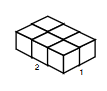
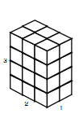
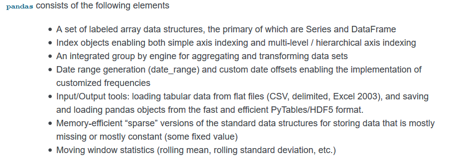
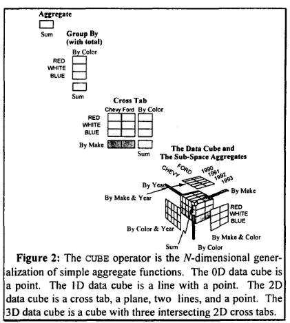

_[Link to Slides](http://www.porganized.com/Scripting-Course/slides/04-pandas.html)_


# Scripting Week 4: Container Patterns and Pandas

## Announcements

## Final Project

- proposal due date moved to week 6

### Details

- Data analysis project
- Develop a research question
- Collect or retrieve the data
- Write a narrative answering your research questions

# Labs and Slides

- Another possible tweak - depending on what you think.

# Today

- Containers
- Pandas
- Basics of Split-Apply-Combine

# Review


```python

```

## Containers

If we want to design an object for holding or aggregating multiple objects, what decisions would we have to make?

- **Named**: How to we refer to individual objects? Are positions in the container named, or numbered?
- **Dynamic Typing**: Does it hold anything you give it, or just one type of object (e.g. integers, floats, strings)?
- **Unique**: Do objects have to be unique? (i.e. nothing two items that are `==`)
- **Ordered**: Are objects in the container in a predictable, consistant order?
- **Mutable**: Can you change the container (add, remove objects) after creating it?

We've seen a list, one type of container in Python.


```python
my_list = [1, 'two', True, 4.0, 4.0, 4.0]
my_list
```


    [1, 'two', True, 4.0, 4.0, 4.0]


Are lists *named*?

 **No**.


```python
my_list[3]
```


    4.0


Example of a named container: a `dict`.


```python
my_dict = { 'name': 'Peter', 'pet': 'Kiki'}
my_dict
```


    {'name': 'Peter', 'pet': 'Kiki'}


```python
my_dict['name']
```


    'Peter'


Are lists *dynamically typed*?

**Yes**.


```python
my_list
```


    [1, 'two', True, 4.0, 4.0, 4.0]


```python
for obj in my_list:
    print("The type of", obj, "is", type(obj))
```

    The type of 1 is <class 'int'>
    The type of two is <class 'str'>
    The type of True is <class 'bool'>
    The type of 4.0 is <class 'float'>
    The type of 4.0 is <class 'float'>
    The type of 4.0 is <class 'float'>


Are lists *Unique*?

**No**.


```python
my_list
```


    [1, 'two', True, 4.0, 4.0, 4.0]


Example of a container with uniqueness: a `set`:


```python
my_set = { 1, 1, 2, 2, 2 }
my_set
```


    {1, 2}


Are lists *Ordered*?

**Yes**.


```python
for obj in my_list:
    print(obj, end=', ')
```

    1, two, True, 4.0, 4.0, 4.0, 

Sets and dicts are unordered. E.g.


```python
my_set = { 1, 'two', True, 4.0, 4.0, 4.0 }
my_set
```


    {1, 4.0, 'two'}


```python
my_dict = { "zoo": "Denver Zoo", "admission": 21.00 }
my_dict
```


    {'admission': 21.0, 'zoo': 'Denver Zoo'}


*(There's an order here, but not the one you specified!)*

Are lists *mutable*?

**Yes**.


```python
my_list = [1, 'two', True, 4.0, 4.0, 4.0]
print(my_list)
my_list[4] = 'New value!'
print(my_list)
```

    [1, 'two', True, 4.0, 4.0, 4.0]
    [1, 'two', True, 4.0, 'New value!', 4.0]


*I didn't set a new list to the `my_list` variable name: I changed something in the existing list*.

Compare a `set`:


```python
my_set = { 1, 'two', 4.0 }
print(my_set)
my_set[2] = 'New value!'
print(my_set)
```

    {1, 4.0, 'two'}


    ---------------------------------------------------------------------------

    TypeError                                 Traceback (most recent call last)

    <ipython-input-44-49e0c28338aa> in <module>()
          1 my_set = { 1, 'two', 4.0 }
          2 print(my_set)
    ----> 3 my_set[2] = 'New value!'
          4 print(my_set)


    TypeError: 'set' object does not support item assignment


## Dimensionality


Once we start working with data, another property becomes important: how many dimensions to a dataset?


# Pandas

- Pandas is a Python port of a data structure from `R`: the dataframe.
- Pandas makes high-performance data analysis easier, and meshes with a broader set of tools for analysis

### What's notable about Pandas?

Here's how Pandas is *pitched* in their [documentation](https://pandas.pydata.org/pandas-docs/stable/overview.html). Let's consider the points and work backwards toward understanding it, by untangling the jargon.



*Data Structures* 

> A set of labeled array data structures, the primary of which are Series and DataFrame

- `labeled` - Named!
- `array` - A generalized, high-performance container.

# Series

A `Series` is a 1-dimensional array of objects.

It's like a super-charged list, that can also be named!


```python
my_series = pd.Series(['John', 'Paul', 'George', 'Ringo'])
my_series
```


    0      John
    1      Paul
    2    George
    3     Ringo
    dtype: object


Right are the *values* - this is the *data*.

Left is the *index* - this is the *metadata*.
 - These are the names for the data
 - We didn't give any names, so 0, 1, 2, 3, etc. were selected as default names

Providing an index explicitly:


```python
my_series = pd.Series(['John', 'Paul', 'George', 'Ringo'],
                      index=["Smart One", "Cute One", "Quiet One", "Funny One"])
my_series
```


    Smart One      John
    Cute One       Paul
    Quiet One    George
    Funny One     Ringo
    dtype: object


*Wait, `['John', 'Paul', 'George', 'Ringo']` is just a list!*

Yup, we *supercharged* it!

Here's another type of collection that can be converted to a Series:


```python
my_dict = { "zoo": "Denver Zoo", "admission": 21.00 }
my_series2 = pd.Series(my_dict)
my_series2
```


    admission            21
    zoo          Denver Zoo
    dtype: object


## Investigating `Series`


```python
my_series[0]
```


    'John'


```python
my_series[:2]
```


    Smart One    John
    Cute One     Paul
    dtype: object


```python
my_series['Cute One']
```


    'Paul'


You can also give a collection of `True` or `False` values to select specific columns:


```python
my_series
```


    Smart One      John
    Cute One       Paul
    Quiet One    George
    Funny One     Ringo
    dtype: object


```python
my_series[[True, False, False, True]]
```


    Smart One     John
    Funny One    Ringo
    dtype: object


Remember lists... what happened when they were added?


```python
list1 = ['hello', 'world']
list2 = ['foo', 'bar']
list1 + list2
```


    ['hello', 'world', 'foo', 'bar']


It concatenates. What about a Series?


```python
series1 = pd.Series(list1)
series2 = pd.Series(list2)
series1 + series2
```


    0    hellofoo
    1    worldbar
    dtype: object


```python
series1 + series2
```


    0    hellofoo
    1    worldbar
    dtype: object


Seems useless, but I'm going to tell you that it is *awesome* for working with data.

*WHY?*

What it's actually doing is working with values one-by-one. Adding strings is rarely useful, but how about:


```python
series1 = pd.Series([100, 200, 100])
series2 = pd.Series([400, 300, 500])
series1 + series2
```


    0    500
    1    500
    2    600
    dtype: int64


```python
# Loading some data
imls = pd.read_csv('../data/imls_mini_by_state.csv', index_col='State')
population = imls['Population'].head(10)
revenue = imls['Revenue'].head(10).astype(int)
```

IMLS Library Data by State (2015)


```python
population
```


    State
    AK      647586
    AL     4833722
    AR     2643930
    AS       60324
    AZ     6758252
    CA    38697702
    CO     5265461
    CT     3596673
    DC      672228
    DE      935043
    Name: Population, dtype: int64


```python
revenue
```


    State
    AK      35984725
    AL     104479197
    AR      74999703
    AS        466525
    AZ     179986697
    CA    1417433751
    CO     299659360
    CT     198873464
    DC      57526154
    DE      26470866
    Name: Revenue, dtype: int32


```python
revenue / population
```


    State
    AK    55.567484
    AL    21.614647
    AR    28.366751
    AS     7.733655
    AZ    26.632138
    CA    36.628370
    CO    56.910375
    CT    55.293730
    DC    85.575361
    DE    28.309785
    dtype: float64


You can also make comparisons easily:


```python
population > 1000000
```


    State
    AK    False
    AL     True
    AR     True
    AS    False
    AZ     True
    CA     True
    CO     True
    CT     True
    DC    False
    DE    False
    Name: Unduplicated Population, dtype: bool


```python
revenue > population
```


    State
    AK    True
    AL    True
    AR    True
    AS    True
    AZ    True
    CA    True
    CO    True
    CT    True
    DC    True
    DE    True
    dtype: bool


Hmmm... What's next?


```python

```


```python
population[population > 1000000]
```


    State
    AL     4833722
    AR     2643930
    AZ     6758252
    CA    38697702
    CO     5265461
    CT     3596673
    Name: Unduplicated Population, dtype: int64


## Some Useful `Series` Methods

### Accessing just a few rows


```python
population.head(5)
```


    State
    AK     647586
    AL    4833722
    AR    2643930
    AS      60324
    AZ    6758252
    Name: Population, dtype: int64


```python
population.sample(5)
```


    State
    CT     3596673
    CA    38697702
    DE      935043
    AL     4833722
    DC      672228
    Name: Unduplicated Population, dtype: int64


### Summary statistics (for numbers!)


```python
population.mean()
```


    6411092.1


```python
population.median()
```


    3120301.5


```python
population.min()
```


    60324


```python
population.max()
```


    38697702


```python
population.std()
```


    133881184885258.06


### `unique`

Lists only the unique values. (Less useful for numerical data.)


```python
ddg = pd.Series(["duck", "duck", "duck", "goose"])
ddg.unique()
```


    array(['duck', 'goose'], dtype=object)


### `value_counts`

Counts how often each unique value shows up in the series.


```python
ddg.value_counts()
```


    duck     3
    goose    1
    dtype: int64


# `DataFrame`

- Table-like structure


```python
pd.DataFrame([[1,2,3], [4,5,6]])
```


<div>
<style scoped>
    .dataframe tbody tr th:only-of-type {
        vertical-align: middle;
    }

    .dataframe tbody tr th {
        vertical-align: top;
    }

    .dataframe thead th {
        text-align: right;
    }
</style>
<table border="1" class="dataframe">
  <thead>
    <tr style="text-align: right;">
      <th></th>
      <th>0</th>
      <th>1</th>
      <th>2</th>
    </tr>
  </thead>
  <tbody>
    <tr>
      <th>0</th>
      <td>1</td>
      <td>2</td>
      <td>3</td>
    </tr>
    <tr>
      <th>1</th>
      <td>4</td>
      <td>5</td>
      <td>6</td>
    </tr>
  </tbody>
</table>
</div>


```python
my_df = pd.DataFrame([[1,2,3], [4,5,6]],
                     index=['row1', 'row2'],
                     columns=['col1', 'col2', 'col3']
                    )
my_df
```


<div>
<style scoped>
    .dataframe tbody tr th:only-of-type {
        vertical-align: middle;
    }

    .dataframe tbody tr th {
        vertical-align: top;
    }

    .dataframe thead th {
        text-align: right;
    }
</style>
<table border="1" class="dataframe">
  <thead>
    <tr style="text-align: right;">
      <th></th>
      <th>col1</th>
      <th>col2</th>
      <th>col3</th>
    </tr>
  </thead>
  <tbody>
    <tr>
      <th>row1</th>
      <td>1</td>
      <td>2</td>
      <td>3</td>
    </tr>
    <tr>
      <th>row2</th>
      <td>4</td>
      <td>5</td>
      <td>6</td>
    </tr>
  </tbody>
</table>
</div>


## Investigating Dataframes

### Selecting Columns


```python
my_df['col1']
```


    row1    1
    row2    4
    Name: col1, dtype: int64


Or:


```python
my_df.col1
```


    row1    1
    row2    4
    Name: col1, dtype: int64


```python
my_df.col1
```


    row1    1
    row2    4
    Name: col1, dtype: int64


This second approach only works when the column name doesn't conflict with build-in methods, properties, or keywords.

e.g.

DataFrames have a method called 'count', so you can run

``my_df.count()``

That means that if you have a column named 'count', you can only use `my_df['count']`.

## When in doubt, use the square bracket notation

`DataFrame` columns are just `Series`


```python
type(my_df)
```


    pandas.core.frame.DataFrame


```python
type(my_df.col1)
```


    pandas.core.series.Series


Remember this!!
 
## A `DataFrame` column is a `Series`

If selecting multiple columns, give a list of column names:


```python
my_df[['col1', 'col3']]
```


<div>
<style scoped>
    .dataframe tbody tr th:only-of-type {
        vertical-align: middle;
    }

    .dataframe tbody tr th {
        vertical-align: top;
    }

    .dataframe thead th {
        text-align: right;
    }
</style>
<table border="1" class="dataframe">
  <thead>
    <tr style="text-align: right;">
      <th></th>
      <th>col1</th>
      <th>col3</th>
    </tr>
  </thead>
  <tbody>
    <tr>
      <th>row1</th>
      <td>1</td>
      <td>3</td>
    </tr>
    <tr>
      <th>row2</th>
      <td>4</td>
      <td>6</td>
    </tr>
  </tbody>
</table>
</div>


How does this look different from the following?


```python
my_df['col1']
```


    row1    1
    row2    4
    Name: col1, dtype: int64


```python

```

### Selecting rows by comparison

Just like with a `Series`, a `DataFrame` can take True / False values


```python
my_df
```


<div>
<style scoped>
    .dataframe tbody tr th:only-of-type {
        vertical-align: middle;
    }

    .dataframe tbody tr th {
        vertical-align: top;
    }

    .dataframe thead th {
        text-align: right;
    }
</style>
<table border="1" class="dataframe">
  <thead>
    <tr style="text-align: right;">
      <th></th>
      <th>col1</th>
      <th>col2</th>
      <th>col3</th>
    </tr>
  </thead>
  <tbody>
    <tr>
      <th>row1</th>
      <td>1</td>
      <td>2</td>
      <td>3</td>
    </tr>
    <tr>
      <th>row2</th>
      <td>4</td>
      <td>5</td>
      <td>6</td>
    </tr>
  </tbody>
</table>
</div>


```python
my_df[[True, False]]
```


<div>
<style scoped>
    .dataframe tbody tr th:only-of-type {
        vertical-align: middle;
    }

    .dataframe tbody tr th {
        vertical-align: top;
    }

    .dataframe thead th {
        text-align: right;
    }
</style>
<table border="1" class="dataframe">
  <thead>
    <tr style="text-align: right;">
      <th></th>
      <th>col1</th>
      <th>col2</th>
      <th>col3</th>
    </tr>
  </thead>
  <tbody>
    <tr>
      <th>row1</th>
      <td>1</td>
      <td>2</td>
      <td>3</td>
    </tr>
  </tbody>
</table>
</div>


## Convert from SQL

```sql
SELECT * FROM my_df
    WHERE col1 == 1;
```


```python

```


<div>
<style scoped>
    .dataframe tbody tr th:only-of-type {
        vertical-align: middle;
    }

    .dataframe tbody tr th {
        vertical-align: top;
    }

    .dataframe thead th {
        text-align: right;
    }
</style>
<table border="1" class="dataframe">
  <thead>
    <tr style="text-align: right;">
      <th></th>
      <th>col1</th>
      <th>col2</th>
      <th>col3</th>
    </tr>
  </thead>
  <tbody>
    <tr>
      <th>row1</th>
      <td>1</td>
      <td>2</td>
      <td>3</td>
    </tr>
  </tbody>
</table>
</div>


```python
my_df[my_df.col1 == 1]
```


<div>
<style scoped>
    .dataframe tbody tr th:only-of-type {
        vertical-align: middle;
    }

    .dataframe tbody tr th {
        vertical-align: top;
    }

    .dataframe thead th {
        text-align: right;
    }
</style>
<table border="1" class="dataframe">
  <thead>
    <tr style="text-align: right;">
      <th></th>
      <th>col1</th>
      <th>col2</th>
      <th>col3</th>
    </tr>
  </thead>
  <tbody>
    <tr>
      <th>row1</th>
      <td>1</td>
      <td>2</td>
      <td>3</td>
    </tr>
  </tbody>
</table>
</div>


```sql
SELECT col2, col3 FROM my_df;
```


```python

```


<div>
<style scoped>
    .dataframe tbody tr th:only-of-type {
        vertical-align: middle;
    }

    .dataframe tbody tr th {
        vertical-align: top;
    }

    .dataframe thead th {
        text-align: right;
    }
</style>
<table border="1" class="dataframe">
  <thead>
    <tr style="text-align: right;">
      <th></th>
      <th>col2</th>
      <th>col3</th>
    </tr>
  </thead>
  <tbody>
    <tr>
      <th>row1</th>
      <td>2</td>
      <td>3</td>
    </tr>
    <tr>
      <th>row2</th>
      <td>5</td>
      <td>6</td>
    </tr>
  </tbody>
</table>
</div>


```python
my_df[['col2', 'col3']]
```


<div>
<style scoped>
    .dataframe tbody tr th:only-of-type {
        vertical-align: middle;
    }

    .dataframe tbody tr th {
        vertical-align: top;
    }

    .dataframe thead th {
        text-align: right;
    }
</style>
<table border="1" class="dataframe">
  <thead>
    <tr style="text-align: right;">
      <th></th>
      <th>col2</th>
      <th>col3</th>
    </tr>
  </thead>
  <tbody>
    <tr>
      <th>row1</th>
      <td>2</td>
      <td>3</td>
    </tr>
    <tr>
      <th>row2</th>
      <td>5</td>
      <td>6</td>
    </tr>
  </tbody>
</table>
</div>


```sql
SELECT * FROM my_df
    WHERE col1 > 2
    LIMIT 10
```


```python

```


```python
my_df[my_df.col1 > 2].head(10)
```


<div>
<style scoped>
    .dataframe tbody tr th:only-of-type {
        vertical-align: middle;
    }

    .dataframe tbody tr th {
        vertical-align: top;
    }

    .dataframe thead th {
        text-align: right;
    }
</style>
<table border="1" class="dataframe">
  <thead>
    <tr style="text-align: right;">
      <th></th>
      <th>col1</th>
      <th>col2</th>
      <th>col3</th>
    </tr>
  </thead>
  <tbody>
    <tr>
      <th>row2</th>
      <td>4</td>
      <td>5</td>
      <td>6</td>
    </tr>
  </tbody>
</table>
</div>


```python
my_df[(my_df.col1 > 2)][:10]
```


<div>
<style scoped>
    .dataframe tbody tr th:only-of-type {
        vertical-align: middle;
    }

    .dataframe tbody tr th {
        vertical-align: top;
    }

    .dataframe thead th {
        text-align: right;
    }
</style>
<table border="1" class="dataframe">
  <thead>
    <tr style="text-align: right;">
      <th></th>
      <th>col1</th>
      <th>col2</th>
      <th>col3</th>
    </tr>
  </thead>
  <tbody>
    <tr>
      <th>row2</th>
      <td>4</td>
      <td>5</td>
      <td>6</td>
    </tr>
  </tbody>
</table>
</div>


```sql
SELECT col2, col3 FROM my_df
    WHERE col1 > 2
    LIMIT 10
```


```python
my_df
```


<div>
<style scoped>
    .dataframe tbody tr th:only-of-type {
        vertical-align: middle;
    }

    .dataframe tbody tr th {
        vertical-align: top;
    }

    .dataframe thead th {
        text-align: right;
    }
</style>
<table border="1" class="dataframe">
  <thead>
    <tr style="text-align: right;">
      <th></th>
      <th>col1</th>
      <th>col2</th>
      <th>col3</th>
    </tr>
  </thead>
  <tbody>
    <tr>
      <th>row1</th>
      <td>1</td>
      <td>2</td>
      <td>3</td>
    </tr>
    <tr>
      <th>row2</th>
      <td>4</td>
      <td>5</td>
      <td>6</td>
    </tr>
  </tbody>
</table>
</div>


```python

```


<div>
<style scoped>
    .dataframe tbody tr th:only-of-type {
        vertical-align: middle;
    }

    .dataframe tbody tr th {
        vertical-align: top;
    }

    .dataframe thead th {
        text-align: right;
    }
</style>
<table border="1" class="dataframe">
  <thead>
    <tr style="text-align: right;">
      <th></th>
      <th>col1</th>
      <th>col2</th>
      <th>col3</th>
    </tr>
  </thead>
  <tbody>
    <tr>
      <th>row2</th>
      <td>4</td>
      <td>5</td>
      <td>6</td>
    </tr>
  </tbody>
</table>
</div>


```python
my_df[my_df.col1 > 2][['col2', 'col3']].head()
```


<div>
<style scoped>
    .dataframe tbody tr th:only-of-type {
        vertical-align: middle;
    }

    .dataframe tbody tr th {
        vertical-align: top;
    }

    .dataframe thead th {
        text-align: right;
    }
</style>
<table border="1" class="dataframe">
  <thead>
    <tr style="text-align: right;">
      <th></th>
      <th>col2</th>
      <th>col3</th>
    </tr>
  </thead>
  <tbody>
    <tr>
      <th>row2</th>
      <td>5</td>
      <td>6</td>
    </tr>
  </tbody>
</table>
</div>


(We'll learn tidier ways to do this in the future, but this is perfectly fine)

### Method Chaining Returns!

Consider what is happening here:


```python
my_df[my_df.col1 > 2][['col2', 'col3']].head()
```


<div>
<style scoped>
    .dataframe tbody tr th:only-of-type {
        vertical-align: middle;
    }

    .dataframe tbody tr th {
        vertical-align: top;
    }

    .dataframe thead th {
        text-align: right;
    }
</style>
<table border="1" class="dataframe">
  <thead>
    <tr style="text-align: right;">
      <th></th>
      <th>col2</th>
      <th>col3</th>
    </tr>
  </thead>
  <tbody>
    <tr>
      <th>row2</th>
      <td>5</td>
      <td>6</td>
    </tr>
  </tbody>
</table>
</div>


Break it down:

This is one action, that returns a DataFrame:

>**my_df[my_df.col1 > 2]**[['col2', 'col3']].head()

This is a second action, that returns a DataFrame:

>**my_df[my_df.col1 > 2][['col2', 'col3']]**.head()

`head()` is run on the second DataFrame.


```python
selection1 = my_df[my_df.col1 > 2]
selection2 = selection1[['col2', 'col3']]
selection2.head()
```


<div>
<style scoped>
    .dataframe tbody tr th:only-of-type {
        vertical-align: middle;
    }

    .dataframe tbody tr th {
        vertical-align: top;
    }

    .dataframe thead th {
        text-align: right;
    }
</style>
<table border="1" class="dataframe">
  <thead>
    <tr style="text-align: right;">
      <th></th>
      <th>col2</th>
      <th>col3</th>
    </tr>
  </thead>
  <tbody>
    <tr>
      <th>row2</th>
      <td>5</td>
      <td>6</td>
    </tr>
  </tbody>
</table>
</div>


## Load more substantial data
A dataset of craft beers from https://www.kaggle.com/nickhould/craft-cans.

`read_csv`, which we saw last week, returns a DataFrame.


```python
beers = pd.read_csv('../data/beers.csv')
```

`head()` works the same as it did for a Series:


```python
beers.head(4)
```


<div>
<style scoped>
    .dataframe tbody tr th:only-of-type {
        vertical-align: middle;
    }

    .dataframe tbody tr th {
        vertical-align: top;
    }

    .dataframe thead th {
        text-align: right;
    }
</style>
<table border="1" class="dataframe">
  <thead>
    <tr style="text-align: right;">
      <th></th>
      <th>abv</th>
      <th>ibu</th>
      <th>id</th>
      <th>name</th>
      <th>type</th>
      <th>brewery_id</th>
      <th>ounces</th>
    </tr>
  </thead>
  <tbody>
    <tr>
      <th>0</th>
      <td>0.050</td>
      <td>NaN</td>
      <td>1436</td>
      <td>Pub Beer</td>
      <td>American Pale Lager</td>
      <td>408</td>
      <td>12.0</td>
    </tr>
    <tr>
      <th>1</th>
      <td>0.066</td>
      <td>NaN</td>
      <td>2265</td>
      <td>Devil's Cup</td>
      <td>American Pale Ale (APA)</td>
      <td>177</td>
      <td>12.0</td>
    </tr>
    <tr>
      <th>2</th>
      <td>0.071</td>
      <td>NaN</td>
      <td>2264</td>
      <td>Rise of the Phoenix</td>
      <td>American IPA</td>
      <td>177</td>
      <td>12.0</td>
    </tr>
    <tr>
      <th>3</th>
      <td>0.090</td>
      <td>NaN</td>
      <td>2263</td>
      <td>Sinister</td>
      <td>American Double / Imperial IPA</td>
      <td>177</td>
      <td>12.0</td>
    </tr>
  </tbody>
</table>
</div>


### Capitalizing on the "column == Series" functionality

- How many unique breweries are there?
- How do we get the counts of each Beer type in the dataset?
- What types of beer most commonly have an abv at 9% or higher?
- What's the average size of beers under 9% abv?
- How do I find the coolest name for a Tripel-style beer?

Tip: Method chaining is useful here!


```python

```


<div>
<style scoped>
    .dataframe tbody tr th:only-of-type {
        vertical-align: middle;
    }

    .dataframe tbody tr th {
        vertical-align: top;
    }

    .dataframe thead th {
        text-align: right;
    }
</style>
<table border="1" class="dataframe">
  <thead>
    <tr style="text-align: right;">
      <th></th>
      <th>abv</th>
      <th>ibu</th>
      <th>id</th>
      <th>name</th>
      <th>type</th>
      <th>brewery_id</th>
      <th>ounces</th>
    </tr>
  </thead>
  <tbody>
    <tr>
      <th>20</th>
      <td>0.082</td>
      <td>NaN</td>
      <td>1592</td>
      <td>He Said Belgian-Style Tripel</td>
      <td>Tripel</td>
      <td>368</td>
      <td>12.0</td>
    </tr>
    <tr>
      <th>171</th>
      <td>0.092</td>
      <td>5.0</td>
      <td>704</td>
      <td>Devils Tramping Ground Tripel</td>
      <td>Tripel</td>
      <td>360</td>
      <td>12.0</td>
    </tr>
    <tr>
      <th>434</th>
      <td>0.082</td>
      <td>NaN</td>
      <td>1178</td>
      <td>Vivant Tripel</td>
      <td>Tripel</td>
      <td>10</td>
      <td>16.0</td>
    </tr>
    <tr>
      <th>444</th>
      <td>0.092</td>
      <td>NaN</td>
      <td>670</td>
      <td>Vivant Tripel (2012)</td>
      <td>Tripel</td>
      <td>10</td>
      <td>16.0</td>
    </tr>
    <tr>
      <th>952</th>
      <td>0.083</td>
      <td>NaN</td>
      <td>2646</td>
      <td>Orabelle</td>
      <td>Tripel</td>
      <td>6</td>
      <td>12.0</td>
    </tr>
    <tr>
      <th>999</th>
      <td>0.090</td>
      <td>NaN</td>
      <td>1570</td>
      <td>Lemon Shandy Tripel</td>
      <td>Tripel</td>
      <td>124</td>
      <td>16.0</td>
    </tr>
    <tr>
      <th>1265</th>
      <td>0.090</td>
      <td>30.0</td>
      <td>1356</td>
      <td>Monk from the 'Yunk</td>
      <td>Tripel</td>
      <td>356</td>
      <td>12.0</td>
    </tr>
    <tr>
      <th>1896</th>
      <td>0.082</td>
      <td>NaN</td>
      <td>2536</td>
      <td>Tripel Deke</td>
      <td>Tripel</td>
      <td>64</td>
      <td>24.0</td>
    </tr>
    <tr>
      <th>2103</th>
      <td>0.085</td>
      <td>34.0</td>
      <td>2575</td>
      <td>Wooden Rooster</td>
      <td>Tripel</td>
      <td>45</td>
      <td>16.9</td>
    </tr>
    <tr>
      <th>2114</th>
      <td>0.085</td>
      <td>NaN</td>
      <td>537</td>
      <td>Velvet Rooster</td>
      <td>Tripel</td>
      <td>45</td>
      <td>16.0</td>
    </tr>
    <tr>
      <th>2312</th>
      <td>0.092</td>
      <td>25.0</td>
      <td>1770</td>
      <td>Voodoo Love Child</td>
      <td>Tripel</td>
      <td>322</td>
      <td>12.0</td>
    </tr>
  </tbody>
</table>
</div>


### Quick Summary Stats


```python
beers.describe()
```


<div>
<style scoped>
    .dataframe tbody tr th:only-of-type {
        vertical-align: middle;
    }

    .dataframe tbody tr th {
        vertical-align: top;
    }

    .dataframe thead th {
        text-align: right;
    }
</style>
<table border="1" class="dataframe">
  <thead>
    <tr style="text-align: right;">
      <th></th>
      <th>abv</th>
      <th>ibu</th>
      <th>id</th>
      <th>brewery_id</th>
      <th>ounces</th>
    </tr>
  </thead>
  <tbody>
    <tr>
      <th>count</th>
      <td>2348.000000</td>
      <td>1405.000000</td>
      <td>2410.000000</td>
      <td>2410.000000</td>
      <td>2410.000000</td>
    </tr>
    <tr>
      <th>mean</th>
      <td>0.059773</td>
      <td>42.713167</td>
      <td>1431.113278</td>
      <td>231.749793</td>
      <td>13.592241</td>
    </tr>
    <tr>
      <th>std</th>
      <td>0.013542</td>
      <td>25.954066</td>
      <td>752.459975</td>
      <td>157.685604</td>
      <td>2.352204</td>
    </tr>
    <tr>
      <th>min</th>
      <td>0.001000</td>
      <td>4.000000</td>
      <td>1.000000</td>
      <td>0.000000</td>
      <td>8.400000</td>
    </tr>
    <tr>
      <th>25%</th>
      <td>0.050000</td>
      <td>21.000000</td>
      <td>808.250000</td>
      <td>93.000000</td>
      <td>12.000000</td>
    </tr>
    <tr>
      <th>50%</th>
      <td>0.056000</td>
      <td>35.000000</td>
      <td>1453.500000</td>
      <td>205.000000</td>
      <td>12.000000</td>
    </tr>
    <tr>
      <th>75%</th>
      <td>0.067000</td>
      <td>64.000000</td>
      <td>2075.750000</td>
      <td>366.000000</td>
      <td>16.000000</td>
    </tr>
    <tr>
      <th>max</th>
      <td>0.128000</td>
      <td>138.000000</td>
      <td>2692.000000</td>
      <td>557.000000</td>
      <td>32.000000</td>
    </tr>
  </tbody>
</table>
</div>


# Next Week
Here's how Pandas is *pitched* in their [documentation](https://pandas.pydata.org/pandas-docs/stable/overview.html). Let's consider the points and work backwards toward understanding it, by untangling the jargon.

>- A set of labeled array data structures, the primary of which are Series and DataFrame
>- Index objects enabling both simple axis indexing and multi-level / hierarchical axis indexing
>- An integrated group by engine for aggregating and transforming data sets
>- Date range generation (date_range) and custom date offsets enabling the implementation of customized frequencies
>- Input/Output tools: loading tabular data from flat files (CSV, delimited, Excel 2003), and saving and loading pandas objects from the fast and efficient PyTables/HDF5 format.
>- Memory-efficient “sparse” versions of the standard data structures for storing data that is mostly missing or mostly constant (some fixed value)
>- Moving window statistics (rolling mean, rolling standard deviation, etc.)

# Overview of Split-Apply-Combine


```python

```

You don't have to split by just *one* property.




## Next Week
- Split-Apply-Combine In Practice
