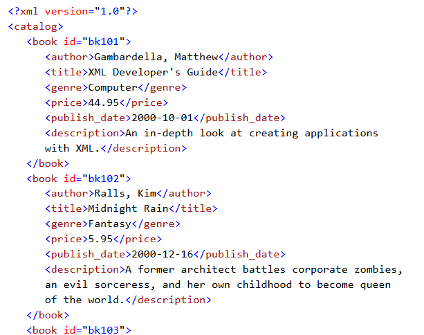

_[Link to Slides](http://www.porganized.com/Scripting-Course/slides/07-pandas-review-mongo-intro.html)_


# Scripting Week 7: MongoDB and Semi-Structured Data


```python
import pandas as pd
```

## Announcements

## Review

Load sample data:


```python
movies = pd.read_csv('../data/movielens_small.csv')
df = movies.sample(n=5, random_state=12345).set_index('title')
df
```


<div>
<style scoped>
    .dataframe tbody tr th:only-of-type {
        vertical-align: middle;
    }

    .dataframe tbody tr th {
        vertical-align: top;
    }

    .dataframe thead th {
        text-align: right;
    }
</style>
<table border="1" class="dataframe">
  <thead>
    <tr style="text-align: right;">
      <th></th>
      <th>userId</th>
      <th>rating</th>
      <th>genres</th>
      <th>timestamp</th>
      <th>year</th>
    </tr>
    <tr>
      <th>title</th>
      <th></th>
      <th></th>
      <th></th>
      <th></th>
      <th></th>
    </tr>
  </thead>
  <tbody>
    <tr>
      <th>Bringing Up Baby</th>
      <td>481</td>
      <td>4.0</td>
      <td>Comedy</td>
      <td>1437001472</td>
      <td>1938</td>
    </tr>
    <tr>
      <th>Long, Hot Summer, The</th>
      <td>311</td>
      <td>3.5</td>
      <td>Drama</td>
      <td>1061927755</td>
      <td>1958</td>
    </tr>
    <tr>
      <th>Net, The</th>
      <td>191</td>
      <td>3.0</td>
      <td>Action</td>
      <td>839925608</td>
      <td>1995</td>
    </tr>
    <tr>
      <th>City Lights</th>
      <td>648</td>
      <td>4.5</td>
      <td>Comedy</td>
      <td>1176754888</td>
      <td>1931</td>
    </tr>
    <tr>
      <th>Eagle vs Shark</th>
      <td>132</td>
      <td>4.0</td>
      <td>Comedy</td>
      <td>1284496709</td>
      <td>2007</td>
    </tr>
  </tbody>
</table>
</div>


```python
df
```


<div>
<style scoped>
    .dataframe tbody tr th:only-of-type {
        vertical-align: middle;
    }

    .dataframe tbody tr th {
        vertical-align: top;
    }

    .dataframe thead th {
        text-align: right;
    }
</style>
<table border="1" class="dataframe">
  <thead>
    <tr style="text-align: right;">
      <th></th>
      <th>userId</th>
      <th>rating</th>
      <th>genres</th>
      <th>timestamp</th>
      <th>year</th>
    </tr>
    <tr>
      <th>title</th>
      <th></th>
      <th></th>
      <th></th>
      <th></th>
      <th></th>
    </tr>
  </thead>
  <tbody>
    <tr>
      <th>Bringing Up Baby</th>
      <td>481</td>
      <td>4.0</td>
      <td>Comedy</td>
      <td>1437001472</td>
      <td>1938</td>
    </tr>
    <tr>
      <th>Long, Hot Summer, The</th>
      <td>311</td>
      <td>3.5</td>
      <td>Drama</td>
      <td>1061927755</td>
      <td>1958</td>
    </tr>
    <tr>
      <th>Net, The</th>
      <td>191</td>
      <td>3.0</td>
      <td>Action</td>
      <td>839925608</td>
      <td>1995</td>
    </tr>
    <tr>
      <th>City Lights</th>
      <td>648</td>
      <td>4.5</td>
      <td>Comedy</td>
      <td>1176754888</td>
      <td>1931</td>
    </tr>
    <tr>
      <th>Eagle vs Shark</th>
      <td>132</td>
      <td>4.0</td>
      <td>Comedy</td>
      <td>1284496709</td>
      <td>2007</td>
    </tr>
  </tbody>
</table>
</div>


How would you select:
    
- Rows 2:4
- The row titled "City Lights"
- The first, second, and fifth rows
- The columns `genres` and `year`
- The column `genres` as a Series
- The column `genres` as a DataFrame
- The rows where the year is `> 1990`
- The rows where the `genres` value is `Action` or `Drama`

### Selecting DataFrames

Everything follows the pattern:

`df[ ... ]`

Except selecting rows by index name, which uses:

`df.loc[ ... ]`

**Selecting rows by numeric index**

Provide `x:y` notation in : `df[10:14]`

**Selecting rows by index name**

Provide the name to `.loc[]`: `df.loc['Sherlock Holmes']`

**Selecting rows by inclusion criteria**

Provide any collection (e.g. a list or Series) of True/False values:

```
df[[True, False, False, True, True]]
```

```
df[df.year > 1996]
```

**Selecting multiple columns**

Provide a collection of strings, referencing the column names:

```
df[['genres', 'year']]
```
    
**Selecting single column (as Series)**

```
df['year']
```

Or:

```
df.year
```

Consider the latter as the shortcut, not the main way.

The output is a Series. To select a single column as a DataFrame, use list with only one value.

## Selecting by Index
    
In addition to passing a string to `.loc[]`:


```python
df.loc['City Lights']
```


    userId              648
    rating              4.5
    genres           Comedy
    timestamp    1176754888
    year               1931
    Name: City Lights, dtype: object


You can pass a list of index names:


```python
df.loc[['City Lights', 'Bringing Up Baby']]
```


<div>
<style scoped>
    .dataframe tbody tr th:only-of-type {
        vertical-align: middle;
    }

    .dataframe tbody tr th {
        vertical-align: top;
    }

    .dataframe thead th {
        text-align: right;
    }
</style>
<table border="1" class="dataframe">
  <thead>
    <tr style="text-align: right;">
      <th></th>
      <th>userId</th>
      <th>rating</th>
      <th>genres</th>
      <th>timestamp</th>
      <th>year</th>
    </tr>
    <tr>
      <th>title</th>
      <th></th>
      <th></th>
      <th></th>
      <th></th>
      <th></th>
    </tr>
  </thead>
  <tbody>
    <tr>
      <th>City Lights</th>
      <td>648</td>
      <td>4.5</td>
      <td>Comedy</td>
      <td>1176754888</td>
      <td>1931</td>
    </tr>
    <tr>
      <th>Bringing Up Baby</th>
      <td>481</td>
      <td>4.0</td>
      <td>Comedy</td>
      <td>1437001472</td>
      <td>1938</td>
    </tr>
  </tbody>
</table>
</div>


### Setting and reseting an index:


```python
df2 = df.reset_index()
df2
```


<div>
<style scoped>
    .dataframe tbody tr th:only-of-type {
        vertical-align: middle;
    }

    .dataframe tbody tr th {
        vertical-align: top;
    }

    .dataframe thead th {
        text-align: right;
    }
</style>
<table border="1" class="dataframe">
  <thead>
    <tr style="text-align: right;">
      <th></th>
      <th>title</th>
      <th>userId</th>
      <th>rating</th>
      <th>genres</th>
      <th>timestamp</th>
      <th>year</th>
    </tr>
  </thead>
  <tbody>
    <tr>
      <th>0</th>
      <td>Bringing Up Baby</td>
      <td>481</td>
      <td>4.0</td>
      <td>Comedy</td>
      <td>1437001472</td>
      <td>1938</td>
    </tr>
    <tr>
      <th>1</th>
      <td>Long, Hot Summer, The</td>
      <td>311</td>
      <td>3.5</td>
      <td>Drama</td>
      <td>1061927755</td>
      <td>1958</td>
    </tr>
    <tr>
      <th>2</th>
      <td>Net, The</td>
      <td>191</td>
      <td>3.0</td>
      <td>Action</td>
      <td>839925608</td>
      <td>1995</td>
    </tr>
    <tr>
      <th>3</th>
      <td>City Lights</td>
      <td>648</td>
      <td>4.5</td>
      <td>Comedy</td>
      <td>1176754888</td>
      <td>1931</td>
    </tr>
    <tr>
      <th>4</th>
      <td>Eagle vs Shark</td>
      <td>132</td>
      <td>4.0</td>
      <td>Comedy</td>
      <td>1284496709</td>
      <td>2007</td>
    </tr>
  </tbody>
</table>
</div>


```python
df2.set_index('genres')
```


<div>
<style scoped>
    .dataframe tbody tr th:only-of-type {
        vertical-align: middle;
    }

    .dataframe tbody tr th {
        vertical-align: top;
    }

    .dataframe thead th {
        text-align: right;
    }
</style>
<table border="1" class="dataframe">
  <thead>
    <tr style="text-align: right;">
      <th></th>
      <th>title</th>
      <th>userId</th>
      <th>rating</th>
      <th>timestamp</th>
      <th>year</th>
    </tr>
    <tr>
      <th>genres</th>
      <th></th>
      <th></th>
      <th></th>
      <th></th>
      <th></th>
    </tr>
  </thead>
  <tbody>
    <tr>
      <th>Comedy</th>
      <td>Bringing Up Baby</td>
      <td>481</td>
      <td>4.0</td>
      <td>1437001472</td>
      <td>1938</td>
    </tr>
    <tr>
      <th>Drama</th>
      <td>Long, Hot Summer, The</td>
      <td>311</td>
      <td>3.5</td>
      <td>1061927755</td>
      <td>1958</td>
    </tr>
    <tr>
      <th>Action</th>
      <td>Net, The</td>
      <td>191</td>
      <td>3.0</td>
      <td>839925608</td>
      <td>1995</td>
    </tr>
    <tr>
      <th>Comedy</th>
      <td>City Lights</td>
      <td>648</td>
      <td>4.5</td>
      <td>1176754888</td>
      <td>1931</td>
    </tr>
    <tr>
      <th>Comedy</th>
      <td>Eagle vs Shark</td>
      <td>132</td>
      <td>4.0</td>
      <td>1284496709</td>
      <td>2007</td>
    </tr>
  </tbody>
</table>
</div>


```python
df3 = df2.set_index(['genres', 'title']).sort_index()
df3
```


<div>
<style scoped>
    .dataframe tbody tr th:only-of-type {
        vertical-align: middle;
    }

    .dataframe tbody tr th {
        vertical-align: top;
    }

    .dataframe thead th {
        text-align: right;
    }
</style>
<table border="1" class="dataframe">
  <thead>
    <tr style="text-align: right;">
      <th></th>
      <th></th>
      <th>userId</th>
      <th>rating</th>
      <th>timestamp</th>
      <th>year</th>
    </tr>
    <tr>
      <th>genres</th>
      <th>title</th>
      <th></th>
      <th></th>
      <th></th>
      <th></th>
    </tr>
  </thead>
  <tbody>
    <tr>
      <th>Action</th>
      <th>Net, The</th>
      <td>191</td>
      <td>3.0</td>
      <td>839925608</td>
      <td>1995</td>
    </tr>
    <tr>
      <th rowspan="3" valign="top">Comedy</th>
      <th>Bringing Up Baby</th>
      <td>481</td>
      <td>4.0</td>
      <td>1437001472</td>
      <td>1938</td>
    </tr>
    <tr>
      <th>City Lights</th>
      <td>648</td>
      <td>4.5</td>
      <td>1176754888</td>
      <td>1931</td>
    </tr>
    <tr>
      <th>Eagle vs Shark</th>
      <td>132</td>
      <td>4.0</td>
      <td>1284496709</td>
      <td>2007</td>
    </tr>
    <tr>
      <th>Drama</th>
      <th>Long, Hot Summer, The</th>
      <td>311</td>
      <td>3.5</td>
      <td>1061927755</td>
      <td>1958</td>
    </tr>
  </tbody>
</table>
</div>


```python
df3.loc[('Comedy')]
```


<div>
<style scoped>
    .dataframe tbody tr th:only-of-type {
        vertical-align: middle;
    }

    .dataframe tbody tr th {
        vertical-align: top;
    }

    .dataframe thead th {
        text-align: right;
    }
</style>
<table border="1" class="dataframe">
  <thead>
    <tr style="text-align: right;">
      <th></th>
      <th>userId</th>
      <th>rating</th>
      <th>timestamp</th>
      <th>year</th>
    </tr>
    <tr>
      <th>title</th>
      <th></th>
      <th></th>
      <th></th>
      <th></th>
    </tr>
  </thead>
  <tbody>
    <tr>
      <th>Bringing Up Baby</th>
      <td>481</td>
      <td>4.0</td>
      <td>1437001472</td>
      <td>1938</td>
    </tr>
    <tr>
      <th>City Lights</th>
      <td>648</td>
      <td>4.5</td>
      <td>1176754888</td>
      <td>1931</td>
    </tr>
    <tr>
      <th>Eagle vs Shark</th>
      <td>132</td>
      <td>4.0</td>
      <td>1284496709</td>
      <td>2007</td>
    </tr>
  </tbody>
</table>
</div>


```python
df3.loc[('Comedy', 'City Lights')]
```


    userId       6.480000e+02
    rating       4.500000e+00
    timestamp    1.176755e+09
    year         1.931000e+03
    Name: (Comedy, City Lights), dtype: float64


# Semi-structured data

Semi-structured data has a structure, but it is specific to the needs of the data.

Tabular data always has two-dimensions - rows and columns (aka 'fields' and 'records') - semi-structured data is less predicatable.

### Common Semi-Structured Formats

JSON
- Hierarchical
- Organized around key/value pairs and lists of values

XML
- Hierarchical, enclosed
- Organized with tags, properties, and values

### XML, briefly

XML has tags and attributes, representing elements, and content



TAGS

- `<catalog>`
- `<book>`
- `<author>`

ELEMENTS
- Everything from `<book>` to `</book>`

ATTRIBUTES
- The ‘id’ of `<book>`

CONTENT
- “Gambardella, Matthew”
- “XML Developer’s Guide”

## JSON

JSON is made up a few data value types:

- string
- number (like a float in Python)
- object (named collection, like a dictionary in Python)
- array  (unnamed collection, like a list in Python)
- boolean
- null

Our 'containers' are objects and arrays. They can hold any of the other data types, *including other arrays and objects*.


### Object

Key value pairs, surrounded by curly braces.

- `:` separates key and value, `,` separates the item pairs.
- Keys have to be strings, values can be anything.

### Arrays

Nearly identical to lists in Python. Values, surrounded by square brackets.

- `,` separates items.
- Values can be any data type.

### Objects 

basic form:

```json
{
  "name": "Jill"
}
```

Adding key-value pairs:
    
```json
{
  "name": "Jill",
  "profession": "Juggler"
}
```

Values can be other types:
    
```json
{
  "name": "Jill",
  "profession": "Juggler",
  "age": 51
}
```

JSON is language-agnostic, so some things are different than in Python. e.g. *true / false* (lowercase) rather than Python's *True / False*:

```json
{
  "name": "Jill",
  "profession": "Juggler",
  "age": 51,
  "active": true
}
```

The values can be arrays and objects - that's how things start to get deep:

```json
{
  "name": "Jill",
  "profession": "Juggler",
  "age": 51,
  "active": true,
  "tools": ["ball", "handkerchief", "flaming motorcycle"]
}
```

Nested Object:

```json
{
  "name": "Jill",
  "profession": "Juggler",
  "age": 51,
  "active": true,
  "tools": ["ball", "handkerchief", "flaming motorcycle"],
  "awards": {
      "Tri-City Juggling Symposium 2010": "Technical Program, Silver",
      "Ballympics 2009": "Best Overall, Runner-up"
  }
}
```

List of objects, why not?

```json
{
  "name": "Jill",
  "profession": "Juggler",
  "age": 51,
  "active": true,
  "tools": ["ball", "handkerchief", "flaming motorcycle"],
  "awards": [
        {
            "event": "Tri-City Juggling Symposium",
             "year": 2010,
             "awards": ["Technical Program, Silver"]
        },
        {
            "event": "Ballympics",
             "year": 2009,
             "awards": ["Best Overall, Runner-up"]
        }
    ]
}
```

Whitespace doesn't matter:

```json
{"name": "Jill", "profession": "Juggler", "age": 51, "active": true, "tools": ["ball", "handkerchief", "flaming motorcycle"], "awards": [{"event": "Tri-City Juggling Symposium", "year": 2010, "awards": ["Technical Program, Silver"]}, {"event": "Ballympics", "year": 2009, "awards": ["Best Overall, Runner-up"]}]}
```

### Exercises

Develop a JSON structure for representing the following:

- a directory of current mayors, organized by cities and subdivided by state
    - Try with 3 cities from 2 states
- a collection of movies, each with basic metadata (e.g. title, director, year) and with viewer opinion information (ratings or reviews)
   - Try with *Black Panther* and *Avengers: Infinity War*

# MongoDB

A semi-structured non-relational (No-SQL) database, which uses a JSON-like format for storing information.

### Terminology

<center>**Database Management System (MongoDB)**</center>
<center>*can have one or more*</center>

<center>**Databases**</center>

<center>*can have one or more*</center>
<center>**Collections**</center>

<center>*can have one or more*</center>
<center>**Documents**</center>

Compare to relational databases - How do the terms align?

*Documents* are JSON-like objects, *Collections* are lists of those objects.

```
[
    {
      "name": "Jill",
      "profession": "Juggler"
    },
    { "name": "Jack",
      "profession": "Unemployed"
    }
]
```

Before we learn about MongoDB, let's get it ready on our systems so we can be hands on!

- Turn to Lab and do the small JSON primer
- Install and connect to Mongo according to lab instructions.

Connecting to a database called 'week7'. I'll put all my collections there this week.


```python
from pymongo import MongoClient
client = MongoClient('localhost', 27017)
db = client.week7
db
```


    Database(MongoClient(host=['localhost:27017'], document_class=dict, tz_aware=False, connect=True), 'week7')


New `example` collection:


```python
collection = db.example
```

## Insert One


```python
doc = {
  "name": "Jill",
  "age": 51,
  "profession": "Juggler"
}
collection.insert_one(doc)
```


    <pymongo.results.InsertOneResult at 0x111e1d1eb40>


## Retrieving Documents

MongoDB does retrieval with `find` or `find_one`, using a JSON-query.

`find_one` gives a JSON object back:


```python
collection.find_one({'name': 'Jill'})
```


    {'_id': ObjectId('5af1c28e4b6d021e1098fa59'),
     'age': 51,
     'name': 'Jill',
     'profession': 'Juggler'}


`find` returns an instance of an object that can be iterated over:


```python
collection.find({'name': 'Jill'})
```


    <pymongo.cursor.Cursor at 0x111e1e046d8>


```python
results = collection.find({'name': 'Jill'})
for result in results:
    print(result)
```

    {'_id': ObjectId('5af1ca774b6d021e1098fa64'), 'name': 'Jill', 'profile': {'age': 51, 'hobbies': ['jogging', 'juggling']}}


*Try iterating over the `results` variable again without doing another search. What happens?*


```python
for result in results:
    print(result)
```

The `cursor` is a pointer to the databases, so you're not holding all the data in memory. Good for really large datasets!

Alternately, you can convert everything to a list, but don't do this if you have a lot of data!


```python
results = collection.find({'name': 'Jill'})
list_of_results = list(results)
list_of_results
```


    [{'_id': ObjectId('5af1c28e4b6d021e1098fa59'),
      'age': 51,
      'name': 'Jill',
      'profession': 'Juggler'}]


## Insert Many


```python
docs = [{ "name": "Jack", "age": 50, "profession": "Unemployed" },
        { "name": "Jun Ho", "age": 34, "profession": "Juggler" }
       ]
collection.insert_many(docs)
```


    <pymongo.results.InsertManyResult at 0x111e1d21a20>


```python
results = collection.find({"profession": "Juggler"})
list(results)
```


    [{'_id': ObjectId('5af1c28e4b6d021e1098fa59'),
      'age': 51,
      'name': 'Jill',
      'profession': 'Juggler'},
     {'_id': ObjectId('5af1c2bb4b6d021e1098fa5b'),
      'age': 34,
      'name': 'Jun Ho',
      'profession': 'Juggler'}]


### Count


```python
collection.count()
```


    3


## Retrieving Everything

*What would our search be to get everything?*


```python

```


```python
results = collection.find({})
list(results)
```


    [{'_id': ObjectId('5af1c28e4b6d021e1098fa59'),
      'age': 51,
      'name': 'Jill',
      'profession': 'Juggler'},
     {'_id': ObjectId('5af1c2bb4b6d021e1098fa5a'),
      'age': 50,
      'name': 'Jack',
      'profession': 'Unemployed'},
     {'_id': ObjectId('5af1c2bb4b6d021e1098fa5b'),
      'age': 34,
      'name': 'Jun Ho',
      'profession': 'Juggler'}]


## `Find` by Example

Exact match:


```python
results = collection.find({
            "age": 50
        })
list(results)
```


    [{'_id': ObjectId('5af1c2bb4b6d021e1098fa5a'),
      'age': 50,
      'name': 'Jack',
      'profession': 'Unemployed'}]


Multiple conditions:


```python
results = collection.find({
            "age": 50,
            "profession": "Unemployed"
        })
list(results)
```


    [{'_id': ObjectId('5af1c2bb4b6d021e1098fa5a'),
      'age': 50,
      'name': 'Jack',
      'profession': 'Unemployed'}]


Greater than, Less than, Greater than or equal to, Less than or equal to:


```python
results = collection.find({
            "age": { "$gt": 50 }
        })
list(results)
```


    [{'_id': ObjectId('5af1c28e4b6d021e1098fa59'),
      'age': 51,
      'name': 'Jill',
      'profession': 'Juggler'}]


```python
results = collection.find({
            "age": { "$gte": 50 }
        })
list(results)
```


    [{'_id': ObjectId('5af1c28e4b6d021e1098fa59'),
      'age': 51,
      'name': 'Jill',
      'profession': 'Juggler'},
     {'_id': ObjectId('5af1c2bb4b6d021e1098fa5a'),
      'age': 50,
      'name': 'Jack',
      'profession': 'Unemployed'}]


```json
{ "$gt": 50 }
```

The `$` tells mongo that this is a special function, not simply a value named `gt`


```python
results = collection.find({
            "age": { "$gte": 50 }
        })
list(results)
```


    []


And more:
    
- Combine expressions with `$or`, `$and`
- Match against multiple values with `$in`, `$all`
    
*What do these do? Can we figure out how to use them?*

### Specifying the return fields

The 2nd argument to `find` or `find_one` specifies which fields to include:


```python
results = collection.find({}, { "name": 1})
list(results)
```


    [{'_id': ObjectId('5af1c28e4b6d021e1098fa59'), 'name': 'Jill'},
     {'_id': ObjectId('5af1c2bb4b6d021e1098fa5a'), 'name': 'Jack'},
     {'_id': ObjectId('5af1c2bb4b6d021e1098fa5b'), 'name': 'Jun Ho'}]


```python
results = collection.find({}, { "name": 1, "age": 1})
list(results)
```


    [{'_id': ObjectId('5af1c28e4b6d021e1098fa59'), 'age': 51, 'name': 'Jill'},
     {'_id': ObjectId('5af1c2bb4b6d021e1098fa5a'), 'age': 50, 'name': 'Jack'},
     {'_id': ObjectId('5af1c2bb4b6d021e1098fa5b'), 'age': 34, 'name': 'Jun Ho'}]


Or by exclusion:


```python
results = collection.find({}, { "name": 0 })
list(results)
```


    [{'_id': ObjectId('5af1c28e4b6d021e1098fa59'),
      'age': 51,
      'profession': 'Juggler'},
     {'_id': ObjectId('5af1c2bb4b6d021e1098fa5a'),
      'age': 50,
      'profession': 'Unemployed'},
     {'_id': ObjectId('5af1c2bb4b6d021e1098fa5b'),
      'age': 34,
      'profession': 'Juggler'}]


*Why use Mongo rather than an SQL DB?*

# <center>Nested Fields and Arrays</center>

New collection:


```python
collection = db.example2
```


```python
doc = {
  "name": "Jill",
  "profile": {
      "age": 51,
      "hobbies": ["jogging", "juggling"]
  }
}
collection.insert_one(doc)
```


    <pymongo.results.InsertOneResult at 0x111e1e1f798>


```python
doc = {
  "name": "Jack",
  "profile": {
      "age": 50,
      "hobbies": ["internet commenting"]
  }
}
collection.insert_one(doc)
```


    <pymongo.results.InsertOneResult at 0x111e1d3f2d0>


```python
doc = {
  "name": "Ju Ho",
  "profile": {
      "age": 34,
      "hobbies": ["petting dogs", "juggling"]
  }
}
collection.insert_one(doc)
```


    <pymongo.results.InsertOneResult at 0x111e1e1f2d0>


```python
collection.count()
```


    3


'dot' notation: separate nested field with a field. e.g. `profile.age`


```python
results = collection.find( { "profile.age": 51} )
list(results)
```


    [{'_id': ObjectId('5af1ca774b6d021e1098fa64'),
      'name': 'Jill',
      'profile': {'age': 51, 'hobbies': ['jogging', 'juggling']}}]


```python
results = collection.find( { "profile.hobbies": "juggling"} )
list(results)
```


    [{'_id': ObjectId('5af1ca774b6d021e1098fa64'),
      'name': 'Jill',
      'profile': {'age': 51, 'hobbies': ['jogging', 'juggling']}},
     {'_id': ObjectId('5af1ca794b6d021e1098fa66'),
      'name': 'Ju Ho',
      'profile': {'age': 34, 'hobbies': ['petting dogs', 'juggling']}}]


