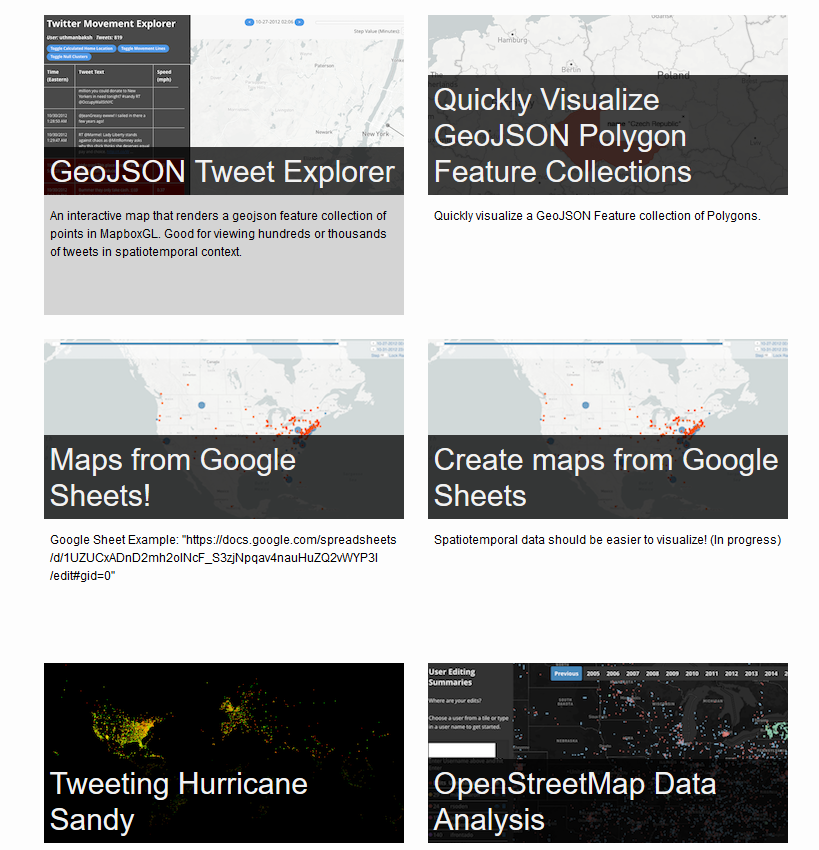
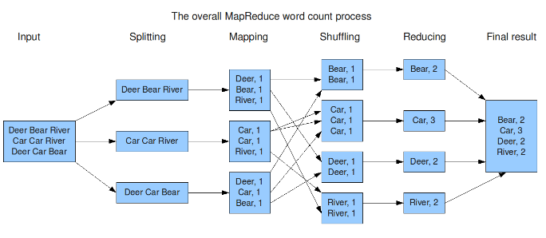
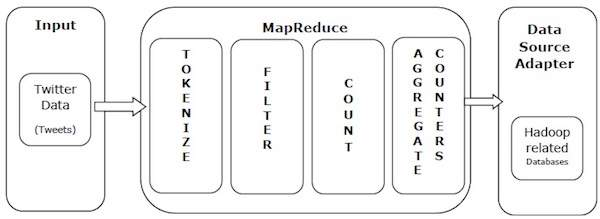

_[Link to Slides](http://www.porganized.com/Scripting-Course/slides/08-aggregations.html)_


# Week 8: Aggregations and MapReduce

# Today

- Small useful skills
- MapReduce
- Aggregations in MongoDB

## Review

# Toy Box of Useful Skills

## File Paths

`.` - Current folder

`..` - Parent folder

`folder1/folder2` - Directory named `folder2`, within a `folder1` directory, within the current directory

`../data` - Go up one directory, then into the 'data' folder

## `groupby(...).apply()`


```python
import pandas as pd
example = pd.DataFrame({'A': 'a a b'.split(), 'B': [1,2,3], 'C': [4,6, 5]})
example
```


<div>
<style scoped>
    .dataframe tbody tr th:only-of-type {
        vertical-align: middle;
    }

    .dataframe tbody tr th {
        vertical-align: top;
    }

    .dataframe thead th {
        text-align: right;
    }
</style>
<table border="1" class="dataframe">
  <thead>
    <tr style="text-align: right;">
      <th></th>
      <th>A</th>
      <th>B</th>
      <th>C</th>
    </tr>
  </thead>
  <tbody>
    <tr>
      <th>0</th>
      <td>a</td>
      <td>1</td>
      <td>4</td>
    </tr>
    <tr>
      <th>1</th>
      <td>a</td>
      <td>2</td>
      <td>6</td>
    </tr>
    <tr>
      <th>2</th>
      <td>b</td>
      <td>3</td>
      <td>5</td>
    </tr>
  </tbody>
</table>
</div>


```python
example.groupby('A').apply(lambda x: x.C.max() - x.B.min())
```


    A
    a    5
    b    2
    dtype: int64


## JSON Auto-indent in Jupyter

Add a line break:
    - after open braces
    - after commas
    - before and after close braces


```python
{ "test": { "key1": "value", "key2": "value" } }
```

## Geographic Queries in MongoDB


```python
from pymongo import MongoClient
client = MongoClient()
db = client.week8
```

Create a collection called 'fastfood', and tell Mongo that the 'geometry' key of each document is geographic:


```python
db.fastfood.create_index([('geometry', '2dsphere')])
```


    'geometry_2dsphere'


Import data of fast food restaurants.

*Thanks Jennings Anderson, PhD student in the EPIC lab, CU Boulder.*


```python
import json
with open('../data/fastfood.geojson', encoding='utf-8') as f:
    jsondata = json.load(f)
db.fastfood.insert_many(jsondata)
```


    <pymongo.results.InsertManyResult at 0x296da1363f0>


```python
db.fastfood.count()
```


    42073


Here's what the data looks like:


```python
db.fastfood.find_one({})
```


    {'_id': ObjectId('5af9f1d14b6d0239d0863b43'),
     'geometry': {'coordinates': [[[-96.1059697, 35.9987409],
        [-96.1059488, 35.9982857],
        [-96.1059014, 35.9982873],
        [-96.1059078, 35.9984123],
        [-96.1058381, 35.9984147],
        [-96.1058317, 35.9982896],
        [-96.1057768, 35.9982915],
        [-96.1057978, 35.9987468],
        [-96.1058574, 35.9987447],
        [-96.1058517, 35.9986359],
        [-96.1059198, 35.9986336],
        [-96.1059255, 35.9987424],
        [-96.1059697, 35.9987409]]],
      'type': 'Polygon'},
     'id': 'relation/1059567',
     'properties': {'@id': 'relation/1059567',
      'amenity': 'fast_food',
      'building': 'yes',
      'cuisine': 'american',
      'name': 'Sonic Drive-In',
      'type': 'multipolygon'},
     'type': 'Feature'}


To find restaurants near me, create a point according to the GeoJSON schema:


```python
my_location =  { 'type' : "Point" ,
                 'coordinates' : [-104.961896, 39.676617] 
                }
```


```python
query = {
    'geometry': {
        '$near': {
            '$geometry' : my_location
        }
    }
}
results = collection.find(query).limit(10)
list(results)
```


    [{'_id': ObjectId('5af9f1d14b6d0239d08693de'),
      'geometry': {'coordinates': [-104.9597847, 39.6785848], 'type': 'Point'},
      'id': 'node/631845194',
      'properties': {'@id': 'node/631845194',
       'amenity': 'fast_food',
       'name': "Ben and Jerry's Ice Cream"},
      'type': 'Feature'},
     {'_id': ObjectId('5af9f1d14b6d0239d08693fa'),
      'geometry': {'coordinates': [-104.9596249, 39.6789283], 'type': 'Point'},
      'id': 'node/638620276',
      'properties': {'@id': 'node/638620276',
       'addr:housenumber': '2081',
       'addr:street': 'South University Boulevard',
       'amenity': 'fast_food',
       'name': "Mustard's Last Stand"},
      'type': 'Feature'},
     {'_id': ObjectId('5af9f1d14b6d0239d08698f5'),
      'geometry': {'coordinates': [-104.959803, 39.6790585], 'type': 'Point'},
      'id': 'node/976518442',
      'properties': {'@id': 'node/976518442',
       'amenity': 'fast_food',
       'description': 'sandwich shop',
       'name': "Jimmy John's"},
      'type': 'Feature'},
     {'_id': ObjectId('5af9f1d14b6d0239d08692ad'),
      'geometry': {'coordinates': [-104.9689833, 39.6787337], 'type': 'Point'},
      'id': 'node/582084431',
      'properties': {'@id': 'node/582084431',
       'amenity': 'fast_food',
       'cuisine': 'mexican',
       'name': 'Twisters'},
      'type': 'Feature'},
     {'_id': ObjectId('5af9f1d14b6d0239d08692ae'),
      'geometry': {'coordinates': [-104.9697091, 39.6787174], 'type': 'Point'},
      'id': 'node/582087071',
      'properties': {'@id': 'node/582087071',
       'amenity': 'fast_food',
       'cuisine': 'pizza',
       'name': "Papa John's"},
      'type': 'Feature'},
     {'_id': ObjectId('5af9f1d14b6d0239d086b357'),
      'geometry': {'coordinates': [-104.9738656, 39.6783054], 'type': 'Point'},
      'id': 'node/2698634674',
      'properties': {'@id': 'node/2698634674',
       'addr:housenumber': '2101',
       'addr:postcode': '80210',
       'addr:street': 'South Downing Street',
       'amenity': 'fast_food',
       'cuisine': 'pizza',
       'name': "Domino's Pizza",
       'phone': '303-777-6655',
       'website': 'http://dominos.com'},
      'type': 'Feature'},
     {'_id': ObjectId('5af9f1d14b6d0239d086af27'),
      'geometry': {'coordinates': [-104.9412762, 39.677781], 'type': 'Point'},
      'id': 'node/2425138773',
      'properties': {'@id': 'node/2425138773',
       'addr:city': 'Denver',
       'addr:postcode': '80222',
       'addr:street': 'South Colorado Boulevard',
       'amenity': 'fast_food',
       'cuisine': 'burger',
       'name': "McDonald's",
       'website': 'http://www.mcdonalds.com/'},
      'type': 'Feature'},
     {'_id': ObjectId('5af9f1d14b6d0239d086af26'),
      'geometry': {'coordinates': [-104.9403896, 39.6787555], 'type': 'Point'},
      'id': 'node/2425138757',
      'properties': {'@id': 'node/2425138757',
       'addr:city': 'Denver',
       'addr:housenumber': '2096',
       'addr:postcode': '80222',
       'addr:street': 'South Colorado Boulevard',
       'alt_name': 'Kentucky Fried Chicken',
       'amenity': 'fast_food',
       'cuisine': 'chicken',
       'name': 'KFC/A&W',
       'opening_hours': 'Su-Sa 1030-2200',
       'phone': '303-756-8251',
       'phone:catering': '303-379-5100',
       'website': 'http://www.kfc.com'},
      'type': 'Feature'},
     {'_id': ObjectId('5af9f1d14b6d0239d086a278'),
      'geometry': {'coordinates': [-104.9401598, 39.6726109], 'type': 'Point'},
      'id': 'node/1666706345',
      'properties': {'@id': 'node/1666706345',
       'addr:city': 'Denver',
       'addr:housenumber': '2432',
       'addr:postcode': '80222',
       'addr:state': 'CO',
       'addr:street': 'South Colorado Boulevard',
       'amenity': 'fast_food',
       'cuisine': 'sandwich',
       'name': 'Taste of Philly',
       'website': 'http://www.tasteofphilly.biz/'},
      'type': 'Feature'},
     {'_id': ObjectId('5af9f1d14b6d0239d086bd48'),
      'geometry': {'coordinates': [-104.9397026, 39.6675713], 'type': 'Point'},
      'id': 'node/3394758568',
      'properties': {'@id': 'node/3394758568',
       'addr:city': 'Denver',
       'addr:housename': 'University Hills',
       'addr:housenumber': '2720',
       'addr:postcode': '80222',
       'addr:state': 'CO',
       'addr:street': 'South Colorado Boulevard',
       'addr:unit': '706',
       'alt_name': "Papa Murphy's Take 'N' Bake Pizza",
       'amenity': 'fast_food',
       'cuisine': 'pizza',
       'name': "Papa Murphy's",
       'opening_hours': 'Su-Th 11:00-20:00; Fr-Sa 11:00-21:00',
       'phone': '+1 303 758 9735',
       'source': 'knowledge',
       'website': 'https://www.papamurphys.com/store-finder/co/denver/CO074'},
      'type': 'Feature'}]


See Jennings Anderson's website for [examples of web tools built with Mongo and Geospatial data](https://www.townsendjennings.com/maps/)



## Geographic data in Pandas

There's a spin-off from Pandas called `GeoPandas`.

[Tutorial: Getting Started on Geospatial Analysis with Python, GeoJSON and GeoPandas](https://www.twilio.com/blog/2017/08/geospatial-analysis-python-geojson-geopandas.html)

# MapReduce

MapReduce is a framework from processing really large datasets, distributed across multiple threads, processes, or machines.

Two parts:

*Map*: Split the input into segments, to do something on it.

*Reduce*: Simplify the individually processed segments into one output.

(reduce is not simply 'combine' as we saw with SAC)

### Archetypal Example: Counting Words



*via http://hci.stanford.edu/courses/cs448g/a2/files/map_reduce_tutorial.pdf*

Some examples to consider:
    
- *Sorting*: How would we sort a *reeaaally* big list? e.g. Sort everything on Amazon by price.
- *Searching*: How do we determine how much a word shows up in 1 billion web pages?

MapReduce generally works by simplifying the problem to key-value pairs. 

MongoDB Example, via https://docs.mongodb.com/manual/tutorial/map-reduce-examples/: **Return the Total Price Per Customer**

Data structure:
```
{
     cust_id: "abc123",
     ord_date: new Date("Oct 04, 2012"),
     status: 'A',
     price: 25,
     items: [ { sku: "mmm", qty: 5, price: 2.5 },
              { sku: "nnn", qty: 5, price: 2.5 } ]
}
```

- Map step: return key-value pair of `cust_id: price`
- Reduce step: sum all the values for alike keys

**Calculate Average Quantity Per Item**

Data structure:
```
{
     cust_id: "abc123",
     ord_date: new Date("Oct 04, 2012"),
     status: 'A',
     price: 25,
     items: [ { sku: "mmm", qty: 5, price: 2.5 },
              { sku: "nnn", qty: 5, price: 2.5 } ]
}
```

- Map step: return key value pairs where the key is the 'sku' of each item, and the value is an object of `{count:1, quantity:  X}`
- Reduce step: Sum count and quantity for each key
- Finalize: Divide quantity/count for an everage



*https://www.tutorialspoint.com/map_reduce/map_reduce_introduction.htm*

# Data Aggregation Pipeline

*Aggregations* in MongoDB is a pipeline for combining data processing actions in MongoDB.

Things you may want to do:

- **match**: Select a subset of data (as you can do with 'find')
- **sort**: Order data by the values of a certain key
- **group**: Group data based on a key - like 'groupby' in Pandas
- **limit**: Trim the number of documents in the dataset
- **unwind**: Deconstruct an array, so that there is a document for every value of the array
- **project**: Select specific fields (like with the second argument to 'find')

These are in fact the names of *stages* of the pipeline:

- **\$match**: Select a subset of data (as you can do with 'find')
- **\$sort**: Order data by the values of a certain key
- **\$group**: Group data based on a key - like 'groupby' in Pandas
- **\$limit**: Trim the number of documents in the dataset
- **\$unwind**: Deconstruct an array, so that there is a document for every value of the array
- **\$project**: Select specific fields (like with the second argument to 'find')

Let's consider these in detail, in practice.


```python
db = client.week7
db.cooking.find_one({})
```


    {'_id': ObjectId('5af1b7634b6d022f8c977dcf'),
     'cuisine': 'greek',
     'id': 10259,
     'ingredients': ['romaine lettuce',
      'black olives',
      'grape tomatoes',
      'garlic',
      'pepper',
      'purple onion',
      'seasoning',
      'garbanzo beans',
      'feta cheese crumbles']}


Basics of the aggregations pipeline:
    
`db.collectionName.aggregate(pipeline)`

where

```python
pipeline = [
    stage1,
    stage2,
    ...
    and_so_on
]
```

# $match

Same as `find`, but a good place to start


```python
pipeline = [
    {
        "$match": { "cuisine": "greek" }
    }
]

results = db.cooking.aggregate(pipeline)
list(results)[:2]
```


    [{'_id': ObjectId('5af1b7634b6d022f8c977dcf'),
      'cuisine': 'greek',
      'id': 10259,
      'ingredients': ['romaine lettuce',
       'black olives',
       'grape tomatoes',
       'garlic',
       'pepper',
       'purple onion',
       'seasoning',
       'garbanzo beans',
       'feta cheese crumbles']},
     {'_id': ObjectId('5af1b7634b6d022f8c977e2c'),
      'cuisine': 'greek',
      'id': 34471,
      'ingredients': ['ground pork',
       'finely chopped fresh parsley',
       'onions',
       'salt',
       'vinegar',
       'caul fat']}]


# $project

Select the columns that you want in the results, or exclude columns.


```python
pipeline = [
    { "$match": { "cuisine": "greek" }  },
    {
        "$project": {"_id": 0, "ingredients": 0}
    }
]

results = db.cooking.aggregate(pipeline)
list(results)[:2]
```


    [{'cuisine': 'greek', 'id': 10259}, {'cuisine': 'greek', 'id': 34471}]


```python
pipeline = [
    { "$match": { "cuisine": "greek" } },
    { "$project": {"cuisine": 1}  }
]

results = db.cooking.aggregate(pipeline)
list(results)[:2]
```


    [{'_id': ObjectId('5af1b7634b6d022f8c977dcf'), 'cuisine': 'greek'},
     {'_id': ObjectId('5af1b7634b6d022f8c977e2c'), 'cuisine': 'greek'}]


# $limit

Same as `limit(n)`.


```python
pipeline = [
    {
        "$match": { "cuisine": "greek" }
    },
    {
        "$limit": 1
    }
]

results = db.cooking.aggregate(pipeline)
len(list(results))
```


    1


# $unwind

Expand each item in a list to it's own document.

Before:
    
```python
[{
  'cuisine': 'greek',
  'ingredients': ['romaine lettuce',
   'black olives',
   'feta cheese crumbles']
}]
```

After

```python
[
    {'cuisine': 'greek', 'ingredients': 'romaine lettuce'},
    {'cuisine': 'greek', 'ingredients': 'black olives'},
    {'cuisine': 'greek', 'ingredients': 'feta cheese crumbles'}
]
```

Step by step: what do the results below represent?


```python
pipeline = [
    { "$match": { "cuisine": "greek" } },
    { "$limit": 1 },
    { "$unwind": '$ingredients' },
    { '$project': { '_id': 0} }
]

results = db.cooking.aggregate(pipeline)
list(results)
```


    [{'cuisine': 'greek', 'id': 10259, 'ingredients': 'romaine lettuce'},
     {'cuisine': 'greek', 'id': 10259, 'ingredients': 'black olives'},
     {'cuisine': 'greek', 'id': 10259, 'ingredients': 'grape tomatoes'},
     {'cuisine': 'greek', 'id': 10259, 'ingredients': 'garlic'},
     {'cuisine': 'greek', 'id': 10259, 'ingredients': 'pepper'},
     {'cuisine': 'greek', 'id': 10259, 'ingredients': 'purple onion'},
     {'cuisine': 'greek', 'id': 10259, 'ingredients': 'seasoning'},
     {'cuisine': 'greek', 'id': 10259, 'ingredients': 'garbanzo beans'},
     {'cuisine': 'greek', 'id': 10259, 'ingredients': 'feta cheese crumbles'}]


**When you're referring to a field in a value (rather than a *key*), precede the name with '\$'**

'cuisine' is referred to in a key here:

```
{ "$match": { "cuisine": "greek" } }
```

'ingredients' is referred to in a value:

```
{ "$unwind": "$ingredients" }
```

*How does this differ?*

```
pipeline = [
    { "$match": { "cuisine": "greek" } },
    { "$limit": 1 },
    { "$unwind": '$ingredients' }
]
```
vs.


```python
pipeline = [
    { "$match": { "cuisine": "greek" } },
    { "$unwind": '$ingredients' },
    { "$limit": 1 }
]

results = db.cooking.aggregate(pipeline)
list(results)
```


    [{'_id': ObjectId('5af1b7634b6d022f8c977dcf'),
      'cuisine': 'greek',
      'id': 10259,
      'ingredients': 'romaine lettuce'}]


```python
[
    { "$match": { "cuisine": "greek" } },
    { "$unwind": '$ingredients' },
    { "$limit": 1 }
]
```

This is quick, because MongoDB is smart - it sees that there's a `$limit` after the `$unwind`, so internally it optimizes the search and doesn't unwind all 40k results.

# $sort

Provide an object where the field names to sort by are the keys, and '-1' or '1' specify to sort in ascending or descending order.


```python
pipeline = [
    { "$match": { "cuisine": "greek" } },
    { "$unwind": '$ingredients' },
    { 
        "$sort": { "ingredients": 1 } 
    },
    { "$limit": 3 }
]

results = db.cooking.aggregate(pipeline)
list(results)
```


    [{'_id': ObjectId('5af1b7634b6d022f8c978297'),
      'cuisine': 'greek',
      'id': 21457,
      'ingredients': '(10 oz.) frozen chopped spinach, thawed and squeezed dry'},
     {'_id': ObjectId('5af1b7634b6d022f8c978264'),
      'cuisine': 'greek',
      'id': 26534,
      'ingredients': '1% low-fat milk'},
     {'_id': ObjectId('5af1b7634b6d022f8c9781d8'),
      'cuisine': 'greek',
      'id': 30848,
      'ingredients': '1% low-fat milk'}]


### Exercises

# $group

It's our split-apply-combine pattern in MongoDB.


```python
pipeline = [
    { 
        "$group": {
            "_id": "$cuisine",
            "num_matching": { "$sum": 1 }
        }
    }
]

results = db.cooking.aggregate(pipeline)
list(results)
```


    [{'_id': 'moroccan', 'num_matching': 821},
     {'_id': 'korean', 'num_matching': 830},
     {'_id': 'thai', 'num_matching': 1539},
     {'_id': 'russian', 'num_matching': 489},
     {'_id': 'chinese', 'num_matching': 2673},
     {'_id': 'brazilian', 'num_matching': 467},
     {'_id': 'mexican', 'num_matching': 6438},
     {'_id': 'japanese', 'num_matching': 1423},
     {'_id': 'italian', 'num_matching': 7838},
     {'_id': 'spanish', 'num_matching': 989},
     {'_id': 'french', 'num_matching': 2646},
     {'_id': 'jamaican', 'num_matching': 526},
     {'_id': 'southern_us', 'num_matching': 4320},
     {'_id': 'filipino', 'num_matching': 755},
     {'_id': 'british', 'num_matching': 804},
     {'_id': 'indian', 'num_matching': 3003},
     {'_id': 'irish', 'num_matching': 667},
     {'_id': 'greek', 'num_matching': 1175},
     {'_id': 'vietnamese', 'num_matching': 825},
     {'_id': 'cajun_creole', 'num_matching': 1546}]


Sort and limit:


```python
pipeline = [
    { 
        "$group": {
            "_id": "$cuisine",
            "num_matching": { "$sum": 1 }
        } 
    },
    {
        "$sort": {"num_matching": -1 }
    },
    {
        "$limit": 3
    }
]

results = db.cooking.aggregate(pipeline)
list(results)
```


    [{'_id': 'italian', 'num_matching': 7838},
     {'_id': 'mexican', 'num_matching': 6438},
     {'_id': 'southern_us', 'num_matching': 4320}]


```python
pipeline = [
    { "$unwind": "$ingredients" },
    { 
        "$group": {
            "_id": "$ingredients",
            "count": { "$sum": 1 }
        }
    },
    { "$sort": {"count": -1 }  },
    { "$limit": 3 }
]

results = db.cooking.aggregate(pipeline)
list(results)
```


    [{'_id': 'salt', 'count': 18049},
     {'_id': 'olive oil', 'count': 7972},
     {'_id': 'onions', 'count': 7972}]


`$group` follows the following pattern:

```python
"$group": {
            "_id": GROUPING_CONDITIONS,
            FIELD: ACCUMULATOR
        }
```

You always need an id. It can be a string (to group by a single column), an object where the keys are new names and the values are the fields that your grouping by, or `None`, which groups the entire dataset into a single point.

The `_id` can be an object with multiple values.


```python
pipeline = [
    { "$unwind": "$ingredients" },
    { 
        "$group": {
            "_id": {"cuisine": "$cuisine", "ingredients": "$ingredients"},
            "num_matching": { "$sum": 1 }
        }
    },
    { "$sort": {"num_matching": -1 }  },
    { "$limit": 4 }
]

results = db.cooking.aggregate(pipeline)
list(results)
```


    [{'_id': {'cuisine': 'italian', 'ingredients': 'salt'}, 'num_matching': 3454},
     {'_id': {'cuisine': 'italian', 'ingredients': 'olive oil'},
      'num_matching': 3111},
     {'_id': {'cuisine': 'mexican', 'ingredients': 'salt'}, 'num_matching': 2720},
     {'_id': {'cuisine': 'southern_us', 'ingredients': 'salt'},
      'num_matching': 2290}]


here I named the id keys as the same thing as the incoming information:
    
```
"_id": {"cuisine": "$cuisine", "ingredients": "$ingredients"}
```

But they can be named whatever you like. e.g.

```
"_id": {"foo": "$cuisine", "bar": "$ingredients"}
```

Count total number of ingredients by grouping on `None`:


```python
pipeline = [
    { "$unwind": "$ingredients" },
    { 
        "$group": {
            "_id": None,
            "num_matching": { "$sum": 1 }
        }
    },
    { "$sort": {"num_matching": -1 }  },
    { "$limit": 3 }
]

results = db.cooking.aggregate(pipeline)
list(results)
```


    [{'_id': None, 'num_matching': 428275}]


## Groupby operators

- `$sum`
  - Using `{ "$sum": 1 }` returns a count, but you can also sum a numeric set of values with `{ "$sum": "$keyName" }`
- `$avg`
- `$first`
- `$last`
- `$min`
- `$max`

How would you get the average number of ingredients per cuisine type?


```python

```

- First step: how do you get a count of ingredients per each individual recipe?


```python
!cd
```

    C:\Users\Peter.Organisciak\Dropbox\teaching\lis4235-scripting\slides


```python
pipeline = [
    { "$unwind": "$ingredients" },
    { 
        "$group": {
            "_id": {'cuisine':'$cuisine', 'id': '$id'},
            "num_ingredients": { "$sum": 1 }
        }
    },
    { 
        "$group": {
            "_id": {'cuisine':'$_id.cuisine'},
            "average_ingredients": { "$avg": "$num_ingredients" }
        }
    },
    {
        "$sort": { "average_ingredients": 1}
    }
]

results = db.cooking.aggregate(pipeline)
list(results)
```


    [{'_id': {'cuisine': 'irish'}, 'average_ingredients': 9.299850074962519},
     {'_id': {'cuisine': 'brazilian'}, 'average_ingredients': 9.5203426124197},
     {'_id': {'cuisine': 'southern_us'}, 'average_ingredients': 9.634953703703705},
     {'_id': {'cuisine': 'british'}, 'average_ingredients': 9.708955223880597},
     {'_id': {'cuisine': 'japanese'}, 'average_ingredients': 9.735066760365426},
     {'_id': {'cuisine': 'french'}, 'average_ingredients': 9.817838246409675},
     {'_id': {'cuisine': 'italian'}, 'average_ingredients': 9.909032916560347},
     {'_id': {'cuisine': 'filipino'}, 'average_ingredients': 10.0},
     {'_id': {'cuisine': 'greek'}, 'average_ingredients': 10.182127659574467},
     {'_id': {'cuisine': 'russian'}, 'average_ingredients': 10.224948875255624},
     {'_id': {'cuisine': 'spanish'}, 'average_ingredients': 10.42366026289181},
     {'_id': {'cuisine': 'mexican'}, 'average_ingredients': 10.87744641192917},
     {'_id': {'cuisine': 'korean'}, 'average_ingredients': 11.28433734939759},
     {'_id': {'cuisine': 'chinese'}, 'average_ingredients': 11.98279087167976},
     {'_id': {'cuisine': 'jamaican'}, 'average_ingredients': 12.214828897338403},
     {'_id': {'cuisine': 'thai'}, 'average_ingredients': 12.545808966861598},
     {'_id': {'cuisine': 'cajun_creole'},
      'average_ingredients': 12.617076326002588},
     {'_id': {'cuisine': 'vietnamese'}, 'average_ingredients': 12.675151515151516},
     {'_id': {'cuisine': 'indian'}, 'average_ingredients': 12.705960705960706},
     {'_id': {'cuisine': 'moroccan'}, 'average_ingredients': 12.909866017052375}]


